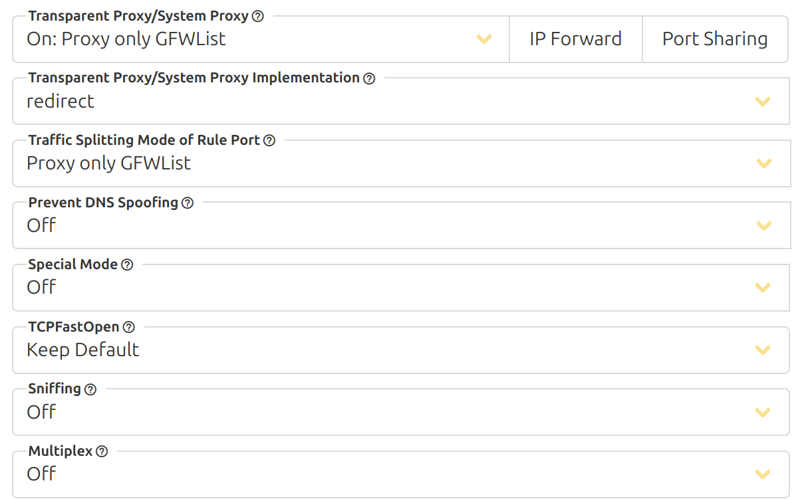

- [GNU software](https://www.gnu.org/software/software.html)
- [google开源代码书写规范](https://zh-google-styleguide.readthedocs.io/en/latest/contents/)
# 框架
## 一 Linux 文件系统：

当然，Mac有自己的文件系统，2020年为APFS；Linux也更新了自己的文件系统，2020年为ZFS（ZFS并不只是一个文件系统，相比之下，XFS/ext4更算是一个文件系统，XFS整体性能优于ext4，但是断电文件修复能力差，还有 2025 年仍不够稳定的 Btrfs 系统，具体见《Raid进阶笔记》）。但同为Unix内核，很多文件的逻辑依然保持一致，这里只谈一致的问题，不谈具体的文件系统特性。
要注意：管理命令（zpool, zfs, lvm, mdadm）属于用户空间工具，它们的作用是配置/控制内核驱动，而不是自己执行 IO。

```
物理磁盘
   ↓
硬件 RAID 控制器 (可选，直接虚拟出逻辑盘)
   ↓
Linux 块设备驱动 (/dev/sdX, /dev/nvmeXnY)

   ↓
存储聚合 / 卷管理 / 分区表 (GPT/MBR → /dev/sdX1)
   - mdadm (软件 RAID)
   - LVM (device mapper)
   - ZFS / Btrfs (卷管理+文件系统)
  
   ↓
文件系统 (ext4, xfs, zfs, btrfs …)

   ↓
VFS 层 (内核抽象：open, read, write)

   ↓
用户空间应用
```


1. [认识 EXT2 文件系统](http://cn.linux.vbird.org/linux_basic/0230filesystem.php#harddisk)  
　　1.1 [硬盘组成与分割的复习](http://cn.linux.vbird.org/linux_basic/0230filesystem.php#harddisk-physical)  
　　1.2 [文件系统特性](http://cn.linux.vbird.org/linux_basic/0230filesystem.php#harddisk-filesystem)： [索引式文件系统](http://cn.linux.vbird.org/linux_basic/0230filesystem.php#indexed_allocation)  
　　1.3 [Linux 的 EXT2 文件系统(inode)](http://cn.linux.vbird.org/linux_basic/0230filesystem.php#harddisk-inode): [data block](http://cn.linux.vbird.org/linux_basic/0230filesystem.php#block), [inode table](http://cn.linux.vbird.org/linux_basic/0230filesystem.php#inode), [superblock](http://cn.linux.vbird.org/linux_basic/0230filesystem.php#super_block), [dumpe2fs](http://cn.linux.vbird.org/linux_basic/0230filesystem.php#dumpe2fs)  
　　1.4 [与目录树的关系](http://cn.linux.vbird.org/linux_basic/0230filesystem.php#harddisk-dir)  
　　1.5 [EXT2/EXT3 文件的存取与日志式文件系统的功能](http://cn.linux.vbird.org/linux_basic/0230filesystem.php#harddisk-journal)  
　　1.6 [Linux 文件系统的运行](http://cn.linux.vbird.org/linux_basic/0230filesystem.php#harddisk-filerun)  
　　1.7 [挂载点的意义 (mount point)](http://cn.linux.vbird.org/linux_basic/0230filesystem.php#harddisk-mount)  
　　1.8 [其他 Linux 支持的文件系统与 VFS](http://cn.linux.vbird.org/linux_basic/0230filesystem.php#harddisk-other)2. [文件系统的简单操作](http://cn.linux.vbird.org/linux_basic/0230filesystem.php#filesys)  
　　2.1 [磁盘与目录的容量：](http://cn.linux.vbird.org/linux_basic/0230filesystem.php#filesys_1) [df](http://cn.linux.vbird.org/linux_basic/0230filesystem.php#df), [du](http://cn.linux.vbird.org/linux_basic/0230filesystem.php#du)  
　　2.2 [实体链接与符号链接：](http://cn.linux.vbird.org/linux_basic/0230filesystem.php#link) [ln](http://cn.linux.vbird.org/linux_basic/0230filesystem.php#ln)3. [磁盘的分割、格式化、检验与挂载](http://cn.linux.vbird.org/linux_basic/0230filesystem.php#disk)  
　　3.1 [磁盘分区： fdisk](http://cn.linux.vbird.org/linux_basic/0230filesystem.php#fdisk), [partprobe](http://cn.linux.vbird.org/linux_basic/0230filesystem.php#partprobe)  
　　3.2 [磁盘格式化：](http://cn.linux.vbird.org/linux_basic/0230filesystem.php#format) [mkfs](http://cn.linux.vbird.org/linux_basic/0230filesystem.php#mkfs), [mke2fs](http://cn.linux.vbird.org/linux_basic/0230filesystem.php#mke2fs)  
　　3.3 [磁盘检验： fsck](http://cn.linux.vbird.org/linux_basic/0230filesystem.php#fsck), [badblocks](http://cn.linux.vbird.org/linux_basic/0230filesystem.php#badblocks)  
　　3.4 [磁盘挂载与卸除： mount](http://cn.linux.vbird.org/linux_basic/0230filesystem.php#mount), [umount](http://cn.linux.vbird.org/linux_basic/0230filesystem.php#umount)  
　　3.5 [磁盘参数修订](http://cn.linux.vbird.org/linux_basic/0230filesystem.php#diskpara)： [mknod](http://cn.linux.vbird.org/linux_basic/0230filesystem.php#mknod), [e2label](http://cn.linux.vbird.org/linux_basic/0230filesystem.php#e2label), [tune2fs](http://cn.linux.vbird.org/linux_basic/0230filesystem.php#tune2fs), [hdparm](http://cn.linux.vbird.org/linux_basic/0230filesystem.php#hdparm)4. [配置启动挂载：](http://cn.linux.vbird.org/linux_basic/0230filesystem.php#bootup)  
　　4.1 [启动挂载 /etc/fstab 及 /etc/mtab](http://cn.linux.vbird.org/linux_basic/0230filesystem.php#fstab)  
　　4.2 [特殊装置 loop 挂载(映象档不刻录就挂载使用)](http://cn.linux.vbird.org/linux_basic/0230filesystem.php#loop)5. [内存置换空间(swap)之建置：](http://cn.linux.vbird.org/linux_basic/0230filesystem.php#swap)  
　　5.1 [使用实体分割槽建置swap](http://cn.linux.vbird.org/linux_basic/0230filesystem.php#swapdevice)  
　　5.2 [使用文件建置swap](http://cn.linux.vbird.org/linux_basic/0230filesystem.php#swapfile)  
　　5.3 [swap使用上的限制](http://cn.linux.vbird.org/linux_basic/0230filesystem.php#swapuse)6. [文件系统的特殊观察与操作](http://cn.linux.vbird.org/linux_basic/0230filesystem.php#special)  
　　6.1 [boot sector 与 superblock 的关系](http://cn.linux.vbird.org/linux_basic/0230filesystem.php#special_boot_sector)  
　　6.2 [磁盘空间之浪费问题](http://cn.linux.vbird.org/linux_basic/0230filesystem.php#special_waste)  
　　6.3 [利用 GNU 的 parted 进行分割行为](http://cn.linux.vbird.org/linux_basic/0230filesystem.php#parted)

> windows是先有硬盘分区，再有分区上的目录。
> linux是先有目录，再有每个目录对应的分区，进入一个分区的目录入口就叫挂载点。
> linux中不是每个目录都是挂载点，通常只要求根目录/是挂载点。其他的目录可以用户自己决定要不要挂载单独的分区，如果不挂载，这个目录实际的存储位置和它的父目录相同。
>
> win和linux的区别主要是文件结构(目录)和物理结构(存储)的侧重不同。目录在linux里是更基础的概念，在目录的基础上安排磁盘分区。win则是相反。


### 硬盘设备/分区/文件系统/挂载

**(1) 磁盘设备（/dev/sdX）**
- 物理磁盘（如 HDD、SSD）在 Linux 中表示为 `/dev/sdX`（如 `/dev/sda`, `/dev/sdb`）。
- 可以通过 `lsblk` 或 `fdisk -l` 查看。

**(2) 分区（Partition）**
- 磁盘可以划分成多个分区（如 `/dev/sdb1`, `/dev/sdb2`）。
- 使用 `fdisk`/`gdisk`/`parted` 管理。

**(3) 逻辑卷管理（LVM，可选）**
- 更灵活的存储管理方式，支持动态调整大小、快照等。
- 涉及 **PV（Physical Volume）**、**VG（Volume Group）**、**LV（Logical Volume）**。
- 具体见下面章节：《硬盘扩容》- 《LVM》

**(4) RAID（冗余磁盘阵列）**
- 通过 `mdadm` 实现 **软件 RAID**，将多个磁盘组合成一个逻辑设备（如 `/dev/md0`）。
- 提供数据冗余（RAID 1/5/6）或性能提升（RAID 0）。
- 具体见下面章节：《linux 硬盘raid》

**(5) 文件系统（File System）**
- 数据存储的最终组织形式（如 `ext4`、`xfs`、`btrfs`）。
- 必须 **格式化** 后才能存储文件。 

**(6) 挂载（Mount）**
- 将设备（如 `/dev/md0`）关联到目录（如 `/mnt/raid`），才能访问其中的文件。
- 挂载点（Mount Point）是文件系统的访问入口。

---
 **2. 为什么需要 `/dev/md0` 和 `/mnt/raid` 两个步骤？**

|名称|作用|类比|
|---|---|---|
|**`/dev/md0`**|RAID 设备文件（原始存储块）|相当于一个“未拆封的硬盘”|
|**`/mnt/raid`**|挂载点（访问文件的入口）|相当于“插上硬盘后的盘符（如 D:）”|

1. **`/dev/md0` 是 RAID 设备，但不是文件系统**
    - 当你运行 `sudo mdadm --create /dev/md0 ...` 时，只是创建了一个 **逻辑磁盘设备**，它还没有：
        - 文件系统（如 ext4）。
        - 挂载点（无法直接访问文件）。
    - 此时如果直接尝试访问 `/dev/md0`，系统会报错：
        `cd /dev/md0  # 错误！这不是目录。`
        
2. **`mkfs` 格式化：让 `/dev/md0` 支持存储文件**
    - `sudo mkfs.ext4 /dev/md0` 会在 `/dev/md0` 上创建 **ext4 文件系统**，使其能存储文件和目录。
    
3. **`mount` 挂载：关联设备到目录**
    - Linux 没有“盘符”（如 Windows 的 `C:\`、`D:\`），而是通过 **挂载到目录** 访问文件。
    - `sudo mount /dev/md0 /mnt/raid` 的作用：
        - 将 `/dev/md0` 的文件系统挂载到 `/mnt/raid`。
        - 之后所有对 `/mnt/raid` 的读写操作都会映射到 `/dev/md0`。

#### Linux存储层次结构
- **物理磁盘**：如 `/dev/sda`、`/dev/sdb`（原始存储设备）
- **分区**：磁盘划分的逻辑单元（如 `/dev/sda1`）
- **逻辑卷 (LVM)**：
    - 物理卷 (PV)：分区或磁盘被初始化为PV（如 `sda2` 类型为 `LVM2_member`）
    - 卷组 (VG)：多个PV组合成VG（未直接显示）
    - 逻辑卷 (LV)：在VG上创建的虚拟分区（如 `/dev/mapper/centos-root`）
- **文件系统**：在分区或LV上格式化（如 `xfs`、`swap`）
- **挂载**：将文件系统链接到目录（如 `/`、`/home`）

#### 挂载 (mount)
1.  **指定关联关系：** 你告诉内核：
    *   哪个**设备**（`/dev/sda1`, `/dev/nvme0n1p2`）或者哪个**存储资源**（如 NFS 共享 `server:/share`, Samba 共享 `//server/share`）。
    *   使用哪种**文件系统类型**（ext4, xfs, ntfs, nfs, cifs 等，内核通常能自动检测）。
    *   将其附加到目录树中的哪个**挂载点**（一个预先存在的**空目录**，如 `/mnt/mydrive`, `/home`）。
    *   （可选）指定一些**挂载选项**，如只读(`ro`)、读写(`rw`)、用户权限(`uid=`, `gid=`)、禁止执行程序(`noexec`)等。

2.  **内核执行操作：**
    *   内核接收到 `mount` 命令后，会加载（或确认已加载）相应的**文件系统驱动**（用于理解 ext4, XFS, NTFS 等的结构）。
    *   内核读取设备上的**文件系统元数据**（超级块等），验证其完整性和类型。
    *   内核在内部建立数据结构，将这个文件系统的**根目录**与指定的**挂载点目录**关联起来。
    *   内核更新其**虚拟文件系统**的管理结构，确保所有通过该挂载点的路径访问请求都会被正确路由到对应的物理设备上的文件系统。

3.  **效果：**
    *   访问挂载点目录（如 `/mnt/data`）及其子目录，就是在访问被挂载设备（如 `/dev/sdb1`）上的文件和目录。
    *   该挂载点目录原有的内容（如果有）会被暂时“遮盖”，直到卸载该文件系统后才会重新可见。
    *   系统工具如 `df`, `mount`, `lsblk` 会显示这个挂载关系。

| 命令             | 作用层级        | 关键信息            | 使用场景      |
| -------------- | ----------- | --------------- | --------- |
| **`fdisk -l`** | 磁盘分区表       | 分区物理信息（起止扇区、大小） | 查看磁盘分区结构  |
| **`lsblk -f`** | 块设备拓扑关系     | 设备树、文件系统类型、挂载点  | 展示设备间逻辑关系 |
| **`df -hT`**   | 已挂载文件系统使用情况 | 空间使用率、挂载点、文件系统  | 监控磁盘空间消耗  |

#### 1. `fdisk -l`：磁盘分区信息
```bash
Disk /dev/sda: 53687.1 GB  # 物理磁盘sda（53.6TB）
   /dev/sda1  *  2048  2099199  1GB  83 Linux     # 启动分区（/boot）
   /dev/sda2     2099200 209715199  50GB 8e Linux LVM  # LVM物理卷
   /dev/sda3     209715200 419430399  50GB 8e Linux LVM # LVM物理卷

Disk /dev/sdb: 107.4 GB    # 第二块磁盘（107GB）
   /dev/sdb1      2048 209715199  50GB 8e Linux LVM    # LVM物理卷
```
- **关键点**：
    - `sda` 有3个分区，`sdb` 有1个分区，均加入LVM。
    - 逻辑卷（如 `/dev/mapper/centos-root`）是LVM创建的虚拟设备，不在分区表中直接管理。

####  2. `lsblk -f`：块设备拓扑与文件系统
```bash
sda
├─sda1 xfs               /boot    # 独立分区（/boot）
├─sda2 LVM2_member                 # 物理卷PV（sda2）
│ ├─centos-root xfs      /        # 根逻辑卷（150GB）
│ ├─centos-swap swap     [SWAP]   # 交换分区
│ └─centos-home xfs      /home    # /home逻辑卷（142GB）
└─sda3 LVM2_member                 # 物理卷PV（sda3）
  └─centos-home xfs      /home    # 与sda2的home是同一LV（跨PV）

sdb
└─sdb1 LVM2_member                 # 物理卷PV（sdb）
  └─centos-root xfs      /         # 与sda2的root是同一LV（跨PV）
```

- **关键点**：
    - **LVM扩展性**：`centos-root` 同时使用 `sda2` 和 `sdb1` 的空间（跨磁盘扩展）。
    - **跨PV存储**：`centos-home` 同时使用 `sda2` 和 `sda3` 的空间。
    - **UUID唯一性**：相同UUID（如 `32ab20e6...`）表示同一逻辑卷。

#### 3. `df -hT`：文件系统使用情况
```bash
/dev/mapper/centos-root xfs  150G  24G  127G  16% /     # 根分区使用率16%
/dev/mapper/centos-home xfs  142G  87G   55G  62% /home # /home使用率62%
/dev/sda1              xfs 1014M 151M  864M  15% /boot  # 启动分区
192.168.50.103:/home/data nfs4 965G 216G 749G 23% /nfs-data  # NFS网络存储
overlay               overlay 150G 24G 127G 16% /var/lib/docker/... # Docker容器
```
- **关键点**：
    - **LVM空间分配**：根目录（`/`）150GB来自 `centos-root`（跨 `sda2+sdb1`）。
    - **高使用率目录**：`/home` 占用87GB（62%），需关注清理。
    - **特殊文件系统**：
        - `nfs4`：网络存储
        - `overlay`：Docker容器分层文件系统（共享宿主机的 `/` 空间）
        - `tmpfs`：内存虚拟磁盘（重启消失）

### linux 磁盘分区及调整
#### 磁盘空间调整注意
- **ext4**文件系统：支持在线扩展和离线缩小
- **xfs**文件系统：只支持在线扩展，不能缩小

- LVM是逻辑卷的管理，属于比文件系统更“底层“，也就是LVM支持热调整大小，但是也需要其上的文件系统支持，比如在LVM分区的是xfs，那也不支持缩。
- ext4 在线扩展（非LVM）的前提条件：分区后面有未分配空间或可缩小的相邻分区

一定要先缩小文件系统

#### [非LVM实施方法](https://developer.aliyun.com/article/637485)

- lsblk
- [parted](https://www.gnu.org/software/parted/) 
- fdisk
- resize2fs
- df
- [gparted](https://gitlab.gnome.org/GNOME/gparted/-/tree/master)：依赖上述工具写的GUI的自动化分区管理。


**1. lsblk（列出块设备信息）**

• **用途**：显示系统中的块设备（磁盘、分区、LVM 逻辑卷等）。
• **特点**：
	• 只读工具，不会修改磁盘。
	• 直观展示磁盘结构及其挂载点。
	• 不会显示 CD-ROM 或者网络存储设备（区别于 fdisk -l）。
• **示例**：
```
lsblk
```

**2. [parted](https://www.gnu.org/software/parted/)（高级分区管理工具）**
• **用途**：创建、调整、删除和管理磁盘分区。
• **特点**：
	• 支持 GPT（GUID 分区表）和 MBR（主引导记录）。
	• 可以调整分区大小（GPT和大于2T的MBR下不能用fdisk，要用parted或者gparted）。
	• 交互式和非交互式模式均可用。

• **示例**：
```bash
[root@rcny-cicd ~]# parted

GNU Parted 3.1
Using /dev/sda
Welcome to GNU Parted! Type 'help' to view a list of commands.

(parted) print                                                  
Model: VMware Virtual disk (scsi)
Disk /dev/sda: 53.7TB
Sector size (logical/physical): 512B/512B
Partition Table: msdos
Disk Flags: 
Number  Start   End     Size    Type     File system  Flags
 1      1049kB  1075MB  1074MB  primary  xfs          boot
 2      1075MB  107GB   106GB   primary               lvm
 3      107GB   215GB   107GB   primary               lvm
 
(parted) quit                                                   
[root@rcny-cicd ~]# parted /dev/sdb

GNU Parted 3.1
Using /dev/sdb
Welcome to GNU Parted! Type 'help' to view a list of commands.

(parted) print                                                  
Model: VMware Virtual disk (scsi)
Disk /dev/sdb: 107GB
Sector size (logical/physical): 512B/512B
Partition Table: msdos
Disk Flags: 
Number  Start   End    Size   Type     File system  Flags
 1      1049kB  107GB  107GB  primary               lvm

# (parted) mkpart primary ext4 1MiB 10GiB
```

**3. fdisk（传统 MBR 分区管理工具）**

• **用途**：用于查看和管理 MBR 分区表的磁盘分区（不推荐用于 GPT）。
• **特点**：
	• 仅支持 MBR（不支持 GPT，GPT 需要 gdisk）。
	• 命令行交互式操作。
• **示例**：
```bash
fdisk /dev/sda
Command (m for help): p   # 打印分区表
Command (m for help): n   # 创建新分区
```

**4. resize2fs（调整 ext 文件系统大小）**
• **用途**：调整 ext2/ext3/ext4 文件系统的大小。
• **特点**：
	• **只能用于 ext 文件系统**，不支持 NTFS、XFS、Btrfs 等。
	• 扩展时，目标分区必须已经扩展（如 parted 或 gparted 扩展分区后）。
	• 收缩时，建议先卸载文件系统。
• **示例**：
```bash
resize2fs /dev/sda1
resize2fs /dev/sda1 20G   # 调整文件系统大小为 20GB
```

**5. df（显示磁盘使用情况）**
• **用途**：查看文件系统的磁盘空间使用情况。
• **特点**：
	• 只显示已挂载的文件系统。
	• 支持 -h 选项（人类可读格式）。
• **示例**：
```bash
# 当然这个只是拿一个LVM的系统做演示
df -hT

Filesystem  Type      Size  Used Avail Use% Mounted on
devtmpfs   devtmpfs   16G     0   16G   0% /dev
tmpfs      tmpfs      16G     0   16G   0% /dev/shm
tmpfs      tmpfs      16G   11M   16G   1% /run
tmpfs      tmpfs      16G     0   16G   0% /sys/fs/cgroup
/dev/mapper/centos-root  xfs   150G   34G  117G  23% /
/dev/mapper/centos-home  xfs   142G   80G   62G  57% /home
/dev/sda1                xfs   1014M  151M  864M  15% /boot
192.168.50.103:/home/data nfs4 965G  216G  749G  23% /nfs-data
```

**6. [gparted](https://gitlab.gnome.org/GNOME/gparted/-/tree/master)（GUI 分区管理工具）**
• **用途**：图形化的磁盘分区管理工具（基于 parted）。本质还是调用之前哪些工具
• **特点**：
	• 适合新手，提供可视化界面。
	• 支持调整、删除、创建、格式化分区。
	• 支持多种文件系统（ext4、NTFS、FAT32、XFS 等）。
• **示例**：
```bash
gparted
```

**工具之间的关系**

| **工具**    | **主要功能**      | **作用对象** | **关键区别**        |
| --------- | ------------- | -------- | --------------- |
| lsblk     | 显示块设备信息       | 磁盘 & 分区  | 只读，不修改          |
| fdisk     | 分区管理（仅 MBR）   | 磁盘       | 传统工具，不支持 GPT    |
| parted    | 分区管理（支持 GPT）  | 磁盘       | 现代工具，可调整大小      |
| resize2fs | 调整 ext 文件系统大小 | 分区上的文件系统 | 仅支持 ext 系列      |
| df        | 显示磁盘空间使用情况    | 挂载的文件系统  | 仅显示挂载的分区        |
| gparted   | GUI 分区管理工具    | 磁盘 & 分区  | parted 的 GUI 版本 |

**总结**：
如果你的磁盘是 GPT，建议用 parted 或 gparted 进行分区管理，而 fdisk 主要适用于 MBR。

### [LVM](http://cn.linux.vbird.org/linux_basic/0420quota.php#lvm)扩容
- [lvm2](https://gitlab.com/lvmteam/lvm2)
```bash
sudo apt install lvm2
```

| 序号  | 功能   | PV 物理卷命令                                                                                                                          | VG 卷组命令                                                                                                                           | LV 逻辑卷命令                                                                                                                          |
| --- | ---- | --------------------------------------------------------------------------------------------------------------------------------- | --------------------------------------------------------------------------------------------------------------------------------- | --------------------------------------------------------------------------------------------------------------------------------- |
| 01  | 扫描功能 | [pvscan](https://zhida.zhihu.com/search?content_id=217277193&content_type=Article&match_order=1&q=pvscan&zhida_source=entity)     | [vgscan](https://zhida.zhihu.com/search?content_id=217277193&content_type=Article&match_order=1&q=vgscan&zhida_source=entity)     | [lvscan](https://zhida.zhihu.com/search?content_id=217277193&content_type=Article&match_order=1&q=lvscan&zhida_source=entity)     |
| 02  | 建⽴功能 | [pvcreate](https://zhida.zhihu.com/search?content_id=217277193&content_type=Article&match_order=1&q=pvcreate&zhida_source=entity) | [vgcreate](https://zhida.zhihu.com/search?content_id=217277193&content_type=Article&match_order=1&q=vgcreate&zhida_source=entity) | [lvcreate](https://zhida.zhihu.com/search?content_id=217277193&content_type=Article&match_order=1&q=lvcreate&zhida_source=entity) |
| 03  | 查询功能 | pvdisplay                                                                                                                         | vgdisplay                                                                                                                         | lvdisplay                                                                                                                         |
| 04  | 删除功能 | pvremove                                                                                                                          | vgremove                                                                                                                          | lvremove                                                                                                                          |
| 05  | 扩容功能 |                                                                                                                                   | vgextend                                                                                                                          | lvextend                                                                                                                          |
| 06  | 缩容功能 |                                                                                                                                   | vgreduce                                                                                                                          | lvreduce                                                                                                                          |

> 需要先使用 fdisk 命令进行一个分区设置。  

- [给LVM添加磁盘扩容](https://blog.csdn.net/xieshaohu/article/details/129671846)
已经在VMware中成功添加了一块100G的新磁盘（sdb），现在需要将这100G空间扩展到根目录（/）。你的根目录是LVM逻辑卷（centos-root），所以推荐的做法是将新磁盘加入LVM，并扩展根分区。操作步骤如下：

#### 1. 对新磁盘分区（sdb）  
假设全部用于LVM：
```bash
fdisk /dev/sdb
```
- 输入 n 创建新分区
- 输入 t 设置分区类型为 8e（LVM）
- 输入 w 保存并退出
```bash
[root@rcny-cicd ~]# fdisk /dev/sdb

Welcome to fdisk (util-linux 2.23.2).
Changes will remain in memory only, until you decide to write them.
Be careful before using the write command.
Device does not contain a recognized partition table
Building a new DOS disklabel with disk identifier 0x26908c57.

Command (m for help): n
Partition type:
p primary (0 primary, 0 extended, 4 free)
e extended

Select (default p): p
Partition number (1-4, default 1): 
First sector (2048-209715199, default 2048): 
Using default value 2048
Last sector, +sectors or +size{K,M,G} (2048-209715199, default 209715199): 
Using default value 209715199
Partition 1 of type Linux and of size 100 GiB is set

Command (m for help): t

Selected partition 1

Hex code (type L to list all codes): 8e
Changed type of partition 'Linux' to 'Linux LVM'

Command (m for help): w
The partition table has been altered!
Calling ioctl() to re-read partition table.
Syncing disks.
```
#### 2. 创建物理卷（PV）  
```bash
pvdisplay
pvcreate /dev/sdb1
```

#### 3. 将新PV加入现有卷组（VG）  
你的卷组名是 centos（可用 vgs 或 vgdisplay 查看确认）：
```sh
vgdisplay
vgextend 你的vg名字 /dev/sdb1
```

#### 4. 扩展根逻辑卷（LV）  
先确认根LV名称（一般为 centos-root）：
```sh
lvdisplay
```
扩展根LV（假设全部扩展到根）：
```sh
# 俩都可以，看lvdisplay显示的是啥
# lvextend -l +100%FREE /dev/centos/root
lvextend -l +100%FREE /dev/mapper/centos-root
```

#### 5. 扩展文件系统  
对于xfs（CentOS 7/8默认）：
```sh
xfs_growfs /
```
对于ext4：
```sh
resize2fs /dev/centos/root
```

验证一下：
```bash
df -hT
```
#### 6. 扩容问题
1. 为什么要fdisk输入 t 回车（更改分区类型），默认的分区类型是什么？
```text
默认新建的分区类型是 Linux（类型代码 83），而LVM需要分区类型为 Linux LVM（类型代码 8e）。  
如果不更改为 8e，后续 LVM 工具可能无法识别该分区为物理卷（PV），导致无法加入卷组（VG）。
所以必须用 t 命令将分区类型改为 8e（Linux LVM），这样才能用于LVM扩容。
```

2. 为什么 `resize2fs /dev/centos/root`指定的是设备名？而`xfs_growfs /` 是根目录是文件路径名？
```text
这是因为两种文件系统工具的设计理念不同：
	ext4 工具面向设备层面操作；xfs 工具面向文件系统层面操作

resize2fs（ext4）：
- 操作的是"块设备"（block device），所以需要指定设备路径
- 语法：resize2fs /dev/centos/root
- 它直接修改设备上的文件系统结构

xfs_growfs（xfs）：
- 操作的是"挂载点"（mount point），所以需要指定目录路径
- 语法：xfs_growfs /
- 它通过挂载点找到对应的文件系统进行扩展
```

3. 为什么不需要挂载
```text
	因为挂载点 (`/mnt/data`) 关联的是文件系统的实例。只要文件系统的核心结构（能被内核识别并管理的）没有在操作中被破坏或需要重建（例如格式化 `mkfs` 就需要重新挂载），仅仅是元数据更新（如扩展可用空间），内核就能无缝处理。
	重新挂载 (`umount` + `mount`) 相当于销毁当前的 VFS 实例并创建一个新的。对于 `resize2fs` 扩展这种元数据更新操作，内核有能力在现有挂载实例上应用这些更新，避免了服务中断。
```

### linux 硬盘raid
高阶知识见`Unix-tips.assets/Raid进阶笔记.md`
#### 1. 确认硬盘设备
首先，列出所有磁盘，确认要用于 RAID 的硬盘（如 `/dev/sdb`、`/dev/sdc`）：
```bash
lsblk -o NAME,SIZE,FSTYPE,MOUNTPOINT   # 查看所有磁盘
sudo fdisk -l                          # 查看详细信息
```

确保目标磁盘 **没有重要数据**（RAID 创建会清除数据）。

#### 2. 安装 `mdadm`（软件 RAID 工具）
```bash
# Debian/Ubuntu
sudo apt update && sudo apt install mdadm

# RHEL/CentOS
sudo yum install mdadm

# Arch Linux
sudo pacman -S mdadm
```

#### 3. 创建 RAID 阵列
-  **3.1 常用 RAID 级别**

| RAID 级别     | 最少磁盘数 | 容错能力      | 存储效率    | 适用场景    |
| ----------- | ----- | --------- | ------- | ------- |
| **RAID 0**  | 2+    | ❌ 无       | 100%    | 高性能，无冗余 |
| **RAID 1**  | 2+    | ✔️（镜像）    | 50%     | 高可用性    |
| **RAID 5**  | 3+    | ✔️（1块盘）   | (N-1)/N | 平衡性能与冗余 |
| **RAID 6**  | 4+    | ✔️（2块盘）   | (N-2)/N | 更高容错    |
| **RAID 10** | 4+    | ✔️（镜像+条带） | 50%     | 高性能+高可用 |


-  **3.2 创建 RAID 示例**

 **（1）创建 RAID 1（镜像）**
```bash
sudo mdadm --create /dev/md0 --level=1 --raid-devices=2 /dev/sdb /dev/sdc
```

- `/dev/md0`：RAID 设备名  
- `--level=1`：RAID 1（镜像）  
- `--raid-devices=2`：使用 2 块磁盘  

 **（2）创建 RAID 5（带奇偶校验）**
```bash
sudo mdadm --create /dev/md0 --level=5 --raid-devices=3 /dev/sdb /dev/sdc /dev/sdd
```

**（3）创建 RAID 10（条带+镜像）**
```bash
sudo mdadm --create /dev/md0 --level=10 --raid-devices=4 /dev/sdb /dev/sdc /dev/sdd /dev/sde
```

#### 4. 检查 RAID 状态
```bash
cat /proc/mdstat                  # 查看 RAID 构建进度
sudo mdadm --detail /dev/md0      # 查看详细信息

输出示例：

Personalities : [raid1] 
md0 : active raid1 sdc[1] sdb[0]
      20971456 blocks [2/2] [UU]
```

- `[UU]`：所有磁盘正常（`[_U]` 表示一块盘故障）。

#### 5. 格式化并挂载 RAID
 **（1）格式化（如 ext4）**
```bash
sudo mkfs.ext4 /dev/md0
```

 **（2）创建挂载点并挂载**
```bash
sudo mkdir /mnt/raid
sudo mount /dev/md0 /mnt/raid
```

 **（3）开机自动挂载**
```bash
# 获取 RAID 的 UUID
sudo blkid /dev/md0

# 编辑 /etc/fstab
echo "UUID=你的-UUID /mnt/raid ext4 defaults 0 0" | sudo tee -a /etc/fstab
```

#### 6. 保存 RAID 配置
```bash
sudo mdadm --detail --scan | sudo tee -a /etc/mdadm/mdadm.conf  # Debian/Ubuntu
sudo mdadm --detail --scan | sudo tee -a /etc/mdadm.conf        # RHEL/CentOS

# 然后更新 initramfs：
sudo update-initramfs -u        # Debian/Ubuntu
sudo dracut -v -f               # RHEL/CentOS
```

#### 7. 故障处理
 **（1）模拟磁盘故障**
```bash
sudo mdadm /dev/md0 --fail /dev/sdb
```

**（2）移除故障盘**
```bash
sudo mdadm /dev/md0 --remove /dev/sdb
```

**（3）添加新盘**
```bash
sudo mdadm /dev/md0 --add /dev/sde
```

#### 8. 硬件 RAID 配置
如果使用 **硬件 RAID 卡（如 LSI MegaRAID）**：
1. 开机进入 RAID 卡 BIOS（按提示键，如 `Ctrl+H`）。
2. 在管理界面中创建虚拟磁盘（VD）。
3. 在 Linux 中识别为单块磁盘（如 `/dev/sda`），无需 `mdadm`。

#### 9. 总结

| 操作 | 命令/步骤 |
|------|----------|
| **安装工具** | `sudo apt install mdadm` |
| **创建 RAID** | `sudo mdadm --create /dev/md0 --level=1 --raid-devices=2 /dev/sdb /dev/sdc` |
| **查看状态** | `cat /proc/mdstat` |
| **格式化** | `sudo mkfs.ext4 /dev/md0` |
| **挂载** | `sudo mount /dev/md0 /mnt/raid` |
| **自动挂载** | 编辑 `/etc/fstab` |
| **故障恢复** | `mdadm --fail /dev/md0 /dev/sdb` |

---

1. **数据备份**：RAID 不是备份！重要数据仍需额外备份。
2. **性能权衡**：RAID 0 快但无冗余，RAID 1/5/6 更安全但写入速度较慢。
3. **硬件 RAID**：优先使用主板/RAID 卡配置，性能更稳定。


### 目录结构

根据上述理论，所以磁盘是挂载在目录底下的。

 **[Linux文件系统](http://cn.linux.vbird.org/linux_basic/0210filepermission_3.php)**、 [FHS](https://www.pathname.com/fhs/)、[文件系统层次结构标准维基百科](https://zh.wikipedia.org/zh-cn/文件系统层次结构标准)

* /(root, 根目录)：与开机系统有关；
* /usr (unix software resource)：与软件安装/执行有关；
* /var (variable)：与系统运作过程有关。
* /etc：配置文件
* /bin：重要执行档
* /dev：所需要的装置文件
* /lib：执行档所需的函式库与核心所需的模块
* /sbin：重要的系统执行文件
* /mnt：
* /swap：虚拟内存（硬盘作为内存）

### 常见配置文件

>`/etc/profile`
>
> 在用户登录时，操作系统定制用户环境时使用的第一个文件，此文件为系统的每个用户设置环境信息，当用户第一次登录时，该文件被执行。
>
>`/etc/environment`
>
> 在用户登录时，操作系统使用的第二个文件， 系统在读取用户个人的profile前，设置环境文件的环境变量。
>
>`~/.profile`
>
> 在用户登录时，用到的第三个文件 是.profile文件，每个用户都可使用该文件输入专用于自己使用的shell信息，当用户登录时，该文件仅仅执行一次！默认情况下，会设置一些环境变量，执行用户的.bashrc文件。
>
>`/etc/bashrc`
>
> 为每一个运行bash shell的用户执行此文件，当bash shell被打开时，该文件被读取。
>
>`~/.bashrc`
>
> 该文件包含专用于用户的bash shell的bash信息，当登录时以及每次打开新的shell时，该文件被读取。

用户文件夹里有很多.文件，这些都是系统和软件配置相关的，系统也会把这类文件设为隐藏，我们可以自己创建，以个性化定制app的设置（尤其是以终端为可视化界面的软件）er qi。以vim为例：

* /Users/zxll/.vimrc   #vim用户配置文件
* /Users/zxll/.vim/    #vim用户配置文件夹

#### 永久关闭swap分区

在 /etc/fstab中找到有关swap的行，并对其进行注释。是这样的：

```shell
UUID=6880a28d-a9dc-4bfb-ba47-0876b50e96b3 /               ext4    errors=remount-ro 0       1
UUID=7350e6f2-e3a7-4d80-9a95-8741c7db118f /home           ext4    defaults        0       2
UUID=E2E26AD1E26AAA0D /media/windows  ntfs    defaults,umask=007,gid=46 0       0

# Swap a usb extern (3.7 GB):
#/dev/sdb1 none swap sw 0 0
```

您可以使用gedit编辑该文件。首先备份它，以防万一：

```shell
sudo cp /etc/fstab /etc/fstab_backup
gksu gedit /etc/fstab
```

只需在交换所在行的开头添加＃，然后重新启动计算机即可。
### 文件链接(非编译链接)

硬链接是指针，所有的硬链接都是指向同一个磁盘块。 删除一个指针不会真正删除文件，只有把所有的指针都删除才会真正删除文件。 软连接是另外一种类型的文件，保存的是它指向文件的全路径， 访问时会替换成绝对路径。具体应用见`mac`中的`链接动态库`一节。

```shell
man ln
#得到下面描述 ========
  指令名称 : ln
  使用权限 : 所有使用者
  使用方式 : ln [options] source dist，其中 option 的格式为 :
  [-bdfinsvF] [-S backup-suffix] [-V {numbered,existing,simple}]
  [--help] [--version] [--]
  说明 : Linux/Unix 档案系统中，有所谓的连结(link)，我们可以将其视为档案的别名，而连结又可分为两种 : 硬连结(hard link)与软连结(symbolic link)，硬连结的意思是一个档案可以有多个名称，而软连结的方式则是产生一个特殊的档案，该档案的内容是指向另一个档案的位置。硬连结是存在同一个档 案系统中，而软连结却可以跨越不同的档案系统。
  ln source dist 是产生一个连结(dist)到 source，至于使用硬连结或软链结则由参数决定。
  不论是硬连结或软链结都不会将原本的档案复制一份，只会占用非常少量的磁碟空间。
  -f : 链结时先将与 dist 同档名的档案删除
  -d : 允许系统管理者硬链结自己的目录
  -i : 在删除与 dist 同档名的档案时先进行询问
  -n : 在进行软连结时，将 dist 视为一般的档案
  -s : 进行软链结(symbolic link)
  -v : 在连结之前显示其档名
  -b : 将在链结时会被覆写或删除的档案进行备份
  -S SUFFIX : 将备份的档案都加上 SUFFIX 的字尾
  -V METHOD : 指定备份的方式
  --help : 显示辅助说明
  --version : 显示版本
```


### smartctl 磁盘安全


`smartctl` 是 S.M.A.R.T. 磁盘健康监控工具，以下是需要重点关注的指标：

#### 一、最关键的指标（出现异常需立即备份）

| 属性 ID | 属性名 | 含义 | 危险阈值 |
|---------|--------|------|----------|
| 5 | **Reallocated_Sector_Ct** | 重映射扇区数，坏扇区被替换的次数 | >0 就需关注，>100 危险 |
| 187 | **Reported_Uncorrect** | 无法通过 ECC 校正的错误数 | >0 需关注 |
| 188 | **Command_Timeout** | 命令超时次数，控制器通信问题 | 持续增长危险 |
| 197 | **Current_Pending_Sector** | 等待重映射的扇区数（不稳定扇区） | >0 需关注 |
| 198 | **Offline_Uncorrectable** | 离线扫描发现的不可修复扇区 | >0 需关注 |

#### 二、重要的寿命/磨损指标

| 属性 ID | 属性名 | 含义 | 说明 |
|---------|--------|------|------|
| 9 | **Power_On_Hours** | 通电时间（小时） | 机械盘 3-5万小时算老化 |
| 12 | **Power_Cycle_Count** | 开关机次数 | 频繁开关加速老化 |
| 194 | **Temperature_Celsius** | 温度 | >55°C 需改善散热 |
| 241 | **Total_LBAs_Written** | 总写入量 | SSD 关键指标 |

#### 三、SSD 特有指标

| 属性 ID | 属性名 | 含义 | 说明 |
|---------|--------|------|------|
| 177 | **Wear_Leveling_Count** | 磨损均衡计数 | 值越低寿命越少 |
| 231 | **SSD_Life_Left** | SSD 剩余寿命百分比 | <10% 需准备更换 |
| 233 | **Media_Wearout_Indicator** | 介质磨损指标 | 从100递减到0 |

#### 四、实际操作示例

```bash
# 查看整体健康状态
sudo smartctl -H /dev/sda

# 查看详细 SMART 属性
sudo smartctl -A /dev/sda

# 完整信息（推荐）
sudo smartctl -a /dev/sda

# NVMe 设备
sudo smartctl -a /dev/nvme0
```

#### 五、输出解读示例

```
ID# ATTRIBUTE_NAME          FLAG     VALUE WORST THRESH TYPE      RAW_VALUE
  5 Reallocated_Sector_Ct   0x0033   100   100   010    Pre-fail  0        ✅ 正常
197 Current_Pending_Sector  0x0012   100   100   000    Old_age   8        ⚠️ 需关注
198 Offline_Uncorrectable   0x0010   100   100   000    Old_age   0        ✅ 正常
```

**字段解释：**
- **VALUE**: 当前归一化值（通常 100 为最佳）
- **WORST**: 历史最差值
- **THRESH**: 阈值，VALUE 低于此值表示故障
- **RAW_VALUE**: 原始计数值（最直观）
- **TYPE**: `Pre-fail` 表示可能预示故障，`Old_age` 表示使用磨损

#### 六、判断磁盘问题的规则

**立即更换**：
- `SMART overall-health self-assessment test result: FAILED`
- Reallocated_Sector_Ct 原始值 > 100 且持续增长
- Current_Pending_Sector 持续增长

**密切监控**：
- 任何关键指标的 RAW_VALUE > 0
- 温度长期 > 50°C
- 读写错误率异常增长

**定期监控建议**：
```bash
# 安装监控守护进程
sudo apt install smartmontools
sudo systemctl enable smartd

# 设置邮件告警 /etc/smartd.conf
/dev/sda -a -m your@email.com
```

你的服务器环境中可以用 `smartctl -a` 先跑一遍看看各盘的状态，有具体输出我可以帮你分析。

## 二 守护进程

### 1. 守护进程概述

Linux Daemon（守护进程）是运行在后台的一种特殊进程。它独立于控制终端并且周期性地执行某种任务或等待处理某些发生的事件。它不需要用户输入就能运行而且提供某种服务，不是对整个系统就是对某个用户程序提供服务。Linux系统的大多数服务器就是通过守护进程实现的。常见的守护进程包括系统日志进程syslogd、 web服务器httpd、邮件服务器sendmail和数据库服务器mysqld等。

守护进程一般在系统启动时开始运行，除非强行终止，否则直到系统关机都保持运行。守护进程经常以超级用户（root）权限运行，因为它们要使用特殊的端口（1-1024）或访问某些特殊的资源。

一个守护进程的父进程是init进程，因为它真正的父进程在fork出子进程后就先于子进程exit退出了，所以它是一个由init继承的孤儿进程。守护进程是非交互式程序，没有控制终端，所以任何输出，无论是向标准输出设备stdout还是标准出错设备stderr的输出都需要特殊处理。

守护进程的名称通常以d结尾，比如sshd、xinetd、crond等

### 2. 创建守护进程步骤

首先我们要了解一些基本概念：

进程组 ：

> * 每个进程也属于一个进程组 
>
> - 每个进程主都有一个进程组号，该号等于该进程组组长的PID号 .
> - 一个进程只能为它自己或子进程设置进程组ID号 

会话期： 

> 会话期(session)是一个或多个进程组的集合。

setsid()函数可以建立一个对话期：

 如果，调用setsid的进程不是一个进程组的组长，此函数创建一个新的会话期。

> (1)此进程变成该对话期的首进程 
>
> (2)此进程变成一个新进程组的组长进程。 
>
> (3)此进程没有控制终端，如果在调用setsid前，该进程有控制终端，那么与该终端的联系被解除。 如果该进程是一个进程组的组长，此函数返回错误。
>
> (4)为了保证这一点，我们先调用fork()然后exit()，此时只有子进程在运行

现在我们来给出创建守护进程所需步骤：

编写守护进程的一般步骤步骤：
> （1）在父进程中执行fork并exit推出；
> （2）在子进程中调用setsid函数创建新的会话；
> （3）在子进程中调用chdir函数，让根目录 ”/” 成为子进程的工作目录；
> （4）在子进程中调用umask函数，设置进程的umask为0；
> （5）在子进程中关闭任何不需要的文件描述符

说明：

1. 在后台运行。 

   > 为避免挂起控制终端将Daemon放入后台执行。方法是在进程中调用fork使父进程终止，让Daemon在子进程中后台执行。 
   > if(pid=fork()) 
   > exit(0);//是父进程，结束父进程，子进程继续 

2. 脱离控制终端，登录会话和进程组 

   > 有必要先介绍一下Linux中的进程与控制终端，登录会话和进程组之间的关系：进程属于一个进程组，进程组号（GID）就是进程组长的进程号（PID）。登录会话可以包含多个进程组。这些进程组共享一个控制终端。这个控制终端通常是创建进程的登录终端。 
   >    控制终端，登录会话和进程组通常是从父进程继承下来的。我们的目的就是要摆脱它们，使之不受它们的影响。方法是在第1点的基础上，调用setsid()使进程成为会话组长： 
   >    setsid(); 
   >    说明：当进程是会话组长时setsid()调用失败。但第一点已经保证进程不是会话组长。setsid()调用成功后，进程成为新的会话组长和新的进程组长，并与原来的登录会话和进程组脱离。由于会话过程对控制终端的独占性，进程同时与控制终端脱离。 

3. 禁止进程重新打开控制终端 

   > 现在，进程已经成为无终端的会话组长。但它可以重新申请打开一个控制终端。可以通过使进程不再成为会话组长来禁止进程重新打开控制终端： 
   > if(pid=fork()) 
   > exit(0);//结束第一子进程，第二子进程继续（第二子进程不再是会话组长） 

4. 关闭打开的文件描述符 

   > 进程从创建它的父进程那里继承了打开的文件描述符。如不关闭，将会浪费系统资源，造成进程所在的文件系统无法卸下以及引起无法预料的错误。按如下方法关闭它们： 
   > for(i=0;i 关闭打开的文件描述符close(i);> 

5. 改变当前工作目录 

   > 进程活动时，其工作目录所在的文件系统不能卸下。一般需要将工作目录改变到根目录。对于需要转储核心，写运行日志的进程将工作目录改变到特定目录如/tmpchdir("/") 

6. 重设文件创建掩模 

   > 进程从创建它的父进程那里继承了文件创建掩模。它可能修改守护进程所创建的文件的存取位。为防止这一点，将文件创建掩模清除：umask(0); 

7. 处理SIGCHLD信号 

   > 处理SIGCHLD信号并不是必须的。但对于某些进程，特别是服务器进程往往在请求到来时生成子进程处理请求。如果父进程不等待子进程结束，子进程将成为僵尸进程（zombie）从而占用系统资源。如果父进程等待子进程结束，将增加父进程的负担，影响服务器进程的并发性能。在Linux下可以简单地将SIGCHLD信号的操作设为SIG_IGN。 
   > signal(SIGCHLD,SIG_IGN); 
   > 这样，内核在子进程结束时不会产生僵尸进程。这一点与BSD4不同，BSD4下必须显式等待子进程结束才能释放僵尸进程。 


### 3. 创建守护进程
在创建之前我们先了解setsid()使用：
```c
 #include <unistd.h>
	pid_t setsid(void);
```

> DESCRIPTION 
>  setsid() creates a new session if the calling process is not a process 
>  group leader. The calling process is the leader of the new session, 
>  the process group leader of the new process group, and has no control- 
>  ling tty. The process group ID and session ID of the calling process 
>  are set to the PID of the calling process. The calling process will be 
>  the only process in this new process group and in this new session.

//调用进程必须是非当前进程组组长，调用后，产生一个新的会话期，且该会话期中只有一个进程组，且该进程组组长为调用进程，没有控制终端，新产生的group ID 和 session ID 被设置成调用进程的PID

> RETURN VALUE 
>  On success, the (new) session ID of the calling process is returned. 
>  On error, (pid_t) -1 is returned, and errno is set to indicate the 
>  error.

现在根据上述步骤创建一个守护进程：

以下程序是创建一个守护进程，然后利用这个守护进程每个一分钟向daemon.log文件中写入当前时间：

```c
#include <stdio.h>
#include <unistd.h>
#include <stdlib.h>
#include <time.h>
#include <fcntl.h>
#include <string.h>
#include <sys/stat.h>

#define ERR_EXIT(m) \
do\
{\
    perror(m);\
    exit(EXIT_FAILURE);\
}\
while (0);\

void creat_daemon(void);
int main(void)
{
    time_t t;
    int fd;
    creat_daemon();
    while(1){
        fd = open("daemon.log",O_WRONLY|O_CREAT|O_APPEND,0644);
        if(fd == -1)
            ERR_EXIT("open error");
        t = time(0);
        char *buf = asctime(localtime(&t));
        write(fd,buf,strlen(buf));
        close(fd);
        sleep(60);
            
    }
    return 0;
}
void creat_daemon(void)
{
    pid_t pid;
    pid = fork();
    if( pid == -1)
        ERR_EXIT("fork error");
    if(pid > 0 )
        exit(EXIT_SUCCESS);
    if(setsid() == -1)
        ERR_EXIT("SETSID ERROR");
    chdir("/");
    int i;
    for( i = 0; i < 3; ++i)
    {
        close(i);
        open("/dev/null", O_RDWR);
        dup(0);
        dup(0);
    }
    umask(0);
    return;
}
```


结果：

[](https://images0.cnblogs.com/blog/529981/201307/13191708-0a54178e53cb4b4b9beaf0962d2415fb.png)

结果显示：当我一普通用户执行a.out时，进程表中并没有出现新创建的守护进程，但当我以root用户执行时，成功了，并在/目录下创建了daemon.log文件，cat查看后确实每个一分钟写入一次。为什么只能root执行，那是因为当我们创建守护进程时，已经将当前目录切换我/目录，所以当我之后创建daemon.log文件是其实是在/目录下，那肯定不行，因为普通用户没有权限，或许你会问那为啥没报错呢？其实是有出错，只不过我们在创建守护进程时已经将标准输入关闭并重定向到/dev/null，所以看不到错误信息。


## 三 网络


- **NetworkManager / systemd-networkd / 旧的 ifupdown / CentOS 的 network-scripts**：属于同一层，都是“真正管网卡、配 IP 的后台服务”，一般只选一个用。
    
- **netplan**：是 Ubuntu 发明的一层“前端/翻译器”，自己不配网卡，只是把 YAML 配置翻译给 NetworkManager 或 systemd-networkd。
    
- **cloud-init**：是“开机初始化工具”，顺便帮你写 netplan 或其它网络配置，用完就走人，并不是长期管网卡的服务。
    

### 1. Linux 网络分层

  
从下往上看：

#### 内核 + 驱动层
    
    - 网卡驱动（e1000, vmxnet3 等）
        
    - 内核协议栈（IP/TCP/UDP 等）
        
        它们负责真正收发包，但不关心“IP 是多少”、“网关是谁”。
        
    
#### 配置/管理层
    
这一层决定：
- 给某个网卡设置什么 IP、掩码；
- 默认网关是谁；
- 用什么 DNS；
- Wi-Fi 连哪个热点等。

这里就包括：
- NetworkManager
- systemd-networkd
- 旧的 ifupdown（/etc/network/interfaces）
- RHEL/CentOS 的 network-scripts 等。

#### 前端/抽象层

- Ubuntu 的 netplan
- cloud-init（更上面一层初始化工具，会帮你生成 netplan 或其它配置）

#### 命令行工具
- ip, ip addr, ip route：直接找内核交互，适合临时调整（重启就没了）。
- nmcli, nmtui：NetworkManager 的命令行/图形前端。
- resolvectl：配合 systemd-resolved 看 DNS。

主要碰到的就是第 2、3 、4层：


### 2. 各种工具解释

#### NetworkManager

- Red Hat 系列（CentOS、Fedora、RHEL）和桌面版 Linux 常用的网络管理服务。
- 特点：
    - 支持有线、无线、VPN、移动网络等复杂场景；
    - 桌面环境（GNOME/KDE）里的“小电脑/小网线图标”基本都在控制它；
    - 提供命令行工具 nmcli 和半图形 nmtui；
    - 支持自动切换网络、热点管理、企业 Wi-Fi 认证等。

- 在 Ubuntu：
    - **桌面版**：默认使用 **NetworkManager** 作为 netplan 的 backend；
    - **服务器版**：一般默认是 **systemd-networkd**，而不是 NetworkManager。
 

可以理解为：

> NetworkManager 是一个“大而全”的网络管家，尤其适合桌面和复杂环境。

---
#### systemd-networkd

- systemd 自带的网络管理服务。
    
- 特点：
    - 比 NetworkManager 更轻量、配置文件更简单；
        
    - 特别适合服务器、容器、虚拟机这类“网络结构相对固定、变化少”的环境；
        
    - 配置文件一般在 /etc/systemd/network/ 下；
        
    - 不负责 Wi-Fi 认证（需要额外 wpa_supplicant）。


- Ubuntu Server / cloud image 上，常见模式就是：
    
    > cloud-init → 写 netplan → netplan 生成 systemd-networkd 配置 → networkd 真正去配置网卡
    

可以理解为：

> networkd 是个“安静认真写配置的后台小工”，没有桌面那些花活，但在服务器上很稳。

---

#### ifupdown（/etc/network/interfaces）

- 传统 Debian/Ubuntu 时代的配置方式：
    - 配置文件：/etc/network/interfaces
    - 命令：ifup, ifdown

- 很多老教程还在用这个，但在新版本 Ubuntu 上已经逐步被 netplan + networkd / NetworkManager 替代。

---

#### CentOS 的 network-scripts

- CentOS 7 经典配置：
    - 配置文件：/etc/sysconfig/network-scripts/ifcfg-xxx
    - 服务：network.service

- 其实它的角色类似于 Debian 的 ifupdown，都是老派配置方式。
- 在 CentOS 7 上，NetworkManager 和 network-scripts 是可以共存的，但通常也是**只用一个**来管网卡，不然容易互相抢配置。

---
#### netplan（Ubuntu 特有）

- Ubuntu 定义的一层“前端配置语法”：
    - 你只需要在 /etc/netplan/*.yaml 里写 YAML；
    - 然后执行 netplan generate / netplan apply；
    - 它会自动根据 renderer: 决定把配置翻译给谁：
        - renderer: networkd → 生成 systemd-networkd 的配置；
        - renderer: NetworkManager → 把配置交给 NetworkManager。

注意几点：
- **netplan 自己不配网卡**，只是“翻译器 + 调度器”；
- 你可以认为 netplan 是：
    “对 NetworkManager / networkd 的统一前端，帮你写那些 backend 的配置文件”；

- 所以 netplan 和 NetworkManager 不是竞争关系，而是：
    - netplan = 前端
    - NetworkManager / networkd = 后端

你现在在 Ubuntu Server 上的典型链路是：

> （一开始）cloud-init → 写 /etc/netplan/50-cloud-init.yaml → netplan → systemd-networkd

> （现在）你自己写 /etc/netplan/01-netcfg.yaml → netplan → systemd-networkd

---

#### cloud-init

- 专门为“云环境镜像”（比如阿里云、AWS、OpenStack）设计的初始化工具：
    - 第一次启动时，向云平台要 “用户数据 / 元数据”；
    - 根据云平台下发的信息：
        - 设置主机名、用户账户、SSH key；
        - 写网络配置（可以写 netplan、也可以写 ifupdown 等）；
        - 装软件、跑初始化脚本等。

- cloud-init 本身**不是网络管理守护进程**，只是“开机早期跑一段初始化，然后就退出”的一个工具。
- 在 50-cloud-init.yaml 文件头里看到的那一段说明就是它写的。

  

- 通过 99-disable-network-config.cfg 告诉 cloud-init：
    > 以后别再帮我写网络配置了，我自己来。
---

### 3. 它们之间的关系

只要是“**长期后台管理网卡**”的角色，基本是互斥关系：
- NetworkManager
- systemd-networkd
- ifupdown (/etc/network/interfaces)
- CentOS 的 network-scripts (network.service)
  
同一台机器、同一块网卡，**一般只应该有一个“老大”在管**，否则就会：
- 你改了 A 的配置，结果 B 又改回去；
- 或者两边都抢着往同一网卡写 DNS / 路由。


所以常见安全组合：

- Ubuntu Server：
    - netplan + systemd-networkd（默认）
    
- Ubuntu Desktop：
    - netplan + NetworkManager

- CentOS 7：
    - 只用 NetworkManager
    - 或者只用 network-scripts（network 服务），关闭另一个


反例（容易出问题的）：
- 同时启用 NetworkManager + systemd-networkd，都来抢 ens33；
- 同时用 /etc/network/interfaces 和 netplan 管同一块网卡。

#### netplan 和 cloud-init 属于“上层”

- **netplan**：可以替代“直接写 networkd / NetworkManager 配置”的方式，用统一的 YAML 管理。
- **cloud-init**：只是一次性写配置，可以被你“关掉网络功能”，然后纯靠 netplan + backend。


- 同一层：
    - NetworkManager vs systemd-networkd vs ifupdown vs network-scripts → 基本算替代关系；

- 上一层：
    - netplan → 给 networkd / NetworkManager 打工；
    - cloud-init → 给 netplan 打工（在云环境上）。

---

### 4. 还有哪些常见的配套工具


这些不是“全能管网卡”的，而是针对某一块功能的：

1. **systemd-resolved**
    - 管理 DNS 解析；
    - 和 netplan 有联动：你在 netplan 写 nameservers，最后由 resolved 来提供 DNS 服务；
    - 命令：resolvectl status。
    
2. **wpa_supplicant**
    - 专门负责 Wi-Fi 认证（WPA/WPA2 等）；
    - 即便用 systemd-networkd，要搞 Wi-Fi 还是要配合它。

3. **Open vSwitch (OVS)**
    - 专门做虚拟交换机，用在 KVM/虚拟化/SDN 场景；
    - 和你当前的“简单桥接上外网”没关系；
    - 那个 ovsdb-server.service is not running 就是它相关的 warning。
    
4. **connman / wicked 等**
    - 一些发行版（例如某些嵌入式 Linux、SUSE）使用的网络管理器，和 NetworkManager 类似，也是 2 层“后台老大”。

---

### 5.  Ubuntu 的工具组合

  合理结构应该是：
- 关掉 cloud-init 管网络：
    /etc/cloud/cloud.cfg.d/99-disable-network-config.cfg 写 network: {config: disabled}；

- 把 50-cloud-init.yaml 退役，自己写 /etc/netplan/01-netcfg.yaml；
- renderer: networkd，后台由 systemd-networkd 实际配置网卡；
- DNS 由 systemd-resolved 管（你通过 netplan 给它喂 nameservers）。


可以画成一条链：

> 你编辑 /etc/netplan/01-netcfg.yaml

> → netplan generate / apply

> → 生成 networkd 配置

> → systemd-networkd 真正给 ens33 配 IP / 路由

> → systemd-resolved 管 DNS

  
cloud-init 只是最初那次安装时帮你写了一个 50-cloud-init.yaml，现在我们已经接管这部分。

###  6. 网络相关的shell 指令

```shell
sudo apt install net-tools #安装ifconfig等工具（不用了，这个已经过时了，好多年不维护了，系统默认已改为iproute2 & netplan查询和设置网络）
traceroute www.apple.com #追踪网络连接所跳转的路由器列表
ssh username@ip     # ~/.ssh/known_hosts 记录着已连接主机的信息
scp run/friction.py zxll@192.168.11.15:/home/zxll/run/friction.py #用ssh把本地文件上传到目标服务器，反之亦反

wget https://raw.githubusercontent.com/Homebrew/install/master/install.sh #这个链接就是把github前加raw，可见，网站和文件不在同一服务器。

# raw.githubusercontent.com 是 GitHub 的原始文件托管服务

##======================= git =========================
git config --global http.proxy socks5://127.0.0.1:1086
git config --global --unset http.proxy	#取消代理
git config --global --unset https.proxy
#终端设置代理
export ALL_PROXY=socks5://127.0.0.1:1086   #terminal使用sock5代理
unset ALL_PROXY	#取消代理

netstat -nr // 显示路由表 

## ======= https://wsgzao.github.io/post/tcpdump/ =======
# 抓取包含 172.16.1.122 的数据包  
tcpdump -i eth0 -vnn host 172.16.1.122  
# 抓取包含 172.16.1.0/24 网段的数据包  
tcpdump -i eth0 -vnn net 172.16.1.0/24  
# 抓取包含端口 22 的数据包  
tcpdump -i eth0 -vnn port 22  
# 抓取 udp 协议的数据包  
tcpdump -i eth0 -vnn  udp  
# 抓取 icmp 协议的数据包  
tcpdump -i eth0 -vnn icmp  
# 抓取 arp 协议的数据包  
tcpdump -i eth0 -vnn arp  
# 抓取 ip 协议的数据包  
tcpdump -i eth0 -vnn ip  
# 抓取源 ip 是 172.16.1.122 数据包。  
tcpdump -i eth0 -vnn src host 172.16.1.122  
# 抓取目的 ip 是 172.16.1.122 数据包  
tcpdump -i eth0 -vnn dst host 172.16.1.122  
# 抓取源端口是 22 的数据包  
tcpdump -i eth0 -vnn src port 22  
```


#### ssh root

一般不推荐开启 root 远程登录，更安全的做法是：

1. 用普通用户 ssh 上去，比如 nn 或你安装 Ubuntu 时建的那个用户

2. 登录后执行：
```bash
sudo -i
# 或
sudo su
```

3. 进入 root，再干需要 root 的事情。

如果还是想“直接 ssh root”，步骤如下（Ubuntu Server 22.04）：


##### 步骤 1：给 root 设置密码

用当前有 sudo 权限的用户登录服务器后执行：

```bash
sudo passwd root
```

按提示设置 root 密码。

##### 步骤 2：修改 ssh 配置，允许 root 登录

编辑 sshd 配置：
```bash
sudo nano /etc/ssh/sshd_config
# 或者
sudo vim /etc/ssh/sshd_config
```
找到类似一行（有可能是 # 注释掉的）：
```text
#PermitRootLogin prohibit-password
# 或
PermitRootLogin no
```

改成：
```text
PermitRootLogin yes
```
如果你是用密码登录，确认下面这行也不是 no：
```
PasswordAuthentication yes
```
保存退出（:wq）。

##### 步骤 3：重启 ssh 服务
```bash
sudo systemctl restart ssh
# 有些系统叫 sshd，也可以用：
# sudo systemctl restart sshd
```

#### ssh不重复输入密码

##### 1. ssh config
```bash
mkdir ~/.ssh                             
chmod 700 ~/.ssh
vim ~/.ssh/config
```

把以下内容粘贴进vim的`~/.ssh/config`
```text
Host *
  AddKeysToAgent yes
  UseKeychain yes
  IdentityFile ~/.ssh/id_ed25519

Host huawei
  HostName 192.168.50.117
  User root
  Port 36406

Host windows
  HostName 192.168.50.50
  User Administrator
  Port 22
```

##### 2-1 生成密钥
```bash
chmod 600 ~/.ssh/config

# 使用算法 Ed25519 生成密钥；全部回车就行
ssh-keygen -t ed25519

# 拷贝公钥
brew install ssh-copy-id
ssh-copy-id -p 36406 root@192.168.50.117
```

##### 2-2 windows 传密钥

windows 不能用 ssh-copy-id , 所以需要手动 ，先`cat ~/.ssh/id_ed25519.pub` 然后替换下面
```powershell
$key = 'ssh-ed25519 AAAAC3...'           # 你的公钥
$path = 'C:\ProgramData\ssh\administrators_authorized_keys'

New-Item -ItemType File -Force $path | Out-Null   
# 如果文件不存在就创建，存在则不动，Out-Null 隐藏输出

if (-not (Select-String -Path $path -SimpleMatch $key -Quiet)) {Add-Content -Path $path -Value $key -Encoding ascii}
# 只有公钥不存在时才追加，避免重复

icacls $path /inheritance:r /grant:r "Administrators:(F)" "SYSTEM:(F)"
# /inheritance:r  移除继承权限
# /grant:r        替换模式授权（比 /grant 更干净）
# 只给 Administrators 和 SYSTEM 完全控制权

# (如果有)删除PSReadLine插件的 $key 的历史记录
vim (Get-PSReadLineOption).HistorySavePath
# 用 /$key 搜索，然后dd删除，然后 :wq 保存
```


#### DNS问题
1. **`/etc/resolv.conf` 的作用**
    - 这个文件是 Linux/macOS 系统中 **DNS 解析的配置文件**，指定了系统使用的 DNS 服务器地址。
    - 默认情况下，系统会使用网络接口（如路由器、ISP）提供的 DNS，但有时这些 DNS 可能不稳定或无法解析某些域名（如 Docker Hub）。
2. **`nameserver 8.8.8.8` 和 `nameserver 8.8.4.4` 的作用**
    - `8.8.8.8` 和 `8.8.4.4` 是 **Google 的公共 DNS 服务器**，它们通常比 ISP 提供的 DNS 更稳定、响应更快。
    - 修改后，系统会优先使用 Google DNS 解析域名，从而可能解决 Docker Hub 连接超时的问题。

这种修改是否影响全局网络？ **是的，会影响整个系统的 DNS 解析**
- 修改 `/etc/resolv.conf` 后，**所有网络请求**（不仅仅是 Docker）都会使用新的 DNS 服务器。
- 但通常不会有负面影响，因为 Google DNS (`8.8.8.8`) 是广泛使用的公共 DNS，稳定性和速度都较好。

⚠️ **注意**：
- 在 macOS 上，`/etc/resolv.conf` 可能是由 `systemd-resolved` 或 `NetworkManager` 动态管理的，手动修改可能会被覆盖。
- **在 macOS 上修改全局 DNS（推荐）**
	1. 打开 **系统偏好设置 > 网络**。
	2. 选择当前网络（如 Wi-Fi），点击 **高级 > DNS**。
	3. 添加 `8.8.8.8` 和 `8.8.4.4`，并拖到列表顶部。


#### 防火墙

ubuntu
```bash
# 查看状态
sudo ufw status
sudo ufw status verbose

# 启用/禁用
sudo ufw enable
sudo ufw disable

# 允许/拒绝端口
sudo ufw allow 22
sudo ufw allow 80/tcp
sudo ufw deny 3306

# 允许特定IP
sudo ufw allow from 192.168.1.100

# 删除规则
sudo ufw delete allow 80

# 重置
sudo ufw reset
```

centos
```bash
# 查看状态
sudo systemctl status firewalld
sudo firewall-cmd --state

# 启动/停止/重启
sudo systemctl start firewalld
sudo systemctl stop firewalld
sudo systemctl enable firewalld

# 查看已开放端口
sudo firewall-cmd --list-all
sudo firewall-cmd --list-ports

# 开放端口（临时）
sudo firewall-cmd --add-port=8080/tcp

# 开放端口（永久）
sudo firewall-cmd --permanent --add-port=8080/tcp
sudo firewall-cmd --reload

# 移除端口
sudo firewall-cmd --permanent --remove-port=8080/tcp
sudo firewall-cmd --reload

# 开放服务
sudo firewall-cmd --permanent --add-service=http
sudo firewall-cmd --permanent --add-service=https
```
## 四 shell命令
- [GNU software](https://www.gnu.org/software/software.html)
### 常用

| 信息类型     | 推荐命令                   | 示例输出关键字段                 |
| -------- | ---------------------- | ------------------------ |
| **系统版本** | cat /etc/os-release    | Ubuntu 22.04.3 LTS       |
| **内核**   | uname -a               | 5.15.0-86-generic        |
| **CPU**  | lscpu                  | Intel Xeon Gold 6248R    |
| **内存**   | free -h                | Mem: 62G                 |
| **磁盘容量** | lsblk                  | sda 3.6T                 |
| **分区使用** | df -hT                 | /dev/sda1 ext4 1.8T 1.2T |
| **温度**   | sensors                | CPU: 48°C                |
| **BIOS** | sudo dmidecode -t bios | Version: 2.15            |

```shell
uname #查看计算机类型等系统信息

# 系统资源管理器
top

# 查看用户组
groups
# 查看用户组（更全）
# cat /etc/group

chsh -s /bin/zsh    #设置默认shell为zsh

env  #查看系统全部环境变量
echo $path #仅查看path
env|grep PATH #同样仅查看path

whereis zsh #返回二进制、man文件、src文件等路径
which zsh #shell的path中的二进制文件路径

man ln #查看ln这个指令的说明文档

# 展示目录结构，只显示目录，且限制3层
tree -d -L 3

# 查看前 10 行
head -n 10 file
# 查看后 10 行
tail -n 10 file
```

### 系统时间

- timedatectl
- sntp
- chrony

| 特性/工具      | `timedatectl`            | `sntp`                   | `ntpq`                  | `ntpdate` (已弃用)         | `chrony` (`chronyd`/`chronyc`) |
| ---------- | ------------------------ | ------------------------ | ----------------------- | ----------------------- | ------------------------------ |
| **核心定位**   | 系统时间/日期/时区/NTP开关**管理前端** | 轻量级**一次性NTP客户端**         | **监控诊断工具** (针对 `ntpd`)  | **过时**的一次性NTP设置工具       | **现代NTP客户端/服务器实现套件**           |
| **是否持续同步** | ❌ (控制背后的服务)              | ❌ (运行一次退出)               | ❌ (查询工具)                | ❌ (运行一次退出)              | ✅ (`chronyd` 是守护进程)            |
| **主要功能**   | 查看/设置时间、时区、RTC、NTP开关     | 查询NTP服务器、一次性设置系统时间       | 查询/监控/诊断 `ntpd` 状态      | 强制一次性设置系统时间 (跳变)        | 持续NTP同步、时钟漂移补偿、NTP服务器          |
| **时间调整方式** | N/A                      | 可配置步进(Step)或倾斜(Slew)     | N/A                     | **强制步进(Step) 跳变**       | **优先倾斜(Slew)**，减少跳变            |
| **守护进程**   | ❌                        | ❌                        | ❌                       | ❌                       | ✅ (`chronyd`)                  |
| **监控工具**   | 基本状态 (`status`)          | ❌                        | ✅ (自身就是工具)              | ❌                       | ✅ (`chronyc`)                  |
| **网络中断处理** | N/A                      | N/A                      | N/A                     | N/A                     | ✅ (利用历史漂移率估算)                  |
| **启动同步速度** | N/A                      | ✅ (快)                    | N/A                     | ✅ (快，但有跳变风险)            | ✅✅ (非常快，设计目标之一)                |
| **资源占用**   | 很低                       | 很低                       | 低                       | 低                       | 低到中等                           |
| **现代推荐度**  | ✅✅ (管理首选)                | ✅ (替代 `ntpdate`， 用于简单场景) | ⚠️ (主要用于遗留 `ntpd` 系统诊断) | ❌ (避免使用)                | ✅✅✅ (默认首选实现)                   |
| **典型使用场景** | 日常时间/时区查看设置，启用NTP同步      | 脚本、嵌入式设备、快速一次性同步         | 诊断传统 `ntpd` 服务问题        | **无** (使用 `sntp` 或守护进程) | 服务器、桌面、笔记本、虚拟机等所有场景            |

```bash
# timedatectl
timedatectl set-timezone Asia/Shanghai
timedatectl set-ntp true
timedatectl status

# chronyd
sudo apt install chronyd
systemctl restart chronyd.service
chronyc tracking
chronyc sources

timedatectl status
```

### 命令行操作
#### awk

awk 是一个文本处理工具，擅长 **按列操作文本**，在 shell 脚本里经常用于：
- 按字段分割文本
- 打印特定列
- 做简单计算或条件过滤

```bash
awk '条件 {动作}' 文件
awk -F分隔符 '{动作}'
```

- -F分隔符：指定字段分隔符（默认空格或制表符）
- $1, $2, ..., $NF：表示第 1 列、第 2 列、最后一列
- {print $1}：打印第 1 列

```bash
echo "apple,banana,cherry" | awk -F, '{print $2}'
banana

echo -e "a/b/c\nd/e/f" | awk -F/ '{print $NF}'
c
f
```


```bash
echo -e "a/b/c\nd/e/f" | awk -F/ '{n=NF; print $(n-1) "/" $NF}'
```

- n=NF → NF 是当前行的列数
- $(n-1) → 倒数第二列
- $NF → 倒数第一列

输出：
```
b/c
e/f
```

#### 重定向输出到文件
```bash
command > file.txt      # 覆盖写入
command >> file.txt     # 追加写入
command 2> error.txt    # stderr 重定向
command &> all.txt      # stdout + stderr 都写入
```

#### 管道
 | 把前一个命令的输出作为后一个命令的输入
```bash
command1 | command2
```

### 权限

Linux chmod（英文全拼：change mode）命令是控制用户对文件的权限的命令

Linux/Unix 的文件调用权限分为三级 : 文件所有者（Owner）、用户组（Group）、其它用户（Other Users）。


只有文件所有者和超级用户可以修改文件或目录的权限。可以使用绝对模式（八进制数字模式），符号模式指定文件的权限。


**使用权限** : 所有使用者

#### 语法

```shell
chmod [-cfvR] [--help] [--version] mode file...
```

mode : 权限设定字串，格式如下 :

```shell
[ugoa...][[+-=][rwxX]...][,...]
```

其中：

- u 表示该文件的拥有者，g 表示与该文件的拥有者属于同一个群体(group)者，o 表示其他以外的人，a 表示这三者皆是。
- \+ 表示增加权限、- 表示取消权限、= 表示唯一设定权限。
- r 表示可读取，w 表示可写入，x 表示可执行，X 表示只有当该文件是个子目录或者该文件已经被设定过为可执行。

其他参数说明：

- -c : 若该文件权限确实已经更改，才显示其更改动作
- -f : 若该文件权限无法被更改也不要显示错误讯息
- -v : 显示权限变更的详细资料
- -R : 对目前目录下的所有文件与子目录进行相同的权限变更(即以递归的方式逐个变更)
- --help : 显示辅助说明
- --version : 显示版本

#### 符号模式

使用符号模式可以设置多个项目：who（用户类型），operator（操作符）和 permission（权限），每个项目的设置可以用逗号隔开。 命令 chmod 将修改 who 指定的用户类型对文件的访问权限，用户类型由一个或者多个字母在 who 的位置来说明，如 who 的符号模式表所示:

| who  | 用户类型 | 说明                   |
| :--- | :------- | :--------------------- |
| `u`  | user     | 文件所有者             |
| `g`  | group    | 文件所有者所在组       |
| `o`  | others   | 所有其他用户           |
| `a`  | all      | 所用用户, 相当于 *ugo* |

operator 的符号模式表:

| Operator | 说明                                                   |
| :------- | :----------------------------------------------------- |
| `+`      | 为指定的用户类型增加权限                               |
| `-`      | 去除指定用户类型的权限                                 |
| `=`      | 设置指定用户权限的设置，即将用户类型的所有权限重新设置 |

permission 的符号模式表:

| 模式 | 名字         | 说明                                                         |
| :--- | :----------- | :----------------------------------------------------------- |
| `r`  | 读           | 设置为可读权限                                               |
| `w`  | 写           | 设置为可写权限                                               |
| `x`  | 执行权限     | 设置为可执行权限                                             |
| `X`  | 特殊执行权限 | 只有当文件为目录文件，或者其他类型的用户有可执行权限时，才将文件权限设置可执行 |
| `s`  | setuid/gid   | 当文件被执行时，根据who参数指定的用户类型设置文件的setuid或者setgid权限 |
| `t`  | 粘贴位       | 设置粘贴位，只有超级用户可以设置该位，只有文件所有者u可以使用该位 |

#### 八进制语法

chmod命令可以使用八进制数来指定权限。文件或目录的权限位是由9个权限位来控制，每三位为一组，它们分别是文件所有者（User）的读、写、执行，用户组（Group）的读、写、执行以及其它用户（Other）的读、写、执行。历史上，文件权限被放在一个比特掩码中，掩码中指定的比特位设为1，用来说明一个类具有相应的优先级。

| #    | 权限           | rwx  | 二进制 |
| :--- | :------------- | :--- | :----- |
| 7    | 读 + 写 + 执行 | rwx  | 111    |
| 6    | 读 + 写        | rw-  | 110    |
| 5    | 读 + 执行      | r-x  | 101    |
| 4    | 只读           | r--  | 100    |
| 3    | 写 + 执行      | -wx  | 011    |
| 2    | 只写           | -w-  | 010    |
| 1    | 只执行         | --x  | 001    |
| 0    | 无             | ---  | 000    |

```shell
#语法为：
chmod abc file
其中a,b,c各为一个数字，分别表示User、Group、及Other的权限。
r=4，w=2，x=1
若要 rwx 属性则 4+2+1=7；
若要 rw- 属性则 4+2=6；
若要 r-x 属性则 4+1=5。
chmod a=rwx file
```


### 磁盘监控

```bash
# io统计数据; 1 表示每秒刷新一次
iostat 1
```
- **KB/t**
    - 每次 I/O 请求的平均数据大小（KB per transfer）
    - 如果是 4K 随机读写，这个数值一般接近 4 KB；顺序大块读写则会比较大

- **tps**
    - 每秒的 I/O 请求次数（transactions per second，也就是 IOPS）
    - 例如 393 tps 表示每秒大约有 393 次磁盘操作（读或写）

- **MB/s**
    - 每秒传输的数据量（吞吐率，MB per second）
    - 例如 11.77 MB/s，说明该磁盘每秒处理的数据量约 11.77 MB


#### load average

- **load average** （1m, 5m, 15m）
    - 系统平均负载（过去 1 分钟、5 分钟、15 分钟）
    - 这个值表示平均运行队列的长度（等待 CPU 的进程数）
    - 一般规则：如果 load average > CPU 核心数

- **CPU 瓶颈**
    - load average 高
    - 同时 CPU 使用率也接近 100%（us+sy 很高，id 很低）
    - 说明进程都在抢 CPU

- **I/O 瓶颈**
    - load average 高
    - 但 CPU idle（id）依旧很高，说明 CPU 并不忙
    - 用 iostat -x 能看到 %util 很高（磁盘被打满）
    - 或者 vmstat 里 b 列（blocked）很高，说明有很多进程在等待 I/O

```bash
# 
iotop -oP
```

#### vmstat
```bash
# 查看虚拟内存统计信息
vmstat 1

# 只显示第7、8列
vm_stat 1 | awk '{print $7, $8}'

# mac
vm_stat 1
```

### 文件读写

```shell
#磁盘管理
diskutil list       # 显示磁盘列表
df -h               # disk free查看磁盘可用空间
lsblk               # 查看所有磁盘和分区

echo $SHELL         #查看当前使用的shell类型
cat /etc/shells     #查看已安装的shell
cat “filename”      #查看文件
pwd                 #查看当前文件路径
ls                  #查看当前文件下有
chmod 777 homebrew.sh #授权sh文件运行、具体见上一节中权限
open .              #打开当前文件夹
#把finder拖入terminal就会自动把绝对路径拷贝到terminal里
pbcopy < /dev/null  #清除剪贴板
pbcopy              #相当于‘cmd’+C

vim /Volumes/files/研究生/friction** # 编辑外置硬盘里的文件(** 表示利用了fzf模糊搜索)
vim ~/.oh-my-zsh/plugins	#这里边装了很多内置的插件，但是默认不开启比如下面这个z
z
  -c    # restrict matches to subdirectories of the current directory
  -h    # show a brief help message
  -l    # list only
  -r    # match by rank only
  -t    # match by recent access only
  -x    # remove the current directory from the datafile

ag read_csv ~/code/ # ag搜索文件内容‘read_csv’ 后边是指定在文件夹‘~/code/’里边 


grep -q "Per MPI" log1.txt  #检查文件log1.txt中是否有“Per MPI”若有，返回0
# https://wangchujiang.com/linux-command/c/grep.html


##=============================sed================================
sed   # https://www.runoob.com/linux/linux-comm-sed.html
	  # https://juejin.im/post/5d669f4bf265da03ea5a8f82
      # http://zhouxiaohong.com/2016/08/02/sed-in-mac/   
      
sed '/^$/d' sed-demo.txt         #删除 sed-demo.txt 中的空行
sed '/^[RF]/d' sed-demo.txt      #删除 R 或者 F 字符开头的所有行
sed '/m$/d' sed-demo.txt         #删除 m 字符结尾的所有行
sed '/[A-Za-z]/d' sed-demo.txt   #删除所有包含字母的行
sed '/^$/{n;/^$/d}' sed-demo.txt #删除重复空行，连续的空行只保留一个替换
sed '/^[[:space:]]*$/d' gra1.txt >gra.txt #将文件gra1.txt删除带有空格的空行，并保存为gra.txt

#下面这个指令是Mac上的“特有的”去除每行前的空格，必须要换  行
LC_CTYPE=C sed -i '' -e '1i \  
   ' log.txt          


cat tmp.txt 
123456789
123456789
123456789

# 删除每行第一个字符
sed 's/.//' tmp.txt 
23456789
23456789
23456789

# 删除每行前两个字符，并保存到tmp2.txt
sed 's/..//' tmp.txt > tmp2.txt
3456789
3456789
3456789

# 删除每行前k个字符，例如k=5
sed 's/.\{5\}//' tmp.txt 
6789
6789
6789

#删除每行开头的空格键和TAB键
sed 's/^[ \t]*//g'

#删除每行结尾的空格键和TAB键
sed 's/[ \t]*$//g'

#删除所有空格
sed 's/[[:space:]]//g'  tmp.txt >aa.txt
cat tmp.txt | sed 's/\ //g'>aa.txt

#删除每行开头的空格
sed 's/^ *//' tmp.txt > tmp2.txt
#或sed 's/^[ ]*//' tmp.txt > tmp2.txt
#或sed 's/^[[:space:]]*//' tmp.txt > tmp2.txt

#删除空行
sed '/^$/d' tmp.txt

#在每行行首添加双引号"
sed 's/^/"&/g' tmp.txt
#在每行行尾添加双引号和逗号
sed 's/$/",&/g' tmp.txt


[[:space:]]表示空格或者TAB的集合
s表示替换命令
/asd/qwe/ 表示匹配asd，并写入qwe
g表示此行中替换所有的匹配
. 表示任何单个字符
*表示某个字符出现了0次或多次
^[ \t]表示以空格或者TAB键开头
^行首，/^#/ 以#开头的匹配 
$行尾，/}$/ 以}结尾的匹配
[ ] 字符集合。 如：[abc]表示匹配a或b或c，还有[a-zA-Z]表示匹配所有的26个字符。如果其中有^表示反，如[^a]表示非a的字符
\< 表示词首。 如 \<abc 表示以 abc 为首的詞
\> 表示词尾。 如 abc\> 表示以 abc 結尾的詞

参数说明：
-e<script>或--expression=<script> 以选项中指定的script来处理输入的文本文件。
-f<script文件>或--file=<script文件> 以选项中指定的script文件来处理输入的文本文件。
-h或--help 显示帮助。
-n或--quiet或--silent 仅显示script处理后的结果。
-V或--version 显示版本信息。
动作说明：
a ：新增， a 的后面可以接字串，而这些字串会在新的一行出现(目前的下一行)～
c ：取代， c 的后面可以接字串，这些字串可以取代 n1,n2 之间的行！
d ：删除，因为是删除啊，所以 d 后面通常不接任何咚咚；
i ：插入， i 的后面可以接字串，而这些字串会在新的一行出现(目前的上一行)；
p ：打印，亦即将某个选择的数据印出。通常 p 会与参数 sed -n 一起运行～
s ：取代，可以直接进行取代的工作哩！通常这个 s 的动作可以搭配正规表示法！例如 1,20s/old/new/g 就是啦！
```

### 压缩与解压
#### tar
```bash
# 打包并压缩成 tar.gz
tar -czf myfile.tar.gz mydir

# 解压
tar -xzf myfile.tar.gz

# 自动识别是否gzip压缩？
tar -xf myfile.tar

# -c → create 创建
# -x → extract 解压 
# -z → 处理 gzip 格式  
# -f → 指定文件名
```

#### zip
```bash
# 压缩目录 mydir 为 myfile.zip
zip -r myfile.zip mydir

# 解压
unzip myfile.zip
```

#### 7zip


```bash
# p7zip/7za 早已不更新 7zz
apt install 7zip
```

#### 拆分压缩与解压
```bash
# 会是machine-learning.00 .01
split -b 300m -d -a 2 machine-learning.tar machine-learning.

# mac 不支持--additional-suffix
split -b 300m -d -a 2 --additional-suffix=.tar myfile.tar.gz myfile
# -b 300m → 每份 300MB
# -d → 用数字编号 (00, 01, 02 …)
# -a 2 → 后缀长度是 2 位 (00, 01, 02)
# --additional-suffix=.tar → 每个文件最后加 .tar
# myfile → 输出文件名前缀


# 还原
cat machine-learning.* > machine-learning.tar
cat myfile*.tar > myfile.tar.gz

# 解压
tar -xzf myfile.tar.gz
```

### rsync
`rsync` 是一个强大的文件同步和传输工具，比 `scp` 更高效，支持**增量传输**（只传输变化的部分）、**断点续传**、**压缩传输**、**保留文件属性**（权限、时间戳等），是局域网或远程文件同步/备份的首选工具。

---

#### **1. 基本语法**
```bash
rsync [选项] 源文件 目标路径
```
- **源文件**：可以是本地路径或远程路径（格式：`user@host:path`）
- **目标路径**：可以是本地目录或远程服务器路径

#### **2. 常用选项**
| 选项 | 说明 |
|------|------|
| `-a` (archive) | 归档模式（保留权限、时间戳、递归目录等，相当于 `-rlptgoD`） |
| `-v` (verbose) | 显示详细传输信息 |
| `-z` (compress) | 压缩传输（节省带宽） |
| `-P` | 显示进度 + 支持断点续传（`--partial --progress`） |
| `-n` (dry run) | 模拟运行，不实际传输（测试用） |
| `--delete` | 删除目标端多余的文件（保持严格同步） |
| `-e ssh` | 使用 SSH 加密传输（默认支持，可省略） |
| `--exclude="*.log"` | 排除某些文件（如日志） |

#### **3. 常见用法示例**
 **(1) 本地同步（类似 `cp`，但更智能）**
```bash
rsync -avz /path/to/source/ /path/to/destination/
```
- 注意 `/` 的区别：
  - `source/` → 同步 `source` 目录下的**内容**到 `destination`
  - `source` → 同步 `source` 目录**本身**到 `destination`

 **(2) 同步到远程服务器（类似 `scp`，但更高效）**
```bash
rsync -avzP /local/path/ user@remote_host:/remote/path/

rsync -avhzP -e "ssh -p 36406" /local/path/ root@192.168.50.117:/remote/path/
```
- `-P` 显示进度，支持断点续传
- `-z` 压缩传输（适合慢速网络）

 **(3) 从远程服务器同步到本地**
```bash
rsync -avzP user@remote_host:/remote/path/ /local/path/
```

 **(4) 排除某些文件（如 `node_modules` 或日志）**
```bash
rsync -avz --exclude="node_modules" --exclude="*.log" /source/ /dest/
```
或使用 `--exclude-from=FILE` 指定排除列表文件：
```bash
rsync -avz --exclude-from="exclude_list.txt" /source/ /dest/
```
`exclude_list.txt` 示例：
```
*.tmp
cache/
*.bak
```

 **(5) 删除目标端多余文件（严格同步）**
```bash
rsync -avz --delete /source/ /dest/
```
- 如果 `dest/` 中有 `source/` 没有的文件，`--delete` 会删除它们，确保两端完全一致。

 **(6) 限速传输（避免占用全部带宽）**
```bash
rsync -avz --bwlimit=1000 /source/ user@remote:/dest/
```
- `--bwlimit=1000` 限制速度为 1000 KB/s（单位：KB/s）

 **(7) 仅同步更新的文件（增量备份）**
```bash
rsync -avzu /source/ /dest/
```
- `-u` (update) 仅同步比目标端新的文件

 **(8) 使用 SSH 自定义端口**
```bash
rsync -avz -e "ssh -p 2222" /source/ user@remote:/dest/
```
- `-e "ssh -p 2222"` 指定 SSH 端口（如 2222）

#### **4. `rsync` vs `scp` 对比**
| 特性         | `rsync`       | `scp`    |
| ---------- | ------------- | -------- |
| **增量传输**   | 只传变化部分        | ❌ 每次全量传输 |
| **断点续传**   | 支持            | ❌ 不支持    |
| **压缩传输**   | ✅ `-z` 节省带宽   | ❌ 无压缩    |
| **目录同步**   | ✅ 递归同步目录      | ✅ 但效率低   |
| **删除多余文件** | ✅ `--delete`  | ❌ 不支持    |
| **带宽限制**   | ✅ `--bwlimit` | ❌ 不支持    |
| **模拟运行**   | ✅ `-n` 测试     | ❌ 不支持    |
| **速度**     | ⚡ 更快（增量+压缩）   | 🐢 较慢    |

- **同步目录**：`rsync -avz --delete /source/ /dest/`（严格同步）
- **排除文件**：`rsync -avz --exclude="*.log" /source/ /dest/`
- **限速传输**：`rsync -avz --bwlimit=1000 /source/ user@host:/dest/`


### 编译相关
```shell
##===================== c系语言 ========================
gcc -v				#查看gcc版本信息
python3             # enter the python shell

g++ 指令# https://www.cnblogs.com/yyehl/p/6862153.html

gcc -Og -S -masm=intel mstore.c #预处理+编译，且汇编语言为intel格式标准，-Og表示不进行优化
g++ -E test.cpp (-o test.i)#预处理, -o是指定输出文件名
g++ -S test.i (-o bala.s) #编译（生成的就是汇编文件）
g++ -c test.s -o balabala.o #汇编，生成的为二进制文件
g++ test.o #链接，就是把相关的#include文件链接起来，生成a.out文件

#单文件直接生成可执行文件
g++ test.cpp
#多文件直接生成可执行文件
g++ test1.cpp test2.cpp

##======================其他======================
javac test.java #编译java
java test #运行java
```


### screen/tmux/zellij

#### tmux
- [Tmux 使用教程](https://www.ruanyifeng.com/blog/2019/10/tmux.html)
```bash
# 创建新会话
tmux
# 或者
tmux new -s <session-name>

# 退出会话但不删除
tmux detach

# 退出会话且删除
exit

# 查看所有会话
tmux ls

# 进入某个对话
tmux attach -t 0
tmux attach -t <session-name>
tmux switch -t <session-name>

# 在会话中 开启分屏
tmux splitw -h
tmux splitw -v

# 分屏切换
tmux select-pane -L


```

快捷键如下：要注意，是按了ctrl+b松开后再按其他键。

```bash
在 tmux 窗格中，Ctrl+d 的行为与普通终端相同：
1. 退出当前进程
2. 如果进程退出且没有其他进程，窗格会关闭
3. 如果所有窗格都关闭，窗口会关闭
4. 如果所有窗口都关闭，会话仍然存在
```

- **默认前缀键**：`Ctrl+b`
```bash
## 会话（session）管理
Ctrl+b $    # 重命名当前会话
Ctrl+b d    # 分离当前会话（detach）
Ctrl+b s    # 列出所有会话（sessions）
# Ctrl+b (    # 切换到上一个会话
# Ctrl+b )    # 切换到下一个会话

## 窗口（window）管理
Ctrl+b c    # 创建新窗口（create）
Ctrl+b ,    # 重命名当前窗口
# Ctrl+b &    # 关闭当前窗口
# Ctrl+b p    # 切换到上一个窗口（previous）
# Ctrl+b n    # 切换到下一个窗口（next）
# Ctrl+b 0-9  # 切换到指定编号的窗口
# Ctrl+b w    # 列出所有窗口（windows）
# Ctrl+b l    # 切换到最后一个活跃窗口

## 窗格（pane）管理
Ctrl+b %    # 水平分割窗格（split horizontally）
# Ctrl+b "    # 垂直分割窗格（split vertically）
Ctrl+b x    # 关闭当前窗格
# Ctrl+b !    # 将当前窗格拆分为新窗口
# Ctrl+b z    # 最大化/恢复当前窗格（zoom）
# Ctrl+b {    # 与上一个窗格交换位置
# Ctrl+b }    # 与下一个窗格交换位置
# Ctrl+b o    # 切换到下一个窗格
# Ctrl+b ;    # 切换到上次使用的窗格
# Ctrl+b q    # 显示窗格编号，然后按数字切换
# Ctrl+b Space # 切换窗格布局

## 窗格切换
Ctrl+b ↑    # 切换到上方窗格
Ctrl+b ↓    # 切换到下方窗格
Ctrl+b ←    # 切换到左边窗格
Ctrl+b →    # 切换到右边窗格

## 窗格大小调整
# Ctrl+b Ctrl+↑    # 向上调整窗格大小（按住Ctrl）
# Ctrl+b Ctrl+↓    # 向下调整窗格大小
# Ctrl+b Ctrl+←    # 向左调整窗格大小
# Ctrl+b Ctrl+→    # 向右调整窗格大小

## 复制模式
Ctrl+b [    # 进入复制模式
    # 在复制模式中：
    ↑↓←→     # 移动光标
    Space    # 开始选择文本
    Enter    # 复制选中的文本
    q        # 退出复制模式
Ctrl+b ]    # 粘贴复制的文本

## 其他实用快捷键
Ctrl+b t    # 显示时钟
Ctrl+b ?    # 显示所有快捷键帮助
Ctrl+b :    # 进入命令模式，可直接输入tmux命令
Ctrl+b [    # 进入滚动模式（查看历史输出）
Ctrl+b r    # 强制重绘客户端
Ctrl+b Ctrl+o    # 旋转窗格位置
```

## 使用技巧

1. **快速操作流程**：
   ```bash
   Ctrl+b 然后 %    # 水平分割
   Ctrl+b 然后 "    # 垂直分割  
   Ctrl+b 然后 方向键 # 在窗格间切换
   Ctrl+b 然后 x    # 关闭当前窗格
   ```

2. **会话恢复**：
   ```bash
   # 分离会话
   Ctrl+b d
   
   # 重新连接
   tmux attach -t 会话名
   ```

3. **快速窗口切换**：
   ```bash
   Ctrl+b 然后 数字键  # 直接跳到对应窗口
   ```

这些是 tmux 最常用的默认快捷键，熟练掌握后可以极大提高工作效率！


#### screen
```shell
screen -S yourname -> 新建一个叫yourname的session
screen -ls -> 列出当前所有的session
screen -r yourname -> 回到yourname这个session
screen -d yourname -> 远程detach某个session
screen -d -r yourname -> 结束当前session并回到yourname这个session

#在每个screen session 下，所有命令都以 ctrl+a(C-a) 开始。
C-a ? -> #显示所有键绑定信息
C-a c -> #创建一个新的运行shell的窗口并切换到该窗口
C-a n -> #Next，切换到下一个 window 
C-a p -> #Previous，切换到前一个 window 
C-a 0..9 -> #切换到第 0..9 个 window
Ctrl+a [Space] -> #由视窗0循序切换到视窗9
C-a C-a -> #在两个最近使用的 window 间切换 
C-a x -> #锁住当前的 window，需用用户密码解锁
C-a d -> #detach，暂时离开当前session，将目前的 screen session (可能含有多个 windows) 丢到后台执行，并会回到还没进 screen 时的状态，此时在 screen session 里，每个 window 内运行的 process (无论是前台/后台)都在继续执行，即使 logout 也不影响。 
C-a z -> #把当前session放到后台执行，用 shell 的 fg 命令则可回去。
C-a w -> #显示所有窗口列表
C-a t -> #Time，显示当前时间，和系统的 load 
C-a k -> #kill window，强行关闭当前的 window
C-a [ -> #进入 copy mode，在 copy mode 下可以回滚、搜索、复制就像用使用 vi 一样
```

### curl

```shell
curl ifconfig.me
--->123.112.11.172%


##============================选项===========================
-A/--user-agent <string>              设置用户代理发送给服务器
-b/--cookie <name=string/file>    cookie字符串或文件读取位置
-c/--cookie-jar <file>                    操作结束后把cookie写入到这个文件中
-C/--continue-at <offset>            断点续转
-D/--dump-header <file>              把header信息写入到该文件中
-e/--referer                                  来源网址
-f/--fail                                          连接失败时不显示http错误
-o/--output                                  把输出写到该文件中
-O/--remote-name                      把输出写到该文件中，保留远程文件的文件名
-r/--range <range>                      检索来自HTTP/1.1或FTP服务器字节范围
-s/--silent                                    静音模式。不输出任何东西
-T/--upload-file <file>                  上传文件
-u/--user <user[:password]>      设置服务器的用户和密码
-w/--write-out [format]                什么输出完成后
-x/--proxy <host[:port]>              在给定的端口上使用HTTP代理
-#/--progress-bar                        进度条显示当前的传送状态
```

### python 依赖
- [python build requirements](https://docs.python.org/3/using/configure.html#build-requirements)
#### linux python 依赖
见《 Linux - 小问题 - 安装pyenv &本地标准python》

#### mac python 依赖
```bash
# python依赖
# brew install tcl-tk # 有问题
brew install readline
brew install gdbm

# 这几个是brew 安装 python就会安装的
brew install mpdecimal
brew install openssl@3
brew install xz
brew install sqlite

pyenv install --force $(pyenv global)
```

#### mac tcl-tk python问题
- [python不兼容tcl-tk9](https://github.com/python/cpython/issues/112672)
```bash
# brew install tcl-tk # 有问题
brew install tcl-tk@8
# 因为@8不是默认，就需要加入环境变量（按照brew的指示）

# 或者，本质上跟上述一样，还是要tcl-tk@8
brew install python-tk@3.11
```
### pip
* pip修改镜像源

镜像源：http://mirrors.aliyun.com/pypi/simple/

```shell
[global] #pip.conf来修改默认下载源
index-url=https://pypi.tuna.tsinghua.edu.cn/simple/
[install]
trusted-host=pypi.tuna.tsinghua.edu.cn
```

参考资料：
https://zhuanlan.zhihu.com/p/46975553
https://blog.csdn.net/lixiaozhe_csdn/article/details/94414108

* 指令

```shell
pip install pandas -i https://pypi.tuna.tsinghua.edu.cn/simple/ #pip 换源

#Home-brew安装的python，包所在地址如下
/usr/local/lib/python3.8/site-packages

python -m pip install --upgrade pip #更新pip

pip list --outdated #pip检查有无更新
          
pip install --upgrade 要升级的包名 #更新app

pip show Name #查看Name这个包的具体信息

pip install - -ignore-installed Name #重装最新版插件
```


 #### python和pip包的版本/环境管理
这部分见
### git

---

单独写了一个git的描述文档在`learn-code/learn-tools/learn-git.md`里。

git 忽略mac中的`.DS_Store`文件方法见下：

```shell
touch ~/.gitignore_global
```

然后对这个文件进行修改。

```shell
# Mac OS
**/.DS_Store
```

然后对git进行全局设置，让git忽略.gitignore_global中的所有文件：

```shell
git config --global core.excludesfile ~/.gitignore_global
```

这样就不用每个git目录都设置忽略.DS_Store文件了！

### vim

```shell
##=====================编辑、保存、退出====================
`a`/`i` #在光标处开始编辑: append/insert
`o`		#在下一行开始编辑: open a line
`c`		#删除并插入: change
`ct)`	# change to ）
`ci"`	#把双引号内的删除并插入 : change inner "

`:wq` 		#保存并退出: 
`:w Name` 	#另存为Name
`:q!` 		#强制退出

`esc` #退出编辑模式

##=====================搜索、替换====================
`fs`	#跳转到s这个字母: find s

`/name` #搜索光标以下,回车
`?word` #搜索光标以下,回车
`n`		#光标到下一个搜索结果: next
`:noh` 	#取消搜索后高亮 
`N` 	#反向上一个搜索

`:%s/preword/newword/gc`	#全局(%)查找"preword"替换为"nweword"并且需要确认(c)
`:%s/foo/bar/i`				#全局(%)查找"foo"替换为"bar"，大小写不敏感(i)，敏感用(I)

##=====================移动光标====================
`数字+Enter` #光标向下移动n行
`数字+gg`	#移动到第n行
`数字键+space` #光标向后移动n个字符

`gg` 	#移动到第一行
`G` 	#移动到最后一行

##=====================复制、粘贴、删除、撤销====================
`u`  #复原前一个动作，等于`command+z`
`ctrl+r` #重做上一个动作

`.`	 #重复上一个动作，⚠️是重复！

`v`/鼠标双击选中 	#进入visual模式
`y`				#复制选中文本，若vimrc中

`yy` #复制光标所在行：yank
`p`	 #粘贴内容到光标下一行：paste
`P`	 #粘贴内容到光标上一行

`dd` #删除光标所在行: delete
`dw` #delete a word
`ctrl+w` #在insert模式下delete

##=====================多光标操作====================
"g+d" 	#高亮显示所有相同的单词
`*`			#选中当前光标后所在的相同词语
`#`			#选中当前光标前所在的相同词语

`Ctrl+ v`	#首先进入块模式 
			#使用按键j/k/h/l进行选中多列
`Shift + i`	#进行块模式下的插入
`ESC`		#完成多行的插入

##=====================复杂功能====================
`Ctrl+F` #下一页
`Ctrl+B` #上一页
`Ctrl+O` #前一个buffer
`Ctrl+i` #后一个buffer

`:%s/word1/word2/gc` #全部替换,c表示需要确认

`:2,99s/word1/word2/g` #替换从1行到99行

`:vs Name` #竖直方向再打开一个窗口显示文件‘Name’，水平为`sv`

`:n1,n2 w run/Name` #将n1行到n2行的内容另存为run文件夹下，名为Name

`:set fileencoding` #查看编码格式
`:set fileencoding=utf-8` #转码为UTF-8
`set list` #查看不可见字符（空格换行等）
`set nolist` # 隐藏不可见字符
```

* 我的vimrc : 备份文件里

```shell
ls /usr/share/vim/vim81/colors #查看mac vim本地 主题
```

vim主题one dark ： https://github.com/joshdick/onedark.vim

[Creat our own syntax for vim](https://vim.fandom.com/wiki/Creating_your_own_syntax_files)

vim插件管理器有很多，时代久远的vundle和轻便的[vimplug](https://github.com/junegunn/vim-plug) 还有vim8之后引入了[内置包管理器](https://aisk.me/vim-8-native-plugin-manager/?utm_source=tuicool&utm_medium=referral)
原理都差不多，推荐vimplug。

~/.vim/coc-settings.json 为coc插件的配置文件

* vimplug安装插件很简单：分两步
  1. 在.vimrc中添加如：Plug 'vim-airline/vim-airline'
  2. 进入vim命令行模式输入:PlugInstall

[较新的vim插件推荐](http://liaoph.com/modern-vim/)

[vim插件推荐：](https://zhuanlan.zhihu.com/p/58816186)

[nvim配置](https://github.com/0xff91/vide)

[vim配置](https://blog.fninit.com/posts/2017/golang-in-vim/)

* NERDTree
* [这个怎么样](https://github.com/neoclide/coc.nvim/blob/master/doc/coc.cnx)
* [coc.nvim补全官方](https://github.com/neoclide/coc.nvim/blob/master/doc/coc.cnx)
* [coc插件配置](https://www.jianshu.com/p/cbe374491da4)
* [airline](https://github.com/vim-airline/vim-airline-themes)
* [powerline字体](https://github.com/powerline/fonts)
* [vim support python](https://blog.csdn.net/weixin_33670786/article/details/88678170)
* [fzf 文件模糊搜索](https://github.com/junegunn/fzf/wiki/examples)
* [vim-latex](https://zhuanlan.zhihu.com/p/61036165)
* [vim-markdown](https://zhuanlan.zhihu.com/p/84773275)
* [vim多光标](https://github.com/terryma/vim-multiple-cursors)
* [ale配置](https://segmentfault.com/a/1190000016405629)
* [ale配置2](https://www.cnblogs.com/wudongwei/p/9083546.html)

* vim NERDTree instuction

F3：自定义启用/隐藏目录树
?: 快速帮助文档
o: 打开一个目录或者打开文件，创建的是buffer，也可以用来打开书签
go: 打开一个文件，但是光标仍然留在NERDTree，创建的是buffer
t: 打开一个文件，创建的是Tab，对书签同样生效
T: 打开一个文件，但是光标仍然留在NERDTree，创建的是Tab，对书签同样生效
i: 水平分割创建文件的窗口，创建的是buffer
gi: 水平分割创建文件的窗口，但是光标仍然留在NERDTree
s: 垂直分割创建文件的窗口，创建的是buffer
gs: 和gi，go类似
x: 收起当前打开的目录
X: 收起所有打开的目录
e: 以文件管理的方式打开选中的目录
D: 删除书签
P: 大写，跳转到当前根路径
p: 小写，跳转到光标所在的上一级路径
K: 跳转到第一个子路径
J: 跳转到最后一个子路径
和: 在同级目录和文件间移动，忽略子目录和子文件
C: 将根路径设置为光标所在的目录
u: 设置上级目录为根路径
U: 设置上级目录为跟路径，但是维持原来目录打开的状态
r: 刷新光标所在的目录
R: 刷新当前根路径
I: 显示或者不显示隐藏文件
f: 打开和关闭文件过滤器
q: 关闭NERDTree
A: 全屏显示NERDTree，或者关闭全屏


# 安卓问题

### 小米谷歌锁
因为这个手机有谷歌锁，无法真接安装软件，需要另外一台手机把魔法软件用小米换机把软件传到这一台设备上，然后登录原来的谷歌账号退出后再还原就好了。


# Ubuntu

## 可视化软件
官网下载要注意最好搜一搜怎么添加apt源，否则更新比较麻烦，现在很多app都在ubuntu的应用商店中，优先选择这种安装方式。

| 软件名称                                        | 类型                                                      | 安装方式                                                 |
| ------------------------------------------- | ------------------------------------------------------- | ---------------------------------------------------- |
| [Flathub](https://flathub.org/setup/Ubuntu) | 软件商店                                                    | 按照官网apt安装                                            |
| QQ                                          | 聊天                                                      | 官网下载dpkg安装                                           |
| Edge                                        | 浏览器                                                     | 官网dpkg&添加软件源                                         |
| pdfarranger                                 | PDF编辑                                                   | apt install                                          |
| VLC                                         |                                                         | Ubuntu 应用商店或官网                                       |
| Blender                                     | 3D建模/动画                                                 | Ubuntu 应用商店或官网                                       |
| GNU image                                   | 图片编辑                                                    | Ubuntu 应用商店或官网                                       |
| VScode                                      | 代码编辑器                                                   | 官网（Ubuntu 应用商店安装的有bug)                               |
| FreeCAD                                     | CAD工程图                                                  | Ubuntu 应用商店或官网                                       |
| kicad                                       | 电路&PCB                                                  | Ubuntu 应用商店或官网                                       |
| LocalSend                                   | 局域网传文件                                                  | Ubuntu 应用商店或官网                                       |
| Inkscape                                    | 矢量图做图                                                   | Ubuntu 应用商店或官网                                       |
| Krita                                       | 画画                                                      | Ubuntu 应用商店或官网                                       |
| Kdenlive                                    | 视频编辑器                                                   | Ubuntu 应用商店或官网                                       |
| Foliate                                     | 阅读器                                                     | Ubuntu 应用商店或Flathub商店                                |
| zotero                                      | 文献管理                                                    | Ubuntu 应用商店或官网                                       |
| goldendict                                  | [翻译](https://www.cnblogs.com/keatonlao/p/12702571.html) | [官网](https://github.com/goldendict/goldendict)或apt安装 |
| 欧陆词典                                        | 翻译                                                      | 官网下载Deb安装                                            |


## 小问题


#### yum 更新源

```bash
# 备份当前配置
cp -a /etc/yum.repos.d/CentOS-Base.repo /etc/yum.repos.d/CentOS-Base.repo.backup

# 修改配置，使用稳定的阿里云镜像
cat > /etc/yum.repos.d/CentOS-Base.repo << 'EOF'
# CentOS-Base.repo
#
# The mirror system uses the connecting IP address of the client and the
# update status of each mirror to pick mirrors that are updated to and
# geographically close to the client.  You should use this for CentOS updates
# unless you are manually picking other mirrors.
#
# If the mirrorlist= does not work for you, as a fall back you can try the
# remarked out baseurl= line instead.
#
#

[base]
name=CentOS-$releasever - Base
baseurl=https://mirrors.aliyun.com/centos/$releasever/os/$basearch/
gpgcheck=1
gpgkey=file:///etc/pki/rpm-gpg/RPM-GPG-KEY-CentOS-7
enabled=1

#released updates
[updates]
name=CentOS-$releasever - Updates
baseurl=https://mirrors.aliyun.com/centos/$releasever/updates/$basearch/
gpgcheck=1
gpgkey=file:///etc/pki/rpm-gpg/RPM-GPG-KEY-CentOS-7
enabled=1

#additional packages that may be useful
[extras]
name=CentOS-$releasever - Extras
baseurl=https://mirrors.aliyun.com/centos/$releasever/extras/$basearch/
gpgcheck=1
gpgkey=file:///etc/pki/rpm-gpg/RPM-GPG-KEY-CentOS-7
enabled=1

#additional packages that extend functionality of existing packages
[centosplus]
name=CentOS-$releasever - Plus
baseurl=https://mirrors.aliyun.com/centos/$releasever/centosplus/$basearch/
gpgcheck=1
gpgkey=file:///etc/pki/rpm-gpg/RPM-GPG-KEY-CentOS-7
enabled=0
EOF


# 禁用fastestmirror插件（有时会导致超时）
sed -i 's/enabled=1/enabled=0/' /etc/yum/pluginconf.d/fastestmirror.conf

# 清理缓存
yum clean all
rm -rf /var/cache/yum/*

# 测试每个仓库单独更新
yum --disablerepo="*" --enablerepo=base makecache
yum --disablerepo="*" --enablerepo=updates makecache
yum --disablerepo="*" --enablerepo=extras makecache
yum --disablerepo="*" --enablerepo=epel makecache

# 最后测试所有仓库
yum makecache
yum update -y
yum groupinstall -y "Development Tools"
```

### 安装 Ubuntu-Windows 双系统
有iCloud Books中的pdf 文件备份
https://blog.csdn.net/NeoZng/article/details/122779035

### 安装pyenv &本地标准python
本地没法用apt 安装python，先安装系统python-pip
```bash
sudo apt install python3-pip
sudo apt install python3-virtualenv
```

编译 Python 所需要的库：
```bash
sudo apt install build-essential zlib1g-dev libncurses5-dev libgdbm-dev libnss3-dev libssl-dev libreadline-dev libffi-dev libbz2-dev liblzma-dev sqlite3 libsqlite3-dev tk-dev uuid-dev libgdbm-compat-dev
```

安装

这些包有问题迟早要还（`sudo apt install --reinstall ？=？`来指定安装的版本），比如下面：

错误 no module named zlib：
解决：sudo apt install libffi-dev

错误 No module named '_bz2'：
解决：sudo apt install libbz2-dev，但是可能报错libbz2-1.0版本不对，这时候需要sudo apt install --reinstall libbz2-1.0=1.0.8-5.1（具体版本看报错信息）

错误：No module named '_ctypes'：
解决：sudo apt install libffi-dev 
No module named '_tkinter'解决：sudo apt install tk-dev

#### pyenv cache
pyenv 安装python需要代理，可以自己代理下载或者下载镜像文件放到pyenv的cache文件夹中，也就是`~/.pyenv/cache`。


### linux 串口无法访问（权限低）
- []()
```bash
# 临时处理
sudo chmod 777 /dev/ttyUSB0

# 永久处理(最后是自己的用户名)，然后重启
sudo usermod -aG dialout zx
```

### ubuntu 安装arm-none-eabi-gcc
Apt库里有这个交叉编译的gcc，但是没有gdb，所以需要自己安装。（不排除未来加入gdb的可能性，那就可以用apt安装了）见文链接。但是apt中的版本先用search看一下，如果版本太老（2025年还是10.3几年没更新了），就在下面两个网站下载：（建议官网，deb的需要额外库）

- [aliyun-arm-gcc-deb](https://mirrors.aliyun.com/ubuntu/pool/universe/g/gcc-arm-none-eabi/)
- [arm官方下载,不需要额外库but slow](https://developer.arm.com/downloads/-/arm-gnu-toolchain-downloads)
```bash
sudo apt search gcc-arm-none-eabi

# 如果版本不老，就不需要下载，直接apt安装
sudo apt install gcc-arm-none-eabi
```

1. 需要安装的库
```bash
sudo apt install build-essential zlib1g-dev libexpat1-dev \
libssl-dev libc6-dev libbz2-dev libffi-dev \
libdb-dev liblzma-dev libncurses-dev \
libncursesw5-dev libsqlite3-dev libreadline-dev \
uuid-dev libgdbm-dev tk-dev libbluetooth-dev
```

2. 分三种情况
	1. 如果apt安装，无需操作
	2. 如果下载的是deb包，则`sudo dpkg -i gcc-arm-none-eabi-*名字**.deb`
	3. 如果是压缩包（建议），以`arm-gnu-toolchain-14.2.rel1-x86_64-arm-none-eabi.tar.xz`为例
```bash
# 解压可视化操作
# sudo tar xvf arm-gnu-toolchain-14.2.rel1-x86_64-arm-none-eabi.tar.xz

# 复制到/usr/share/
sudo cp -r arm-gnu-toolchain-14.2.rel1-x86_64-arm-none-eabi /usr/share/

sudo ln -s /usr/share/arm-gnu-toolchain-14.2.rel1-x86_64-arm-none-eabi/bin/arm-none-eabi-gcc /usr/bin/arm-none-eabi-gcc 
sudo ln -s /usr/share/arm-gnu-toolchain-14.2.rel1-x86_64-arm-none-eabi/bin/arm-none-eabi-g++ /usr/bin/arm-none-eabi-g++
sudo ln -s /usr/share/arm-gnu-toolchain-14.2.rel1-x86_64-arm-none-eabi/bin/arm-none-eabi-gdb /usr/bin/arm-none-eabi-gdb
sudo ln -s /usr/share/arm-gnu-toolchain-14.2.rel1-x86_64-arm-none-eabi/bin/arm-none-eabi-size /usr/bin/arm-none-eabi-size
sudo ln -s /usr/share/arm-gnu-toolchain-14.2.rel1-x86_64-arm-none-eabi/bin/arm-none-eabi-as /usr/bin/arm-none-eabi-as
sudo ln -s /usr/share/arm-gnu-toolchain-14.2.rel1-x86_64-arm-none-eabi/bin/arm-none-eabi-objcopy /usr/bin/arm-none-eabi-objcopy
sudo ln -s /usr/share/arm-gnu-toolchain-14.2.rel1-x86_64-arm-none-eabi/bin/arm-none-eabi-objdump /usr/bin/arm-none-eabi-objdump

#如果报错显示 /usr/bin/arm-none-eabi-gcc already exists，则：
sudo rm /usr/bin/arm-none-eabi-gcc 
sudo rm /usr/bin/arm-none-eabi-g++
sudo rm /usr/bin/arm-none-eabi-gdb
sudo rm /usr/bin/arm-none-eabi-size
sudo rm /usr/bin/arm-none-eabi-as
sudo rm /usr/bin/arm-none-eabi-objcopy
sudo rm /usr/bin/arm-none-eabi-objdump
```

3. 如果执行`arm-none-eabi-gcc -v`报错没有libncurses.so.5，则链接如下两个库
```
sudo ln -s /usr/lib/x86_64-linux-gnu/libncurses.so.6 /usr/lib/x86_64-linux-gnu/libncurses.so.5
sudo ln -s /usr/lib/x86_64-linux-gnu/libtinfo.so.6 /usr/lib/x86_64-linux-gnu/libtinfo.so.5
```
[ubuntu安装arm-none-eabi-gdb问题](https://askubuntu.com/questions/1243252/how-to-install-arm-none-eabi-gdb-on-ubuntu-20-04-lts-focal-fossa)

### ubuntu 修改键盘映射
[ubuntu交换alt和ctrl](https://www.cnblogs.com/liuzhch1/p/16047019.html)
在 Ubuntu 下交换`Alt`和`Ctrl`键：

```bash
code /usr/share/X11/xkb/keycodes/evdev
```

或者用系统默认编辑器打开：

```bash
sudo xdg-open /usr/share/X11/xkb/keycodes/evdev
```

然后找到`LALT`和`LCTL`所在的行，它们的默认值应该为`<LALT>=64`, `<LCTL>=37`。把它们的值互换即可交换这两个键。

其他的按键映射同理。

最后重启使更改生效

```bash
reboot
```

---

此外还可以用 Ubuntu 自带的软件进行更改。按下`Super`键(也就是`Win`键)，输入`Tweaks`，一个开关图标的软件就会跳出来(中文名叫`优化`)。打开它，在左边栏选择`键盘和鼠标`，在`键盘`里最后`其他布局选项`。在`Alt/Win键行为`或`Ctrl键位置`里自行修改。  
但是我自己使用`优化`进行更改有时候会失效，比如在挂起之后。更改keycodes暂时没有遇到失效的情况。

### Ubuntu安装驱动

```shell
ubuntu-drivers devices
sudo ubuntu-drivers autoinstall
#如果想安装特定项，就用apt install 
```
### Ubuntu设置中文输入法

> [引用博客](https://blog.csdn.net/weixin_44916154/article/details/124582379)
> ### 安装 Chinese 语言包
> 2. 单击桌面右上角图标，点击 Settings，在弹出的窗口中，点击 Region & Language，然后点击 Manage Installed Languages
> 3. 在 Language Support 窗口中，单击 Install/Remove Languages...
> 4. 在弹出的 Installed Languages 窗口中，找到 Chinese(simplified)，然后将其勾选，最后单击 Apply，如果进行了第4步的话，会发现 Chinese(simplified) 已经安装了
> ### 安装输入法
> 5. 终端输入`sudo apt-get install ibus-pinyin`
> ### 设置输入法
> 6. 安装好后，进入 Settings，点击 Keyboard，再点 Input Sources 下的 `+`，在 Add an Input Source 窗口中选择 Chinese，然后选择 Chinese(Intelligent Pinyin) 并单击 `Add`
> 7. shift就可以切换中英文了，win+space也可以。


### 指纹解锁（Ubuntu）
https://github.com/Am0rphous/Shenzhen-Goodix-Fingerprint-Reader
```bash
#能看到fingerprint
lsusb

#设置uesrs密码那里如果没有，ke nengp可能是指纹解锁不是rem认证设备
# 下面指令 tab 一下，看看有带 tod 的包，
sudo apt install libfprint
sudo apt install libfprint-2-tod1

# 下载驱动：比如我的是goodix fingerprint 找一找
#http://dell.archive.canonical.com/updates/pool/public/libf/libfprint-2-tod1-goodix/
sudo dpkg -i ****.deb

#空格修改，enter确认
sudo pam-auth-update
fprintd-verify
fwupdmgr update                            #Updates firmware
sudo systemctl restart fprintd.service     #Restarts the fprintd service
sudo systemctl status fprintd.service      #Lets check the status
fprintd-enroll                             #Starts the enrolling process when setting up the figngerprint
journalctl -f -u fprintd.service           #any error should show here
```

### 安装whisper-cli问题
- [hf-mirror大模型网站镜像](https://hf-mirror.com)
[whisper.cpp](https://github.com/ggerganov/whisper.cpp)
问题：当编译cuda版本时，即：
```bash
cmake -B build -DGGML_CUDA=1
cmake --build build -j --config Release
```
错误如下：
```bash
nvcc warning : Cannot find valid GPU for '-arch=native', default arch is used
```
[问题](https://github.com/ggerganov/whisper.cpp/issues/876)？[解决？](https://forums.developer.nvidia.com/t/cant-compile-with-cuda-support/284731)：

- [cuda-downloads](https://developer.nvidia.com/cuda-downloads)
- [cudnn-archive](https://developer.nvidia.com/rdp/cudnn-archive)
```bash
# 之后又不行了，原因就是sudo apt install nvidia-cuda-toolkit来安装，但是版本太老，会有问题

# 以ubuntu24.04为例，一下指令参考上述nvidia官网链接

# 安装cuda-runfile方式
wget https://developer.download.nvidia.com/compute/cuda/12.6.3/local_installers/cuda_12.6.3_560.35.05_linux.run
sudo sh cuda_12.6.3_560.35.05_linux.run

# 安装cudnn-Deb方式
wget https://developer.download.nvidia.com/compute/cudnn/9.8.0/local_installers/cudnn-local-repo-ubuntu2404-9.8.0_1.0-1_amd64.deb
sudo dpkg -i cudnn-local-repo-ubuntu2404-9.8.0_1.0-1_amd64.deb
sudo cp /var/cudnn-local-repo-ubuntu2404-9.8.0/cudnn-*-keyring.gpg /usr/share/keyrings/
sudo apt-get update
sudo apt-get -y install cudnn-cuda-12

# 然后删除build文件夹（make clean）
cmake -B build -DGGML_CUDA=1
# 下面这个得加入环境变量 
export CUDA_ARCH_FLAG=sm_86
cmake --build build -j --config Release
```
要强调一下：硬件型号-驱动版本−cuda版本−cudnn版本，是有依次的依赖关系的。哪个低了都要依着低的那个版本要求来。比如同样30系显卡要560驱动就可以安装cuda12.6，但是550驱动就最高安装cuda12.4。


具体sm_86可以见[官网](https://developer.nvidia.com/cuda-gpus)。
关于whipser详细信息见computer tips中的whisper部分。


### 安装腾讯会议问题
1. wayland
```bash
# 有vscode或者sublime插件也可以把vi换成code/st
sudo vi /opt/wemeet/wemeetapp.sh

# 在if [ "$XDG_SESSION_TYPE" = "wayland" ]前面加上：
# force x11 instead of Wayland
export XDG_SESSION_TYPE=x11
export EGL_PLATFORM=x11 
export QT_QPA_PLATFORM=xcb
unset WAYLAND_DISPLAY 
unset WAYLAND_DISPLAYCOPY
```
2. 可以打开但是没法共享屏幕
```bash
sudo vi /etc/gdm3/custom.conf
# 把 < #WaylandEnable=false > 的注释井号去掉,然后重启，就可以解决无法屏幕共享的问题
```

### 安装openlane
- [openlane2](https://openlane2.readthedocs.io/en/latest/)
```bash
# 先安装docker（mac，ubuntu见上文）
brew install --cask docker

# 安装openlane2
pip install openlane
```

[OpenLane1](https://github.com/The-OpenROAD-Project/OpenLane)

```bash
# 这个是openlene1的安装，不如直接安装openlane2
git clone https://github.com/The-OpenROAD-Project/OpenLane
cd OpenLane
make

# 如果错误时没有nix，则
sudo apt install nix
# 如果还有错误：没有启用Flakes，全局用/etc/nix/nix.conf
sudo vi /etc/nix/nix.conf
# 用户：vi ~/.config/nix/nix.conf
# 文件中添加一行；experimental-features = nix-command flakes

#如果有权限问题
sudo make
```

### 安装vulkan
```bash
sudo apt install vulkan-tools libvulkan-dev
wget -qO- https://packages.lunarg.com/lunarg-signing-key-pub.asc | sudo tee /etc/apt/trusted.gpg.d/lunarg.asc
sudo wget -qO /etc/apt/sources.list.d/lunarg-vulkan-jammy.list https://packages.lunarg.com/vulkan/lunarg-vulkan-jammy.list
sudo apt update
sudo apt install vulkan-sdk
```

### 安装TI-CCS
- [CCSTUDIO](https://www.ti.com/tool/CCSTUDIO#downloads)
- [ccs_installation](https://software-dl.ti.com/ccs/esd/documents/users_guide_12.2.0/ccs_installation.html)
- [CCS-linux-support](https://software-dl.ti.com/ccs/esd/documents/ccs_theia_linux_host_support.html)

```bash
# 缺少libusb
sudo apt install libusb-dev

# 缺少libtinfo5（ubuntu24版本是6）
wget http://security.ubuntu.com/ubuntu/pool/universe/n/ncurses/libtinfo5_6.3-2ubuntu0.1_amd64.deb
sudo dpkg -i libtinfo5_6.3-2ubuntu0.1_amd64.deb

# 缺少libpython3.9.so.1.0 可以不理会
```

#### 安装mspm0-openocd
目前2025年mspm0和stm32的开源流程的核心区别在于openocd官方还未支持mspm0，ti已经开发了支持mspm0的openocd。据[官方帖子](https://e2e.ti.com/support/microcontrollers/arm-based-microcontrollers-group/arm-based-microcontrollers/f/arm-based-microcontrollers-forum/1373048/mspm0l1105-flashing-mspm0l1105-using-openocd)& [openocd分支来自Nishanth Menon](https://review.openocd.org/c/openocd/+/8385)。方法就是自己[github](https://github.com/nmenon/openocd/tree/master)下载并编译：
```bash
# 0. install deps (for example on ubuntu)
sudo apt update
sudo apt install git make autoconf automake libtool pkg-config libusb-dev libftdi1-dev libhidapi-dev

# 1. clone
mkdir openocd-mspm0
cd openocd-mspm0
git clone https://github.com/nmenon/openocd.git
cd openocd

# 2. prepare (like clone and make jimtcl)
./bootstrap
git submodule init
git submodule update
cd jimtcl
./configure
make
sudo make install

# 3. make (二进制文件/指令 的地址可以按需指定)
cd ..
./configure --prefix=/home/zx/Develop/openocd-mspm0
make
sudo make install

# 4. use dap (文件 cmsis-dap.cfg 和 ti_mspm0.cfg 也要指定位置或者拷贝到项目地址)
/home/zx/Develop/openocd-mspm0/bin/openocd  -f cmsis-dap.cfg -f ti_mspm0.cfg -c init -c "reset halt" -c "wait_halt" -c "flash write_image erase Debug/try_mspm0g3507.out" -c reset -c shutdown

# 5. debug 指定好cortex-debug插件的openocd地址就可以，或者在launch文件中指定
```

### 代理
v2rayA 应用商店就可以下载（但安装有些问题，具体见小飞机章节或者官网）github也可以（推荐）。是linux中比较稳定和轻量的代理。


1. Ubuntu Setting - Network - Proxy 设置为开启状态
2. HTTP 端口默认为 20172
3. 即 `export http_proxy=http://localhost:20172` 和 `export https_proxy=http://localhost:20172`
4. Cursor 设置：添加 `http://localhost:20172` 并关闭 HTTP/2

### ubuntu 无法使用cv2.imshow()
安装contrib版本：pip install opencv-contrib-python

### 开机卡在dev/sda1: clean,… files, …blocks
有可能是[nvidia显卡驱动](https://askubuntu.com/questions/882385/dev-sda1-clean-this-message-appears-after-i-startup-my-laptop-then-it-w)问题。

```bash
#比如版本460，就把460相关的都删了，下面指令tab，自动补全找那个版本。
#比如sudo apt purge nvidia-driver-460 nvidia-kernels-common-460
sudo apt purge nvidia-

#然后自动安装显卡驱动
sudo ubuntu-drivers autoinstall

#应该就成了
```

### 增加swap
不能直接用 GParted 来调整 swap 文件的大小，因为：
- GParted 操作的是分区（block device），而你用的是swap 文件；
- swap 文件是位于某个分区中的普通文件，它的大小不受 GParted 控制。
---

你可以通过命令行方式，删除旧 swap 文件并创建新的更大的 swap 文件，步骤如下：
（将 swap 文件从 2G 改为 8G）

#### 1. 关闭并删除当前 swap
```bash
sudo swapoff /swapfile
sudo rm /swapfile
```

#### 2. 创建新的 4G swap 文件
```bash
sudo fallocate -l 8G /swapfile
# 或用 dd（速度慢一些）
# sudo dd if=/dev/zero of=/swapfile bs=1M count=4096
```

#### 3. 设置权限
```bash
sudo chmod 600 /swapfile
```

#### 4. 格式化为 swap
```bash
sudo mkswap /swapfile
```

#### 5. 启用新的 swap
```bash
sudo swapon /swapfile
```

#### 6. 确保开机自动挂载（检查 /etc/fstab）
```bash
cat /etc/fstab
```

确认有以下一行（如果没有就加上）：
```bash
/swapfile none swap sw 0 0
```

---
#### 🔍 检查是否生效
```bash
free -h
```

应该能看到 swap 变成了 8G。

---
如果用 swap 分区（更适合内存压力大的环境），也可以用 GParted 添加 swap 分区并启用它。

在 Linux 上配置 RAID（冗余磁盘阵列）可以通过 **软件 RAID（如 `mdadm`）** 或 **硬件 RAID（如主板/RAID 卡）** 实现。以下是详细步骤：

## Terminal：
### dircolors

```shell
00 　　　 //默认
01 　　 　//加粗
04 　 　　//下划线
05 　 　　//闪烁
07 　 　　//反显
08 　 　　//隐藏
文字颜色 
30 — Black   //黑色
31 — Red     //红色
32 — Green   //绿色
33 — Yellow  //黄色
34 — Blue    //蓝色
35 — Magenta //洋红色
36 — Cyan    //蓝绿色
37 — White   //白色
背景颜色 
40 — Black 
41 — Red 
42 — Green 
43 — Yellow 
44 — Blue 
45 — Magenta 
46 — Cyan 
47 – White
```


### 指令

```shell
systemctl start sshd.service   # 开启ssh服务

systemctl enable sshd.service #ssh 开机自启

sudo apt install net-tools #安装ifconfig等工具
sudo apt install build-essential #安装gcc、g++、make等
apt-cache show gcc #Ubuntu 看软件库中软件信息
dpkg -L gcc #Ubuntu查看gcc所有文件都安装在哪里

```

## linux桌面

| **桌面环境/窗口管理器**               | **RAM used** | **% CPU used** | **类型**      |
| ---------------------------- | ------------ | -------------- | ----------- |
| KDE 4.6                      | 363 MB       | 4 %            | 桌面环境        |
| Unity                        | 271 MB       | 14%            | 桌面环境(shell) |
| GNOME 3                      | 193 MB       | 10%            | 桌面环境        |
| GNOME 2.x                    | 191 MB       | 1 %            | 桌面环境        |
| XFCE 4.8                     | 144 MB       | 10 %           | 桌面环境        |
| LXDE                         | 85 MB        | 10 %           | 桌面环境        |
| IceWM                        | 85 MB        | 2 %            | 窗口管理器       |
| Enlightenment (E17 Standard) | 72 MB        | 1 %            | 窗口管理器       |
| Fluxbox                      | 69 MB        | 1 %            | 窗口管理器       |
| OpenBox                      | 60 MB        | 1 %            | 窗口管理器       |
| JWM                          | 58 MB        | 1 %            | 窗口管理器       |

1. 安装Gnome tweak tool（可视化）

```shell
sudo apt install gnome-tweak-tool
sudo apt install chrome-gnome-shell
sudo apt install gnome-shell-extensions
```

2. 去浏览器安装extension
   搜索下载theme解压，复制到`/usr/share/themes`
   同样下载icon 解压，复制到`/usr/share/icons`(这是全局的，用户见下)

3. 手动安装 GNOME Shell 扩展

   你不需要始终在线才能安装 GNOME Shell 扩展，你可以下载文件并稍后安装，这样就不必使用互联网了。

   去 GNOME 扩展网站下载最新版本的扩展。

   

   *Download GNOME Shell Extension*

   解压下载的文件，将该文件夹复制到 `~/.local/share/gnome-shell/extensions` 目录。到主目录下并按 `Ctrl+H` 显示隐藏的文件夹，在这里找到 `.local` 文件夹，你可以找到你的路径，直至 `extensions` 目录。

   一旦你将文件复制到正确的目录后，进入它并打开 `metadata.json` 文件，寻找 `uuid` 的值。

   确保该扩展的文件夹名称与 `metadata.json` 中的 `uuid` 值相同。如果不相同，请将目录重命名为 `uuid` 的值。

   

   差不多了！现在重新启动 GNOME Shell。 按 `Alt+F2` 并输入 `r` 重新启动 GNOME Shell

**[上述参考链接](https://linux.cn/article-9447-1.html)**。

4. 重置存储在/ org / gnome /中的所有Gnome设置（从命令行）

   建议您在使用dconf reset命令之前执行备份。为此，请创建一个备份 `~/.config/dconf/user` 除了在Gnome Tweaks中发布的设置外，您还可以在系统设置中重置Gnome设置。保存dconf设置 `/org/gnome/`，以及其他Gnome设置。使用以下命令：

   ```shell
   dconf reset -f /org/gnome/
   mv .config/dconf/user .config/dconf/user.bak && sudo reboot
   ```

# zx ubuntu 新机设置流程

## init shell cmd

```bash
# 换源：https://mirrors.tuna.tsinghua.edu.cn/help/ubuntu/
# 桌面版换源可以直接在update可视化工具中选择，也可按照上述连接操作
sudo apt update
sudo apt upgrade

# 安装驱动
sudo ubuntu-drivers autoinstall

# 官网下载vscode & Linuxqq
sudo dpkg -i ****.deb

sudo apt install build-essential
sudo apt install -y git vim zsh curl wget ffmpeg tmux cmake tree net-tools pandoc nodejs npm zoxide fzf ninja-build
chsh -s $(which zsh)
# 安装ohmyzsh
# git clone https://gitee.com/mirrors/oh-my-zsh.git ~/.oh-my-zsh
sh -c "$(wget -O- https://gitee.com/mirrors/oh-my-zsh/raw/master/tools/install.sh)"

# 安装ohmyzsh插件
git clone https://github.com/zsh-users/zsh-syntax-highlighting.git ${ZSH_CUSTOM:-~/.oh-my-zsh/custom}/plugins/zsh-syntax-highlighting
# git clone https://gitee.com/mirrors/zsh-syntax-highlighting.git.git ${ZSH_CUSTOM:-~/.oh-my-zsh/custom}/plugins/zsh-syntax-highlighting
git clone https://github.com/zsh-users/zsh-autosuggestions ${ZSH_CUSTOM:-~/.oh-my-zsh/custom}/plugins/zsh-autosuggestions
# git clone https://gitee.com/mirrors/zsh-autosuggestions.git ${ZSH_CUSTOM:-~/.oh-my-zsh/custom}/plugins/zsh-autosuggestions
# 然后再在zshrc的plug中写上这俩的名字

# 安装输入法（先根据上述章节确定安装了中文）
sudo apt install -y ibus-pinyin

# 安装pyenv&python (或者先安装python3，然后再安装uv，再安装python)
sudo apt install -y build-essential zlib1g-dev libncurses5-dev libgdbm-dev libnss3-dev libssl-dev libreadline-dev libffi-dev libbz2-dev liblzma-dev sqlite3 libsqlite3-dev tk-dev uuid-dev libgdbm-compat-dev

curl -fsSL https://pyenv.run | bash

  echo 'export PYENV_ROOT="$HOME/.pyenv"' >> ~/.zshrc
  echo '[[ -d $PYENV_ROOT/bin ]] && export PATH="$PYENV_ROOT/bin:$PATH"' >> ~/.zshrc
  echo 'eval "$(pyenv init - zsh)"' >> ~/.zshrc

# pyenv 的路径在
pyenv install -l
pyenv install 3.11.14
pyenv install 3.12.12
pyenv versions
pyenv global 3.11.14

# 设置pip国内代理
pip config set global.index-url https://pypi.tuna.tsinghua.edu.cn/simple/
pip config set install.trusted-host pypi.tuna.tsinghua.edu.cn

```

### zoxide + fzf 的 zshrc 配置
```bash
# -----------------------------
# zoxide + fzf 配置
# -----------------------------

# 初始化 zoxide
eval "$(zoxide init zsh)"

# 全局 fzf 样式配置
export FZF_DEFAULT_OPTS='--height=50% --layout=reverse --border --ansi'

# fzf 列表跳转
zx() {
    local dir
    dir=$(zoxide query -l | \
        awk -F/ '{n=NF; print $(n-1) "/" $NF " ::: " $0}' | \
        fzf --delimiter=":::" --with-nth=1 \
            --preview 'ls --color=always {2} | grep -vE "^\.$|^\.\.$|^\.git$"' \
            --preview-window=right:50%:wrap --inline-info)
    [[ -n "$dir" ]] && cd "$(echo "$dir" | awk -F' ::: ' '{print $2}')"
}

# 当前目录子目录搜索
cdf() {
    local dir
    dir=$(find . -type d 2>/dev/null | fzf --inline-info)
    [[ -n "$dir" ]] && cd "$dir"
}
```

### 安装docker
https://docs.docker.com/engine/install/ubuntu/

docker 的安装国内网是没有问题的，只是源有问题。所以就按照官方设置apt的docker源的方式安装就可以

1. 安装
```bash
# 卸载docker
sudo apt remove $(dpkg --get-selections docker.io docker-compose docker-compose-v2 docker-doc podman-docker containerd runc | cut -f1)

# 安装依赖
sudo apt update
sudo apt install ca-certificates curl

# key
sudo install -m 0755 -d /etc/apt/keyrings
sudo curl -fsSL https://download.docker.com/linux/ubuntu/gpg -o /etc/apt/keyrings/docker.asc
sudo chmod a+r /etc/apt/keyrings/docker.asc

# Add the repository to Apt sources:
sudo tee /etc/apt/sources.list.d/docker.sources <<EOF
Types: deb
URIs: https://download.docker.com/linux/ubuntu
Suites: $(. /etc/os-release && echo "${UBUNTU_CODENAME:-$VERSION_CODENAME}")
Components: stable
Signed-By: /etc/apt/keyrings/docker.asc
EOF

# 安装docker
sudo apt update
sudo apt install docker-ce docker-ce-cli containerd.io docker-buildx-plugin docker-compose-plugin

# 后续查看状态
sudo systemctl status docker

# 设置开机自启
sudo systemctl enable docker
```

2. docker pull设置镜像
国内大部分docker镜像都失效了，但是可以登陆[阿里云账号](https://cr.console.aliyun.com)[设置镜像](https://cr.console.aliyun.com/cn-hangzhou/instances/mirrors)。
好像阿里也失效了，[github-docker-镜像网站](https://github.com/DaoCloud/public-image-mirror)
```bash
sudo vim /etc/docker/daemon.json
# 然后添加如下内容
{
    "registry-mirrors": ["https://docker.m.daocloud.io"] 
}
# 然后重启该服务
sudo systemctl daemon-reload
sudo systemctl restart docker
```
具体其他问题比如设置代理等，参考`learn-code`仓库中的`learn-docker.md`笔记文件。