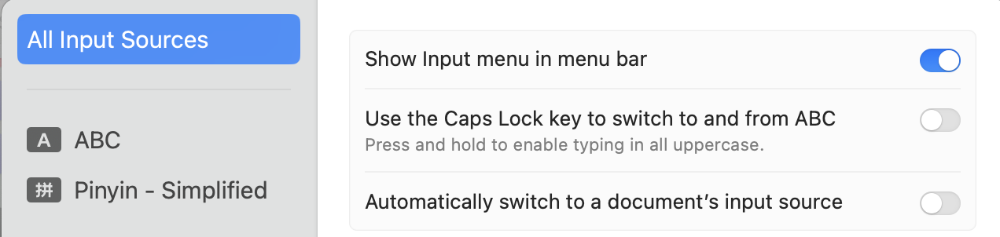
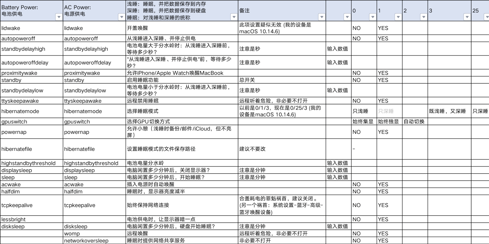
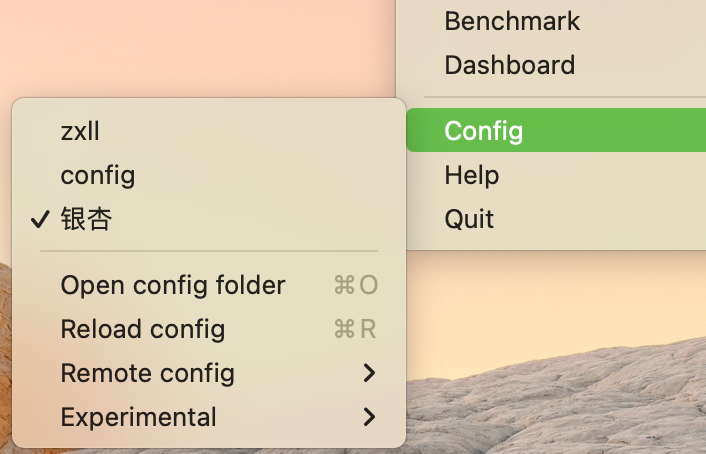

# mac小问题

## [Mds_Stores 进程高占用](https://www.easeus.com/computer-instruction/mds-store.html#temporarily_stop_and_restart_spotlight)
Are you wondering what Mds_Stores is? If you are not too tech-savvy, seeing such a massive CPU utilization on one process can be jarring. Let's know more about this software problem. 

The Mds_Stores is an in-built indexing process integrated into the Mac Spotlight Search. Here, the MDS stands for metadata server. The MDS tracks and maintains the data present on the Mac and is used by the macOS [Spotlight](https://en.wikipedia.org/wiki/Spotlight_\(software\)). It is the responsibility of Mds_Stores to maintain and compile the data that MDS collects to make Spotlight more efficient. 

Mds_Stores facilitates quick Spotlight search results. The recommendations you get when you type something into the Spotlight are due to the Mds_Stores. That makes it easier for you to complete the task.

1. [Reboot Your Mac](https://www.easeus.com/computer-instruction/mds-store.html#reboot_your_mac)
2. [Disable Spotlight](https://www.easeus.com/computer-instruction/mds-store.html#disable_spotlight)
3. [Temporarily Stop and Restart Spotlight](https://www.easeus.com/computer-instruction/mds-store.html#temporarily_stop_and_restart_spotlight)

## 输入法中英切换
`ctrl + space`是切换输入法，而中文输入法本身就能输入英文。（这种在输入法界面能看到还是中文输入法）；而英文输入法是`ABC`。

这个在windows上也是类似，shift是在中文输入法下切换中英文输入，而`ctrl + space`是切换输入法，也就是说，如果切换到英文输入法，一般是没法再通过shift来切换回中文输入，这样就造成了割裂。

mac下的大写键就是类似windows的shift键，但是需要关上下图中的`use Caps Lock key to switch to and from ABC`，因为他坚固两个功能就会混乱，比如在中文输入法下，他是切中文输入法下的英文还是切换回`ABC`呢？


## remove rosetta2
- [uninstall-rosetta-2](https://iboysoft.com/tips/uninstall-rosetta-2.html)
1. Reboot your Mac into Recovery Mode by restarting your computer and holding down Command+R until the Apple logo appears on your screen.
2. Click Utilities > Terminal.
3. In the Terminal window, type in `csrutil disable` and press Enter.
4. Restart your Mac.


## system data large
一般30G以内是正常，超过的话，基本都是缓存或者其他系统未识别的文件太多。
### user library
这部分可以删除全部的cache，和部分的container，不要再finder去找，从设置-储存 - documents - file browser来看，因为这里是自动搜索按照大小排序的。
###  ios backup
mac在iphone或ipad插上数据线时会自动备份。如果不需要可以删除，或者移到apfs的硬盘。

### time machine snapshots
- [How to delete Time Machine snapshots on your Mac](https://www.macworld.com/article/231067/how-to-delete-time-machine-snapshots-on-your-mac.html)

```bash
tmutil listlocalsnapshots /

# 显示com.apple.TimeMachine.2018-03-01-002010.local，只需要下面这个指令加上这个日期
sudo tmutil deletelocalsnapshots 2018-03-01-002010
```
## 系统设置

### 默认字小

> 默认字太小，分辨率缩放之后字体模糊

这个问题我同样遇到了， 结论就是最好不调缩放比例。因为非整数缩放几乎无法避免变模糊的问题，因为渲染像素无法点对点显示，所以我尝试的解决方案是：
1. 缩放比例使用系统默认
2. 在设置-辅助功能-显示中，调大字体，menu bar size 选large；
3. 然后系统软件字体一般都会自动调大；未适配软件，如terminal，sublime等可以自行设置字体大小；
4. 设置-外观中，sidebar icon size选large
上述几点基本上跟缩放差不多，又保证了清晰度。

### mac和windows自动切换键鼠

> 

ShareMouse是一个不错的解决方案，尤其是mac和windows之间，可以使用mac的触控板，还不需要额外的设备（相比于logitech的Flow方案）

### mac取消自动备份iPhone
> [Disable automatic back up of your iOS devices](https://www.reddit.com/r/mac/?f=flair_name%3A%22Discussion%22)
If you are synchronizing on a Mac:
1. Close Music on your Mac.
2. Launch Terminal
3. Type 
```bash
defaults write com.apple.AMPDevicesAgent.plist AutomaticDeviceBackupsDisabled -bool true
```
and press Enter.
4. If you want to re-enable automatic backups, type
```bash 
defaults write com.apple.AMPDevicesAgent.plist AutomaticDeviceBackupsDisabled -bool false
```
and press Enter.
4. Reboot your Mac.
In case you need to backup, you have to do it manually now: press the "Back Up Now" button of the iOS device in Finder.

# 软件

## deskflow
[deskflow](https://github.com/deskflow/deskflow/)
### deskflow无法连接
```bash
# deskflow-server 权限，就在app的contents里，对应的就是mac设置-network-firewall-options界面中的权限表。
sudo /usr/libexec/ApplicationFirewall/socketfilterfw --add /Applications/Deskflow.app/Contents/MacOS/deskflow-server
sudo /usr/libexec/ApplicationFirewall/socketfilterfw --unblockapp /Applications/Deskflow.app/Contents/MacOS/deskflow-server

# deskflow-client 权限
sudo /usr/libexec/ApplicationFirewall/socketfilterfw --add /Applications/Deskflow.app/Contents/MacOS/deskflow-client
sudo /usr/libexec/ApplicationFirewall/socketfilterfw --unblockapp /Applications/Deskflow.app/Contents/MacOS/deskflow-client

# 重启下server和client就可以了
```

### deskflow 配置
有时候可能会出现配置错误，比如mac端换了一个名字，就无法开启server了，是因为名称不一致，这时候找到两个配置文件：`~/Library/Deskflow/deskflow-server.conf`和`~/Library/Deskflow/Deskflow.conf`
windows就是`C:\ProgramData\Deskflow\deskflow-server.conf`

### deskflow 输入法语言bug
```bash
WARNING: current server language is not installed on client
```
目前只能是mac用英语的时候切过去可以。

 

```yaml
section: screens
	zx-lls-MacBook-Pro.local:
		halfDuplexCapsLock = false
		halfDuplexNumLock = false
		halfDuplexScrollLock = false
		xtestIsXineramaUnaware = false
		switchCorners = none
		switchCornerSize = 0
	zhengxu-work:
		halfDuplexCapsLock = false
		halfDuplexNumLock = false
		halfDuplexScrollLock = false
		xtestIsXineramaUnaware = false
		switchCorners = none
		switchCornerSize = 0
end

section: aliases
end

section: links
	zx-lls-MacBook-Pro.local:
		right = zhengxu-work
	zhengxu-work:
		left = zx-lls-MacBook-Pro.local
end
```

### 外接屏幕控制

#### 亮度控制
- [monitor control](https://github.com/MonitorControl/MonitorControl)

#### 开启HiDPi
- [M2 Macbook Pro外接2K显示器开启HiDPi](https://zhuanlan.zhihu.com/p/697043685)
**Github社区现有的两种为Mac开启HiDPi的工具存在问题：**

- [one-key-hidpi](https://link.zhihu.com/?target=https%3A//github.com/xzhih/one-key-hidpi) 提供的脚本不适用[M2芯片](https://zhida.zhihu.com/search?content_id=243028881&content_type=Article&match_order=1&q=M2%E8%8A%AF%E7%89%87&zhida_source=entity)，很多issue在讲这个问题
- [BetterDisplay](https://link.zhihu.com/?target=https%3A//github.com/waydabber/BetterDisplay) 虽然适用于[M芯片](https://zhida.zhihu.com/search?content_id=243028881&content_type=Article&match_order=1&q=M%E8%8A%AF%E7%89%87&zhida_source=entity)，但是它的原理是创建一个高分辨率镜像[虚拟显示器](https://zhida.zhihu.com/search?content_id=243028881&content_type=Article&match_order=1&q=%E8%99%9A%E6%8B%9F%E6%98%BE%E7%A4%BA%E5%99%A8&zhida_source=entity)。在我的使用中，会出现以下问题：（1）鼠标经常消失，需要在显示器点一下鼠标才会出现；（2）输入延迟，无论是键盘输入还是窗口拖拽，会有延迟和拖影（我一开始以为是Magic keyboard延迟或是显示器刷新率没设置对，后来发现是该软件的问题）

注意： [one-key-hidpi](https://link.zhihu.com/?target=https%3A//github.com/xzhih/one-key-hidpi) 现已解决此bug。


**官网**

* [Sublime](https://www.sublimetext.com)	        ---文本编辑器
* [localsend](https://localsend.org/)	        ---跨平台局域网文件传输
* [Itsycal](https://www.mowglii.com/itsycal/)               ---日期显示
* [Rectangle](https://rectangleapp.com)         ---窗口管理(现mac已集成)
* [FDM](https://www.freedownloadmanager.org)                  ---下载工具
* [Typaro](https://typora.io)               ---Markdown（不免费了，换mweb/vscode）
* [IINA](https://iina.io)                   ---视频播放器
* [Appcleaner](https://freemacsoft.net/appcleaner/)        ---软件卸载
* [f.lux](https://justgetflux.com)                    ---动态色温

* [Shadowsocks](https://github.com/shadowsocks/ShadowsocksX-NG)    ---代理（换ios的小火箭或clash verge 具体见小飞机部分）
* BackgroundMusic-调节声音

**App Store**

* HiddenBar         ---隐藏图标
* Unarchiver         ---解压工具
* BlackMagicDisk ---硬盘测速
* NewFileMenu    ---右键新建文件
* Cleaner Onelite  ---垃圾清理


### Edge卸载（大多Mac App完全卸载方式）

首先就是在Application文件夹中把Edge拖进Trash，然后删除其缓存、配置文件：

* ~/Library/Application Support/ 文件夹中找到并删除其中的 Microsoft Edge 文件夹
* ~/Library/Caches/ 文件夹中找到并删除其中的 Microsoft Edge 文件夹
* ~/Library/Saved Application State/ 文件夹中找到并删除其中的 com.microsoft.edgemac.savedState 文件夹
* ~/Library/WebKit/ 文件夹中找到并删除其中的 com.microsoft.edgemac 文件夹
* ~/Library/Preferences/ 文件夹中找到并删除其中的 com.microsoft.edgemac.plist 文件

- - - 
# Mac 快捷键
- - - -

`command + shift + . `       #显示隐藏文件

`command + shift +3`         # 全屏截图

`command + shift +4`         # 自由截图 改成 `command 4`

`command + shift +5`         # 全部截图录屏选项  改成 `command 5`

`Caps` # 换中英文

`Opt+S` # siri (改)

**`Opt+esc` # 读出选中词**

`Opt+shift+音量` # 精准调整音量

按住 `Opt` # 选中框

按住 `opt` #左右键是在pdf中回退跳转

按住`Opt` # 调整finder窗口大小为修改默认大小

在任务管理器中 `cmd+2` #打开cpu多核占用率窗口

`Cmd+M` ##最小化，区别于隐藏，这个用application window就可以找到，而`Cmd+H`隐藏可以被`Cmd+tab`找到

# Terminal
* 快捷键

`Tab`  #自动补全或查看shell命令

`Ctrl + u`        # 删除光标到行首
`Ctrl + k`      # 删除光标之前到行尾的字符

`Ctrl + a`      # 光标移动到行首(ahead)
`Ctrl + e`      # 光标移动到行尾(End)

`Ctrl + 右箭头`  # 光标向后移动一个字符位置

`Arrow up`  # 直接输入history里的指令

`ctrl+d`     #quit ssh
`ctrl+c`     #kill recent program

`ctrl+r`    # fzf 终端命令历史搜索

## mac系统环境变量
> Mac系统的环境变量，加载顺序为：
> /etc/profile
> /etc/paths 
> ~/.bash_profile 
> ~/.bash_login 
> ~/.profile 
> ~/.bashrc
> (etc目录下面的是系统级的配置，~目录下的是用户配置)
> /etc/profile和/etc/paths是系统级别的，系统启动就会加载，后面几个是当用户级的环境变量。后面3个按照从前往后的顺序读取.如果/.bash_profile文件存在，则后面的几个文件就会被忽略不读了;


## 终端中文支持
将下面几行代码加`.shellrc/.zshrc`。

但要注意的是，若有`ohmyzsh`，它会重置语言环境，所以需要将其添加在`source oh-my-zsh.sh`后。针对git中文乱码的情况，则需要`git config --global core.quotepath false`,关于git再单独一个文件中——`learn-code/learn-tools/learn-git.md`。

```shell
export LC_ALL=en_US.UTF-8  
export LANG=en_US.UTF-8
```

## mac terminal 标题
```shell
#加入.zshrc，取消ohmyzsh自动生成题目
DISABLE_AUTO_TITLE="true"
#再在terminal设置中window中设置显示项目
```

## mac terminal 取消login信息显示
```shell
touch ~/.hushlogin
```


## mac-terminal 指令
- [mac terminal command manual](https://www.dssw.co.uk/reference/)
### 内存
```shell
top -l 1 | head -n 10 | grep PhysMem  #查看mac内存占用
sudo purge          #mac清理RAM  
```

### 电源管理pmset
- `pmset -a`：调整任何条件下的睡眠计划
- `pmset -c`：调整外部供电的睡眠计划
- `pmset -b`：调整电池供电的睡眠计划
- `pmset -g`：查看计划

```bash
pmset -g custom	#显示电源设置
pmset -g log | egrep "\b(Sleep|Wake|DarkWake|Start)\s{2,}" # 查看睡眠唤醒log
sudo pmset -a tcpkeepalive 0  #关闭所有情况下睡眠是保持TCP链接的设置
man pmset

#查看电源设置的手册，比如下面这个：
	proximitywake - On supported systems, this option controls system wake from sleep based on proximity of devices using same 	iCloud id. (value = 0/1)
```


### 网络
```bash
netstat -an | grep 1080	 #查看端口号信息(lsof -i:80 也是看端口号)
>>> tcp6       0      0  ::1.1080          *.*             LISTEN     
>>> tcp4       0      0  127.0.0.1.1080    *.*             LISTEN 

```

#### mac defaults 指令
```
#finder显示隐藏文件
defaults write com.apple.finder AppleShowAllFiles -bool true
KillAll Finder

sudo scutil --set HostName zx #设置机器名，也就是@后的名字
defaults write com.apple.dock springboard-rows -int 7 #改launchpad图标
defaults write com.apple.dock springboard-columns -int 8
defaults write com.apple.dock ResetLaunchPad -bool TRUE
killall Dock

defaults write com.apple.dock showhidden -bool true #有隐藏窗口的图标变暗 
killall Dock

defaults write com.apple.dock persistent-apps -array-add '{"tile-type"="spacer-tile";}' #dock添加透明图标
defaults write com.apple.dock persistent-others -array-add '{tile-data={}; tile-type="spacer-tile";}' #dock堆栈区添加空白
killall Dock

#更改访达默认显示模式（不好使）    
defaults write com.apple.Finder FXPreferredViewStyle Nlsv
　　killall Finder
```

### latex
- [Texlive 和 mactex-no-gui](https://www.reddit.com/r/LaTeX/comments/1e5nyrv/differences_between_texlive_and_mactexnogui/?tl=zh-hans)
```shell
brew install --cask mactex-no-gui

## sudo tlmgr repository set http://mirror.hust.edu.cn/CTAN/systems/texlive/tlnet #latex包设置镜像

## tlmgr update --self #更新tlmgr
```

### 链接动态库！
```shell
man ln
#得到下面描述 ========
  指令名称 : ln
  使用权限 : 所有使用者
  使用方式 : ln [options] source dist，其中 option 的格式为 :
  [-bdfinsvF] [-S backup-suffix] [-V {numbered,existing,simple}]
  [--help] [--version] [--]
  说明 : Linux/Unix 档案系统中，有所谓的连结(link)，我们可以将其视为档案的别名，而连结又可分为两种 : 硬连结(hard link)与软连结(symbolic link)，硬连结的意思是一个档案可以有多个名称，而软连结的方式则是产生一个特殊的档案，该档案的内容是指向另一个档案的位置。硬连结是存在同一个档 案系统中，而软连结却可以跨越不同的档案系统。
  ln source dist 是产生一个连结(dist)到 source，至于使用硬连结或软链结则由参数决定。
  不论是硬连结或软链结都不会将原本的档案复制一份，只会占用非常少量的磁碟空间。
  -f : 链结时先将与 dist 同档名的档案删除
  -d : 允许系统管理者硬链结自己的目录
  -i : 在删除与 dist 同档名的档案时先进行询问
  -n : 在进行软连结时，将 dist 视为一般的档案
  -s : 进行软链结(symbolic link)
  -v : 在连结之前显示其档名
  -b : 将在链结时会被覆写或删除的档案进行备份
  -S SUFFIX : 将备份的档案都加上 SUFFIX 的字尾
  -V METHOD : 指定备份的方式
  --help : 显示辅助说明
  --version : 显示版本


#=================一个案例==================
#安装
cd atomsk	#进入安装文件夹
sudo zsh install.sh		#运行安装程序
>>> The program was successfuly installed in /usr/local/bin/
    To run it, enter 'atomsk' in a terminal.

#试运行（失败）
atomsk		#运行一下 
>>> dyld: Library not loaded: /usr/local/gfortran/lib/libquadmath.0.dylib

#调试（链接动态库）
gfortran --print-file-name libquadmath.0.dylib	#看一下现在这个动态库文件位置
>>> /usr/local/Cellar/gcc/9.3.0/lib/gcc/9/gcc/x86_64-apple-darwin19/9.3.0/../../../libquadmath.0.dylib

which gcc   
>>> /usr/bin/gcc

which gfortran		#看一下全局变量被链接到哪个位置
>>> /usr/local/bin/gfortran

ln /usr/local/Cellar/gcc/9.3.0/lib/gcc/9/libquadmath.0.dylib /usr/local/lib/libquadmath.0.dylib			#把动态库连接到这个位置

#再次试运行（成功）
atomsk --create fcc 4.02 Al aluminium.xsf	#成功啦！
>>> Creating system:
..> Fcc Al oriented X=[100] Y=[010] Z=[001].
..> System was successfully created.
>>> Writing output file(s) (4 atoms):
..> Successfully wrote XSF file: aluminium.xsf
\o/ Program terminated successfully!
>>> Total time: 0.002 s.; CPU time: 0.002 s.
```

#### mac .net core 安装位置
```shell
The following frameworks were found:
      5.0.2 at [/usr/local/share/dotnet/shared/Microsoft.AspNetCore.App]
```


### 终端软件管理
homebrew，curl，wget，pip，conda，yum，scoop……均是包管理器，也就是app store➕迅雷

决定Mac使用Homebrew+pip3来管理terminal的包下载。（pip已集成在python3里，叫pip3）

### Oh my zsh

安装插件步骤
```bash
 # 1. 终端输入
 vim ~/.zshrc

# 2. 找到 plugins=(zsh-syntax-highlighting)    #（）里增加要安装的插件

# 3. 终端输入: clone 与 $ 之间的网址就是安装文件GitHub网址，上述命令指：下载到~/.oh-my-zsh/custom}/plugins/zsh-syntax-highlighting 文件夹
git clone https://github.com/zsh-users/zsh-syntax-highlighting.git ${ZSH_CUSTOM:-~/.oh-my-zsh/custom}/plugins/zsh-syntax-highlighting

# 4. 终端输入 更新配置文件
source ~/.zshrc

# 5. 重启终端
```


[**oh my zsh 有很多内置插件但默认不打开**](https://hufangyun.com/2017/zsh-plugin/)： `cd ~/.oh-my-zsh/plugins` 就可以看下，然后比如使用sublime，就在.zshrc中的plugins=（）中加入sublime，就可以在终端使用如下代码了：

```shell
omz update #更新ohmyzsh 
st filename	#用sublime 打开文件
stt		#用sublime打开当前文件夹


# 还有很多不错的内置插件，比如可以代替autojump的‘z’
z	# 首先你需要进入某个文件夹，然后z会记住，下次就不用cd了，直接z 主要是不需要写路径
>>> 4          /Users/zxll/Desktop/code/lammps/friction
>>> 4          /Users/zxll/Desktop/code/lammps/mechanical
>>> 4          /Users/zxll/Desktop/code/lammps/run
>>> 4          /Users/zxll/Desktop/code/lammps/thermal
>>> 4          /Users/zxll/Desktop/code/python/pandas
>>> 4          /Users/zxll/Desktop/write/markdown/computer
>>> 4          /Users/zxll/Downloads

```

### Homebrew
mac上终端设置代理然后运行下面的install.sh（因为我用的是beta版系统，有时识别不出来就报错，所以把那个linux和mac的if语句删掉了，不判断直接执行）
**文件改动见`/Users/zxll/Documents/zx-profiles/teminal/homebrew改.sh`**
包下载位置一般在：**/Users/zxll/Library/Caches/Homebrew/downloads**

```shell
brew list #列出已安装的软件
brew outdated #查看哪些需要更新
brew update #更新brew
brew update-reset #“重装homebrew”
brew home #用浏览器打开brew的官方网站
brew info #显示软件信息brew deps #显示包依赖
brew upgrade #更新所有
brew upgrade  [Name] #更新指定包
brew cleanup #清理所有包的旧版本
brew cleanup  [Name] #清理指定包的旧版本
brew cleanup -n #查看可清理的旧版本包，不执行实际操作
brew deps --installed --tree #查看所有依赖关系
```

[brew清华源](https://mirrors.tuna.tsinghua.edu.cn/help/homebrew/)
[brew阿里源](https://developer.aliyun.com/mirror/homebrew/)
```shell
# brew 程序本身，Homebrew/Linuxbrew 相同
git -C "$(brew --repo)" remote set-url origin https://mirrors.tuna.tsinghua.edu.cn/git/homebrew/brew.git

# 以下针对 mac OS 系统上的 Homebrew
git -C "$(brew --repo homebrew/core)" remote set-url origin https://mirrors.tuna.tsinghua.edu.cn/git/homebrew/homebrew-core.git
git -C "$(brew --repo homebrew/cask)" remote set-url origin https://mirrors.tuna.tsinghua.edu.cn/git/homebrew/homebrew-cask.git
git -C "$(brew --repo homebrew/cask-fonts)" remote set-url origin https://mirrors.tuna.tsinghua.edu.cn/git/homebrew/homebrew-cask-fonts.git
git -C "$(brew --repo homebrew/cask-drivers)" remote set-url origin https://mirrors.tuna.tsinghua.edu.cn/git/homebrew/homebrew-cask-drivers.git
```

brew 设置原有源：

```shell
# brew 程序本身，Homebrew/Linuxbrew 相同
git -C "$(brew --repo)" remote set-url origin https://github.com/Homebrew/brew.git

# 以下针对 mac OS 系统上的 Homebrew
git -C "$(brew --repo homebrew/core)" remote set-url origin https://github.com/Homebrew/homebrew-core.git
git -C "$(brew --repo homebrew/cask)" remote set-url origin https://github.com/Homebrew/homebrew-cask.git
git -C "$(brew --repo homebrew/cask-fonts)" remote set-url origin https://github.com/Homebrew/homebrew-cask-fonts.git
git -C "$(brew --repo homebrew/cask-drivers)" remote set-url origin https://github.com/Homebrew/homebrew-cask-drivers.git
```

### pdf2zh
- [github-PDFMathTranslate](https://github.com/Byaidu/PDFMathTranslate)
```bash
pip install pdf2zh
```

### yt-dlp

```bash
# https://github.com/yt-dlp/yt-dlp
pip install yt-dlp

# yt-dlp下载视频
yt-dlp youtube_url

# 下载的视频转换为h264编码(一般为vp9)，音频转换为aac(一般为opus), 封装为mp4(一般为mkv)
ffmpeg -i input.mkv -c:v libx264 -c:a aac output.mp4

# 只下载翻译的英文字幕，并转换为srt格式
yt-dlp --skip-download --write-auto-subs --sub-langs en --convert-sub srt https://www.youtube.com/watch?v=6vnU02PKkEs&t=2732s

# 只下载翻译的中文字幕，并转换为srt格式
yt-dlp --skip-download --write-auto-subs --sub-langs zh-Hans-en --convert-sub srt https://www.youtube.com/watch?v=6vnU02PKkEs&t=2732s
```

### pandoc
```bash
brew install pandoc

# 查看字体
fc-list :lang=zh

# mac
pandoc --pdf-engine=xelatex -V CJKmainfont="PingFang SC" input.md -o output.pdf

#windows
pandoc --pdf-engine=xelatex -V CJKmainfont="Microsoft YaHei" input.md -o output.pdf
```


### Neovim
[mac vim 配置](https://www.jianshu.com/p/923aec861af3)
```shell
#安装
brew install neovim
pip3 install neovim --upgrade
```

### ipython
```bash
import os
print (os.path.abspath('.'))      #查看python读取路径

~/.ipython/profile_default/startup  #创建一个自启默认设置https://www.pypandas.cn/docs/user_guide/options.html#overview

# pandas 多核运行 https://github.com/nalepae/pandarallel
df.parallel_apply(func) #加上这个使得命令利用多核
```

### “小飞机”
具体见小飞机笔记。
#### shadowsocks
> [shadowsocks-electron(ALL-platform)](https://github.com/nojsja/shadowsocks-electron)
* socket的pac文件

* clashx的rule(yaml文件)


> 配置文件需要放置在 $HOME/.config/clash/*.yaml
> 这份文件是clashX的基础配置文件，请尽量新建配置文件进行修改。
> 只有这份文件的端口设置会随ClashX启动生效
> 如果您不知道如何操作，请参阅[官方Github文档](https://github.com/Dreamacro/clash/blob/dev/README.md)


### sublime

sublime 快捷键：

* `cmd+c/v/x` 复制/粘贴/剪切 某行（不需要选中）
* `cmd+d/u`   选词/撤销上个选词（选中一个词后，多光标选同样word）
* `cmd+/`     注释本行
* `cmd+[/]`   缩进与取消缩进（选中多行可以同时）
* `cmd+k`     打开/关闭侧边文件栏
* `cmd+F`     搜索
* `cmd+G`     搜索中为搜索下一个
* `opt+Enter` 搜索中搜索并选中全部
* opt+'click'  进入列选择模式
* `cmd+Arrow` 去最上或最下
* `F12`/`cmd+opt+Arrow down`     跳转定义

sublime插件：

* Package Control
* ConvertToUTF8
* SideBar Enhancements
* Anaconda
* Autopep8
* sublimelinter
* PackageDev
* latextools

[latextools](https://latextools.readthedocs.io/en/latest/install/)
* [sublime 多重选择]((null))
* [sublime anaconda 自动补全python库]((null))
* [配置sublime-python1](https://www.jianshu.com/p/193d0f9a6190)
* [配置sublime-python2](https://blog.csdn.net/DawnRanger/article/details/48575507)
* [sublimelinter](http://www.sublimelinter.com/en/stable/)
* [sublime自定义高亮](http://blog.lessfun.com/blog/2016/10/28/make-a-custom-syntax-highlighting-for-sublime-text/)
* [sublime snippets and completions](https://blog.csdn.net/varalpha/article/details/105128139)
* [sublime自定义语法官方文档](https://www.sublimetext.com/docs/3/scope_naming.html)

In Sublime , we can create our own language highlight document named “.sublime-syntax”,which saved in package/user folder.
**其中match语法为正则表达式**

### vscode
#### 主题随主题更改
`setting` 搜索 `auto detect color scheme`
再设置好`light color scheme` 和 `dark color scheme`

#### vscode快捷键
* **`cmd+c/v/x` 复制/粘贴/剪切 某行（不需要选中）**
* **`cmd+d/u`   选词/撤销上个选词（选中一个词后，多光标选同样word）**
* **`cmd+/`       注释本行**
* **`cmd+[/]`   缩进与取消缩进（选中多行可以同时）**
* **`cmd+B`      打开/关闭侧边文件栏**
* **`ctrl+B`    运行脚本**
* **`cmd+F`     搜索**
* **`cmd+R`     打开最近**
* **`cmd+T`     打开下面分割的终端**
* **`cmd+J`     打开控制台**
* **`cmd+P`     打开文件**
* **`cmd+G`     搜索中为搜索下一个**
* **`opt+Enter` 搜索中搜索并选中全部**
* **opt+shift+'click'  进入列选择模式**
* **`cmd+Arrow` 去最上或最下**
* **`cmd+E`/`cmd+opt+Arrow down`  跳转定义**


# zx mac 新机设置流程

## system settings

### 字体大小
 - accessbility - display - text size 设为16pt（14寸）

### 三指拖移
 - system settings - accessbility - point control - tracpad options

### firewall
- system settings - network - firewall


## iCloud

- 登陆iCloud
- system settings - general - storage - store in iCloud （select all）
- App Store 安装所需
- 登陆美区appstore，安装小飞机
- 小飞机改端口、改规则(conf)为黑名单，然后重新开关&更新一下。
- safari换成google


## 安装第三方非命令行软件

- vscode
- obisidian
- chatbox
- [AlDente](https://apphousekitchen.com/aldente-overview/pricing/): 按照设置关闭电池相关，并关上电池供电时屏幕亮度降低。
- sublime: 找到备份设置更改 sublime settings & 添加更改的breaker主题


## init shell cmd
terminal settings 加载 iCloud/github中的zxlldynamic.terminal文件，并设置为default
备份的.vimrc拷贝到

```bash
# 安装xcode clt
xcode-select --install

# 系统设置
defaults write com.apple.AMPDevicesAgent.plist AutomaticDeviceBackupsDisabled -bool true
sudo pmset -c tcpkeepalive 0
sudo pmset -b powernap 0

# 安装brew（国内）
# 从阿里云下载安装脚本并安装 Homebrew 
git clone https://mirrors.aliyun.com/homebrew/install.git brew-install
sh brew-install/install.sh 
rm -rf brew-install 
# 也可从 GitHub 获取官方安装脚本安装 Homebrew 
# /bin/bash -c "$(curl -fsSL https://raw.githubusercontent.com/Homebrew/install/HEAD/install.sh)"

# 临时替换homebrew源
export HOMEBREW_INSTALL_FROM_API=1 
export HOMEBREW_API_DOMAIN="https://mirrors.aliyun.com/homebrew-bottles/api"
export HOMEBREW_BREW_GIT_REMOTE="https://mirrors.aliyun.com/homebrew/brew.git"
export HOMEBREW_CORE_GIT_REMOTE="https://mirrors.aliyun.com/homebrew/homebrew-core.git"
export HOMEBREW_BOTTLE_DOMAIN="https://mirrors.aliyun.com/homebrew/homebrew-bottles"

brew update

# macOS 现在默认是zsh了
# brew install zsh
# chsh -s $(which zsh)

# 安装ohmyzsh
sh -c "$(curl -fsSL https://gitee.com/mirrors/oh-my-zsh/raw/master/tools/install.sh)"

export ALL_PROXY=socks5://127.0.0.1:7897
# 安装ohmyzsh插件
git clone https://github.com/zsh-users/zsh-syntax-highlighting.git ${ZSH_CUSTOM:-~/.oh-my-zsh/custom}/plugins/zsh-syntax-highlighting
git clone https://github.com/zsh-users/zsh-autosuggestions ${ZSH_CUSTOM:-~/.oh-my-zsh/custom}/plugins/zsh-autosuggestions
# 然后再在zshrc的plug中写上这俩的名字
unset ALL_PROXY


# zshrc 加入homebrew的环境变量
echo 'export PATH=/opt/homebrew/bin:$PATH' >> ~/.zshrc

## ============ 下面这些加入zshrc ============ ##

# Set homebrew mirror
# 自 brew 4.0.0 (2023 年 2 月 16 日) 起，HOMEBREW_INSTALL_FROM_API 会成为默认行为，无需设置。
# 大部分用户无需再克隆 homebrew-core 仓库，故无需设置 HOMEBREW_CORE_GIT_REMOTE 环境变量；
export HOMEBREW_INSTALL_FROM_API=1
export HOMEBREW_BREW_GIT_REMOTE="https://mirrors.ustc.edu.cn/brew.git"

export HOMEBREW_API_DOMAIN="https://mirrors.ustc.edu.cn/homebrew-bottles/api"
export HOMEBREW_BOTTLE_DOMAIN="https://mirrors.ustc.edu.cn/homebrew-bottles/"

export HOMEBREW_CORE_GIT_REMOTE="https://mirrors.ustc.edu.cn/homebrew-core.git"

## ============ 上面这些加入zshrc ============ ##
source ~/.zshrc

# 安装其他工具
brew install wget
brew install cmake
brew install tmux
brew install tree
brew install pandoc

brew install --cask docker
brew install kubernetes-cli
brew install --cask gcc-arm-embedded
brew install --cask monitorcontrol
brew install --cask mactex-no-gui
brew tap deskflow/homebrew-tap
brew install deskflow

brew install ffmpeg # 依赖太多，后期用可安装
brew install openocd
# brew install qt # 依赖太多，后期用可安装
# brew install rust
# brew install node # 依赖太多，后期用可安装
# brew install docker # 这个不是见learn-docker.md


# 安装python依赖（tcl-tk问题@8?）
brew install gdbm
brew install openssl@3
brew install xz
brew install sqlite
brew install tcl-tk

# 安装python虚拟环境
brew install pyenv

# pyenv settings, 这些放到zshrc中
echo 'export PYENV_ROOT="$HOME/.pyenv"' >> ~/.zshrc 
echo 'export PATH="$PYENV_ROOT/bin:$PATH" ' >> ~/.zshrc 
echo 'export PATH=$PYENV_ROOT/shims:$PATH' >> ~/.zshrc 
echo 'eval "$(pyenv init - zsh)"' >> ~/.zshrc 
source ~/.zshrc


# pyenv安装python
pyenv install -l
pyenv install 3.12.11
pyenv versions
pyenv global 3.12.11

# 设置pip国内代理
pip config set global.index-url https://pypi.tuna.tsinghua.edu.cn/simple/
pip config set install.trusted-host pypi.tuna.tsinghua.edu.cn

# 设置git账号密码https://docs.github.com/en/account-and-profile/how-tos/setting-up-and-managing-your-personal-account-on-github/managing-email-preferences/setting-your-commit-email-address#setting-your-commit-email-address-on-github

```

上述pip源指令等同于---下面内容写入该文件：`~/.config/pip/pip.conf`
```text
[global]
index-url = https://mirrors.aliyun.com/pypi/simple

[install]
trusted-host = mirrors.aliyun.com
```

