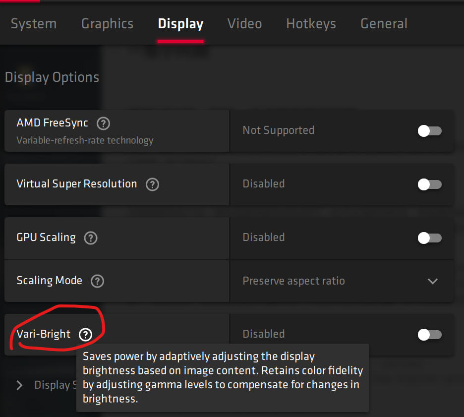
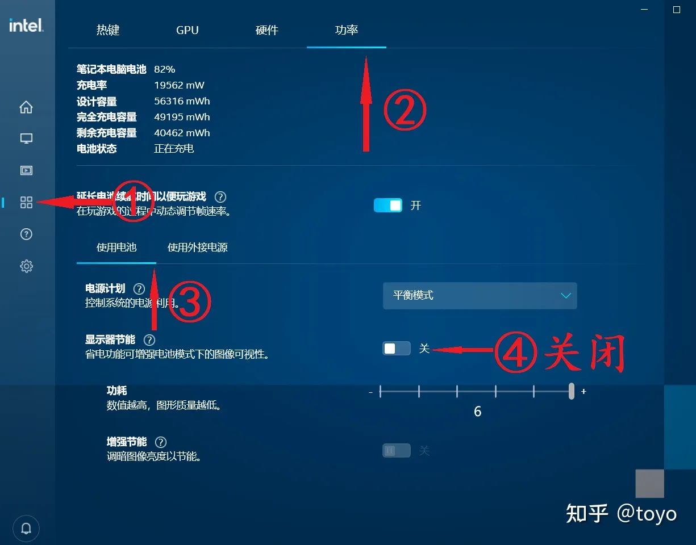

# Windows tips

[toc]


## 环境变量

重要系统变量含义和功能：

ComSpec 变量：规定 http://CMD.COM 文件的位置。运行 http://cmd.com 可直接打开 “命令提示符” 窗口。
NUMBER_OF_PROCESSORS 变量：代表用户电脑中处理器的数量。
OS 变量：表明用户的操作系统。
Path 变量：规定操作系统在指定的文件路径中查看可执行文件。
PathExt 变量：规定在 Path 变量中所指定的可执行文件的扩展名有哪些。
PROCESSOR_ARCHITECTURE 变量：表明用户处理器的架构。
PROCESSOR_IDENTIFIER 变量：表明用户处理器。
PROCESSOR_LEVEL 变量：表明用户处理器的等级。
PROCESSOR_REVISION 变量：表明用户处理器的版本。
TEMP、TMP 变量：规定系统运行或安装程序时用来存储临时文件的目录。
windir 变量：规定操作系统的系统目录的路径。


## 注册表

> 打开注册表：`win+R`输入 `regedit` 按回车键之后，打开注册表编辑器。
>
> 1. 添加鼠标右键新建项：对应**单击桌面空白处**，新建菜单中的项目对应注册表中的位置 ：
>
> HKEY_CURRENT_USER\Software\Microsoft\Windows\CurrentVersion\Explorer\Discardable\PostSetup\ShellNew
>
> 2. 鼠标单击桌面：**桌面空白处点击右键菜单**对应注册表位置：
>
> HKEY_CLASSES_ROOT\Directory\Background\shellex\ContextMenuHandlers
>
> 3. 右键单击文件：鼠标**右键文件**，弹出的菜单项对应注册表中的位置：
>
> HKEY_CLASSES_ROOT\*\shellex\ContextMenuHandlers
>
> 4. 单机文件夹：鼠标**右键文件夹**，弹出的菜单项对应注册表中的位置：
>
> HKEY_CLASSES_ROOT\Directory\shellex\ContextMenuHandlers
>
> 5. 鼠标单击ie浏览器里：鼠标**右键在IE浏览器**里，弹出的菜单明细对应注册表中的位置：
>
> HKEY_CURRENT_USER\Software\Microsoft\Internet Explorer\MenuExt

### win11修改任务栏大小

1. 打开运行，输入“regedit”来启动注册表编辑器；　
2. 定位到“HKEY_CURRENT_USER\Software\Microsoft\Windows\CurrentVersion\Explorer\Advanced\”
3. 新建一个DWORD值，将其命名为“TaskbarSi”；
4. 修改这个值的数据，可以将它修改为0、1和2，分别对应小、中、大尺寸。
5. 保存后关闭注册表编辑器，重启Windows资源管理器进程，即可看到变化了。

## Cmd

[CMD脚本](https://wsgzao.github.io/post/windows-batch/)、

[右键打开CMD](https://lanlan2017.github.io/blog/ed5250a2/)、

* [Start命令](https://docs.microsoft.com/en-us/windows-server/administration/windows-commands/start)、

 * 命令1 & 命令2 & 命令3 ... (无论前面命令是否故障,照样执行后面)   
 * 命令1 && 命令2 && 命令3....(仅当前面命令成功时,才执行后面)   
 * 命令1 || 命令2 || 命令3.... (仅当前面命令失败时.才执行后面)

```powershell
#文件操作
md test #新建文件夹
dir #显示目录
tree #显示目录结构

#网络
ping ip/域名
ping ip/DN -n 5 # 测试5次
tracert ip/DN #路由追踪

#进程管理
tasklist #查看当前进程
tasklist|findstr "9208" #查看进程号
start “” folder1\run.bat #运行
start cmd /k “cd folder1&&python run.py”
taskkill /im notepad.exe #结束进程，按名称
taskkill /pid 1234 #关闭 PID 为 1234 的进程

#服务管理
net start #显示当前正在运行的服务
net start sshd   #开启ssh
net stop 名字 #停止此服务
netstat -aon|findstr "1080" #查看端口占用情况

#查看系统信息
wmic memorychip list brief #看内存
```


## powershell

### powershell配置指令

```powershell

##==================使用powershell模块===========================
PS C:\Users\zxll> Import-Module PackageManagement
Import-Module : 无法加载文件 C:\Program Files\WindowsPowerShell\Modules\PackageManagement
\1.4.7\PackageManagement.psm1，因为在此系统上禁止运行脚本。有关详细信息，请参阅 https:/go
.microsoft.com/fwlink/?LinkID=135170 中的 about_Execution_Policies。
所在位置 行:1 字符: 1
+ Import-Module PackageManagement
+ ~~~~~~~~~~~~~~~~~~~~~~~~~~~~~~~
    + CategoryInfo          : SecurityError: (:) [Import-Module]，PSSecurityException
    + FullyQualifiedErrorId : UnauthorizedAccess,Microsoft.PowerShell.Commands.ImportMod
   uleCommand
PS C:\Users\zxll> get-executionpolicy
Restricted
PS C:\Users\zxll> set-executionpolicy remotesigned
PS C:\Users\zxll> get-executionpolicy
RemoteSigned

###库操作
Install-PackageProvider -Name NuGet -Force
Install-Module -Name PowerShellGet -Force
Update-Module
Get-InstalledModule

Install-Module -Name PSReadLine -AllowPrerelease -Force
Install-Module posh-git -Scope CurrentUser 

Install-Module oh-my-posh -Scope CurrentUser 
```


### 常用指令

```powershell
#找可执行文件的位置，类似Unix中的which或whereis
where.exe atomsk
C:\software\bin\atomsk
C:\software\bin\atomsk.exe


start . #用文件管理器打开当前文件夹（ii .也可以）
Get-Alias #查看现在有的指令别名

where.exe curl #类似which，查看命令的地址
--> C:\Windows\System32\curl.exe

#这个一次性的，需要加入$profile才永久生效
New-Alias #创建新别名“”（或者Set-Alias）
Remove-Item alias:\curl #删除"curl"这个别名
```
### windows 终端设置代理

```shell
# cmd
set http_proxy=http://127.0.0.1:代理服务器本地端口号
set https_proxy=http://127.0.0.1:代理服务器本地端口号

#powershell
$Env:http_proxy="http://127.0.0.1:代理服务器本地端口号"
$Env:https_proxy="http://127.0.0.1:代理服务器本地端口号"

$Env:ALL_proxy="http://127.0.0.1:代理服务器本地端口号"

#git代理 （因为大部分终端网络问题都是github的问题，所以这种情况可以只设置git代理）
git config --global https.proxy http://127.0.0.1:代理服务器本地端口号
git config --global https.proxy https://127.0.0.1:代理服务器本地端口号

#git取消代理
git config --global --unset http.proxy
git config --global --unset https.proxy
```


### mklink

mklink，有点像Unix中的ln指令，又有些不同，它和Windows下的快捷方式也有些不同

|                  | 不带参数      | `/D` 参数              | `/H` 参数      | `J` 参数               |
| :--------------- | :------------ | :--------------------- | :------------- | :--------------------- |
| 中文名称         | 符号链接      | 符号链接               | 硬链接         | 联接                   |
| 英文名称         | Symbolic Link | Symbolic Link          | Hard Link      | Junction               |
| 作用对象         | 文件          | 目录                   | 文件           | 目录                   |
| 是否一定指向路径 | 否            | 否                     | 否             | 是                     |
| `dir` 类型       | `SYMLINK`     | `SYMLINK`              | 无特殊显示     | `JUNCTION`             |
| 资源管理器类型   | `.symlink`    | 文件夹                 | 无特殊显示     | 文件夹                 |
| 资源管理器图标   | 快捷方式      | 文件夹快捷方式         | 无特殊显示     | 文件夹快捷方式         |
| 修改同步         | 是            | 是                     | 是             | 是                     |
| 删除同步         | 否            | 否                     | 否             | 否                     |
| 彻底删除源       | 删除源路径    | 删除源路径             | 删除所有硬链接 | 删除源路径             |
| 引用错误报错     | 无            | 引用了一个不可用的位置 | -              | 引用了一个不可用的位置 |

```powershell
mklink source_link.txt source.txt		#为文件创建符号链接
mklink /D source_link source			#为文件夹创建符号链接

#下面这几步让Ubuntu和powershell都可以使用atomsk指令，且只需要将bin文件夹加入系统环境变量即可

# mklink /H bin\atomsk atomsk-win\atomsk.exe	#这是用cmd，用powershell或者wsl使用下面指令 
cmd.exe /c mklink /H 'bin\atomsk' 'atomsk-win\atomsk.exe'	#为文件创建硬链接
cmd.exe /c mklink /H 'bin\atomsk.exe' 'atomsk-win\atomsk.exe'
cmd.exe /c mklink /H 'bin\cmake.exe' 'c-compiler\cmake\bin\cmake.exe'

cmd.exe /c mklink /H 'bin\vim.exe' 'Vim\vim82\vim.exe'	#windows下使用vim，但实际上Windows下vim不需要加入环境变量，因为它在windows文件夹下创建了一个vim.bat，用来启动vim
```


### 网络指令

```powershell
ssh：（用管理员打开powershell）
net start sshd   #开启ssh
Get-NetFirewallRule -Name *ssh*   #查看防火墙

# (管理员打开powershell输入这个命令)把默认cmd改成powershell
New-ItemProperty -Path "HKLM:\SOFTWARE\OpenSSH" -Name DefaultShell -Value "C:\Windows\System32\WindowsPowerShell\v1.0\powershell.exe" -PropertyType String -Force 

#查看端口占用情况
netstat -aon|findstr "1080"
>>> TCP  [::1]:1575     [::1]:1080       ESTABLISHED     9208

tasklist|findstr "9208"
>>> TCP  [::1]:1575     [::1]:1080       ESTABLISHED     9208
```

* [配置ssh：](https://www.cnblogs.com/sparkdev/p/10166061.html)、

### 磁盘管理

#### [Diskpart](https://docs.microsoft.com/en-us/windows-server/administration/windows-commands/diskpart) : 

```powershell
list disk
list partition
list volume
list vdisk

select disk
select partition
select vdisk
select volume

assign letter=e
```

#### Winfr [命令](https://support.microsoft.com/en-us/windows/recover-lost-files-on-windows-10-61f5b28a-f5b8-3cc2-0f8e-a63cb4e1d4c4)：

> 1. If necessary, [download and launch the app](https://www.microsoft.com/store/r/9N26S50LN705) from the Microsoft Store.
> 2. Press the Windows key, enter **Windows File Recovery** in the search box, and then select **Windows File Recovery.**
> 3. When you are prompted to allow the app to make changes to your device, select **Yes**.
> 4. In the **Command Prompt** window, enter the command in the following format:

```powershell
winfr source-drive: destination-drive: [/switches]
```


##### Default mode examples

Recover a specific file from your C: drive to the recovery folder on an E: drive：

```powershell
winfr C: E: /n \Users\<username>\Documents\QuarterlyStatement.docx
```


Recover jpeg and png photos from your Pictures folder to the recovery folder on an E: drive：

```powershell
winfr C: E: /n \Users\<username>\Pictures\*.JPEG /n \Users\<username>\Pictures\*.PNG
```


Recover your Documents folder from your C: drive to the recovery folder on an E: drive.

```powershell
winfr C: E: /n \Users\<username>\Documents\
```

Don’t forget the backslash (\) at the end of the folder.

##### Segment mode examples (/r)

Recover PDF and Word files from your C: drive to the recovery folder on an E: drive.
```powershell
winfr C: E: /r /n *.pdf /n *.docx
```

Recover any file with the string "invoice" in the filename by using wildcard characters.
```powershell
winfr C: E: /r /n *invoice*
```

##### Signature mode examples (/x)**

When using signature mode, it's helpful to first see the supported extension groups and corresponding file types.
```powershell
winfr /#
```

Recover JPEG (jpg, jpeg, jpe, jif, jfif, jfi) and PNG photos from your C: drive to the recovery folder on an E: drive.
```powershell
winfr C: E: /x /y:JPEG,PNG
```

Recover ZIP files (zip, docx, xlsx, ptpx, and so on) from your C: drive to the recovery folder on an E: drive.

```powershell
winfr C: E:\RecoveryTest /x /y:ZIP
```

1. When you are prompted for confirmation to continue, enter **Y** to start the recovery operation.

   Depending on the size of your source drive, this may take a while.

   To stop the recovery process, press Ctrl+C.

#### fsutil [指令](https://docs.microsoft.com/zh-cn/windows-server/administration/windows-commands/fsutil)：


#### chkdsk [指令](https://docs.microsoft.com/zh-cn/windows-server/administration/windows-commands/chkdsk)：

检查卷的文件系统和文件系统元数据，以查找逻辑错误和物理错误。 如果在没有参数的情况下使用， **chkdsk** 只显示卷的状态，并且不会修复任何错误。 如果与 **/f**、 **/r**、 **/x**或 **/b** 参数一起使用，则会修复卷上的错误。

## Linux on Win

以GNU套件为主的Liunx编程环境，在Windows上实现主要有四种方式：**虚拟机、双系统、mingw 和 WSL**。而只要不是重度使用，在2020年强烈推荐**mingw +  WSL** 方案。

1. 简单编译c++等c系语言、调试Windows下C系项目 均可以用mingw。

2. 而中度使用Linux系统命令行、Linux非图形界面app调试、跨平台共享文件等，WSL是最佳选择。

### msys2与mingw64:

[windows上msys2配置及填坑](https://hustlei.github.io/2018/11/msys2-for-win.html)

```powershell
clang++ -O3 -target x86_64-pc-windows-gnu for.cpp -o for.exe
```


#### [wget](https://eternallybored.org/misc/wget/) on Win

#### [git](https://git-scm.com/downloads) on Win
[安装git：](https://git-scm.com/download/win)、
[git 原理及教程（官方）](https://git-scm.com/book/zh/v2)、

#### [vim](https://www.vim.org/) on Win
[配置vim：](https://segmentfault.com/a/1190000019360991)、

### [WSL](https://docs.microsoft.com/zh-cn/windows/wsl/compare-versions)

安装：
1. 打开windows功能 --- 打开 WSL(Linux子系统) 和 虚拟化系统 功能。

2. 如果有小飞机就加上 `--web-download`,这会在github下载而不是微软商店。
```powershell
wsl --update --web-download
wsl --set-version Ubuntu 2 #将Ubuntu虚拟内核换成WSL2版本
wsl -l -v #查看现有的wsl
wsl --install -d Ubuntu-24.04 --web-download
```

3. wsl网络问题
在用户目录 %USERPROFILE% 下面创建一个配置文件 .wslconfig，写入以下内容：
```bash
[experimental]
networkingMode=mirrored
dnsTunneling=true
firewall=true
autoProxy=true
```
然后就可以在wsl中输入以下指令可使用windows代理：(7890换成自己小飞机的端口号)
```bash
export ALL_PROXY=socks5://127.0.0.1:7890
```

4. 常用指令
```powershell
wslconfig /list #查看默认的wsl
wsl #进入默认的wsl
wslconfig /setdefault Ubuntu #修改"Ubuntu"为默认的wsl
wsl —shutdown #关闭WSL中的Linux内核
```
#### wsl 解决ls文件夹颜色
```powershell
#修改wsl里面查看windows磁盘文件的颜色
dircolors -p > $HOME/.dircolors

vim $HOME/.dircolors
#将 STICKY_OTHER_WRITABLE 后面的数字改成02;32
#将 OTHER_WRITABLE 后面的数字改成01;34

#然后在$HOME/.bashrc(如果用zsh, $HOME/.zshrc)后面添加:
eval $(dircolors -b $HOME/.dircolors)
```

## 动态库

[windows动态库位置](https://www.cnblogs.com/tocy/p/windows_dll_searth_path.html)

## 软件

[10个经验的国产软件](https://sspai.com/post/42153)

UWP软件：

- [ ] quicklook                        空格预览
- [ ] Windows Terminal        官方终端
- [ ] Ubuntu                            官方Linux虚拟机

官网下载：

- [ ] [geek](https://geekuninstaller.com/download)                                  卸载软件
- [ ] [windows File Recovery](https://www.microsoft.com/store/r/9N26S50LN705) 文件恢复（官方）/`winfr`
- [ ] [freefilesync](https://freefilesync.org/)                     本地同步文件
- [ ] [Rufus](https://rufus.ie/)                                启动盘（2020直接[Windows官网](https://go.microsoft.com/fwlink/?LinkId=691209)自动下载制作启动盘）
- [ ] [potplayer](https://potplayer.daum.net/)                         看视频
- [ ] [f.lux](https://justgetflux.com/)                                  调色温
- [ ] [sublime](https://www.sublimetext.com)                           文本编辑器
- [ ] [Typora](https://typora.io)                             Markdown
- [ ] [Bandzip](https://cn.bandisoft.com/bandizip/)                           解压缩软件
- [ ] [火绒](https://www.huorong.cn/)                                 杀毒软件（防流氓）
- [ ] [Listary](https://www.listary.com/)/everything         搜索
- [ ] [XMind](https://www.xmind.cn)                             思维导图
- [ ] [FDM](https://www.freedownloadmanager.org/zh/)                                下载


## 一些小问题


### 屏幕对比度、亮度、色域明显降低问题

这是一般显卡驱动的问题，AMD、intel都有此问题。显卡驱动一般都有亮度自动调节之类的这个选项，关了就可以。


#### AMD显卡



#### intel 显卡




这里我要多说几句，首先就是亮度自适应调节，本不应该影响色域，使屏幕明显颜色失真，所以这个技术很不合格。再就是强调一下时效性，截止到2021年Windows普遍存在这个问题，往往也和电源管理挂钩。

比如风扇转速的问题，屏幕显示的问题，最好在windows设置-显示中，把关于能效的管理策略取消，包括在高级电源管理设置中的诸多选项，可以自定义设置下相关问题，目前的这种“智能”，挺智障的，若真是笔记本电量不足，可以认为的调低电量、关下后台应用等。

### 输入法无法改中文标点

setting - time&language - Language&region - options - keyboard/Microsoft Pinyin - General ：关闭「Use English punctuations when in Chinese input mode」

### 不同外接屏幕无法记住设置的缩放系数

setting - System - Display - Scale 开启[自动scale，也就是关闭用户自己设置缩放系数]