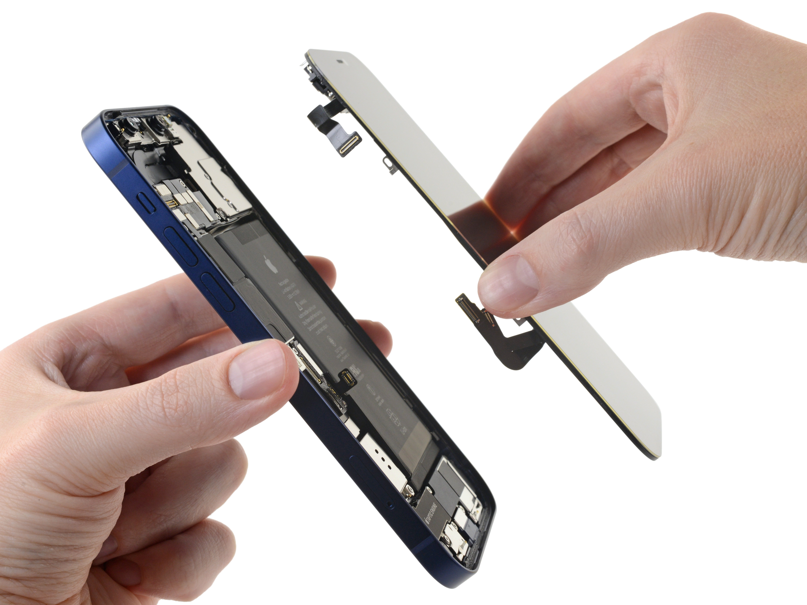
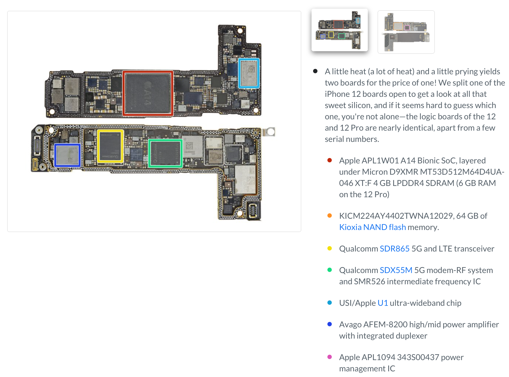

从18年开始对计算机感兴趣后，我就一直好奇这样一个问题：

**当我将手机开机，打开微信，打了一句话“计算机好好玩”，发了出去，这期间发生了什么？**

我从外到里，从里到外，抓耳挠腮，半夜三更的想搞清楚这个问题。如今已有3年之久，我终于敢说：我搞清楚了整个框架的60%以上！

（剩下的40%至少有一半是跟图像相关的，包括摄像头成像，计算摄影，以及GPU渲染管线等，虽都了解过程，但都停留在科普一级，等同于不懂。）

但若是说整个过程包含细节（具体的每一行代码的实现），可能我只理解5%？但即使这样，我可能超过了大多数计算机专业本科毕业生？好吧，不吹了来吧。

这篇文章会非常有意思，希望我的表达能力不要拖后腿，先看看手机（iPhone12为例，什么手机在这篇文章里都一样）都是有啥东西吧：

拆解图片来自：https://www.ifixit.com/Teardown/iPhone+12+and+12+Pro+Teardown/137669

首先屏幕拿下来，里面电池（化学相关，我忘得差不多了），震动马达，图像处理相关的，咱们就都不讲了，日后（等我搞清楚）再补上。

最最最核心的部分，就是这个占比很小的主板了。大家不要怕，这东西看着密密麻麻的，好像很复杂的样子，实际上，它就是超级复杂！

最密密麻麻的小圆点，是一圈焊点，这两块合起来，每个焊点都是一根线，有的线负责供电，有的线负责传数据。（注意这里说的数据，是“广义”的数据，就是指不是供电的，其中包括之后讲到的指令和“真正”的数据）

之所以把主板做成双层，肯定是为了减小主办的面积，毕竟手机里寸土寸金。其次密密麻麻的小方块，都是电容之类的，基本都是为了供电（稳压变压之类的），所以这种小电容拆掉几个手机一点毛病没有。

其次就是几个大方块了，就是上图中用框，框起来的东西。深红色的A14是重中之重。