# 关于接口那些事

我们日常生活中遇到的接口，到底有什么不用呢，我们购买手机电脑时应该如何选择呢？我看了不少资料，也看见不少科普文章，但多多少少说的没那么全面准确，里面有什么坑呢？为什么接口五花八门呢？接口和协议的关系又是怎样呢？我希望接下来能把这些说清楚。

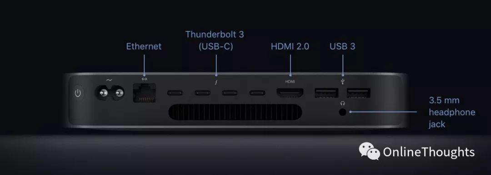

上图是苹果在2018年发布的Mac mini，此举一改苹果近年来疯狂砍接口的趋势，在这么小的机箱里，提供了丰富的接口，我选择它还有一个重要原因：它有着大一统的雷电三（thunderbolt3）！

但我们接下来直接聊它对小白太不友好，所以我想先花一些篇幅说明一下基本概念，然后再分析当下以及未来几年看到的接口（目前是2019年）。高手请跳过这一部分。

## 基本概念的说明

本文讲的接口指的是电子设备尤其是家用电脑的接口，但手机等消费电子也是通用的，因为协议统一是对行业发展极为有利的，这一准则也是让计算机行业如此蓬勃发展的原因之一。接口并不等同于协议，但又有着千丝万缕的关系。比如下图这个很常见的USB Type-A接口，支持的协议就有USB 3.1 gen2/USB 3.0/USB 2.0等，这几个协议也有向下兼容性，也就是支持3.0也支持2.0，反之则不行。

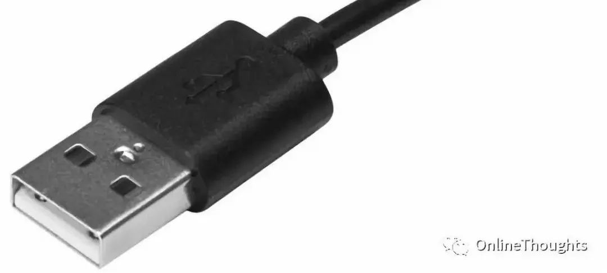

同一个协议也可以支持不同的接口，比如上述的USB 3.0协议还支持USB Type-C 接口，就是下图这种：

但既然这样，为什么还有这么多接口和协议呢，这就说来话长了，比如在十多年前，我们几乎没有什么外置硬盘，因为那个又大又重，所以，传输数据不需要很大的带宽，然而即使在十年前，720p和1080p的显示屏已经被大量使用，所以显示屏的接口和协议就必须要满足这些带宽和延迟。而主板内部的数据吞吐量即使在十年前也是巨大的，这些不同的需求，也就催生了不同接口和协议。

而现在，我们对于外部存储，甚至外接显卡的需求也与日俱增，接口的大带宽和低延迟带给我们无限的想象力，也会大大提升我们的工作效率比如我买一个笔记本，接上外接显卡就能拥有台式的游戏性能和机器学习性能，而拔下接口就有了便携性。

注：每一个协议其实都有复杂的算法许多关，于数据结构类型，以及转码编码的思考，这也是为什么看似小小的U盘都有主控芯片，我们在这里不涉及这方面内容，如果有机会，可以单独谈一下芯片普遍性的问题。我们把问题简单化，聚焦于接口和协议的组合带来的带宽提升等。本文数据来源于维基百科，Intel官方网站，及苹果官网。

## 接口与协议

###  数据接口：

**这类接口通常是接 硬盘等存放专门数据结构的数据的 设备。同时供电。**

- **USB Type-A**：最常见的接口，可能会被Type-C代替。注：1GB/s=8Gb/s。

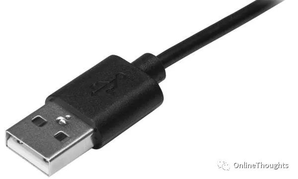

- **Micro-USB**：分为2.0和3.0，下图中左侧为2.0，也就是2010年左右的安卓手机接口；右侧为3.0，也就是我们目前买的机械移动硬盘的接口。这类接口协议和上述Type-A的是通用的，顾名思义，2.0就是指兼容USB2.0协议，3.0就是指兼容USB3.0协议，也向下兼容2.0。

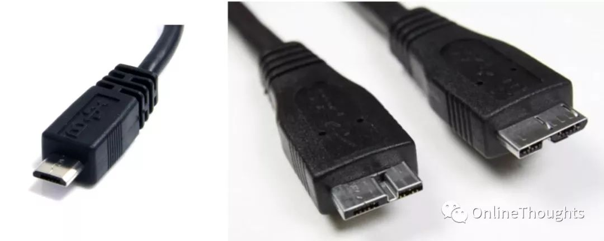

- **USB Type-C**：这就是“未来”，支持的协议太多太杂，留到最后讲，模样见下图：

### 音视频接口：

**这类就是用来连接显示器的，一般不供电。**

- **VGA**：模拟信号，马上被淘汰但是在老设备上还能看见。

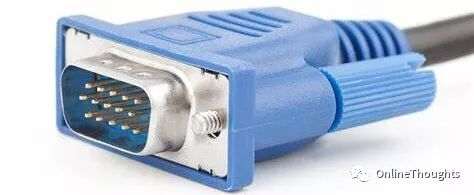

- **HDMI**：目前在显示屏接口里算是最普遍的，电视也大都配有，当然还有Micro-HDMI和Mini-HDMI，它们支持的协议是通用，接口形式大小有别。

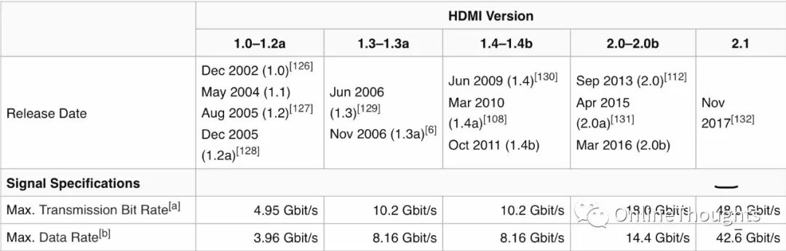

- **DP（DisplayPort）**：同样有Micro-DP接口，下图中大的为DP，小的为Micro-DP。

  

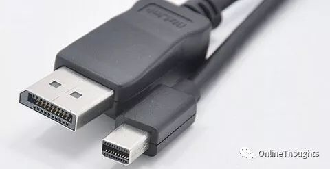

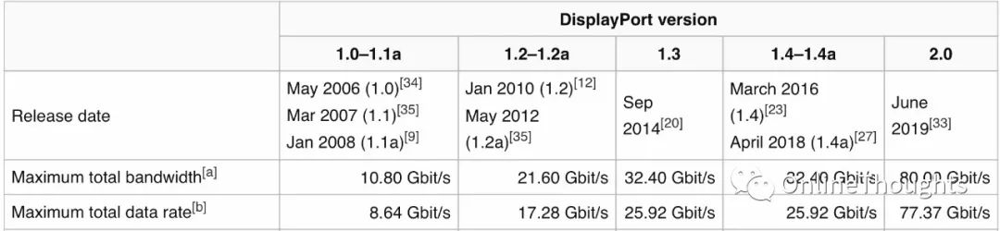

### 主板内部接口：

**快到没朋友，当然接口形式也不是设计来方便插拔的**

- **PCIe接口**：最大的特点就是支持“并联”，有x1/x2/x4/x8/x16几种规格。

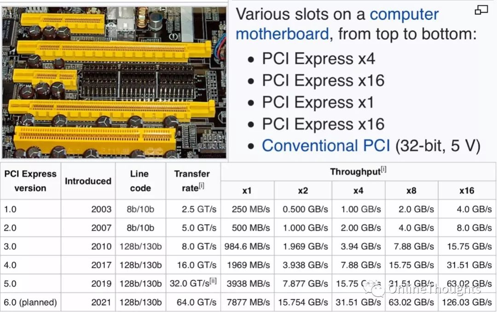

- **SATA接口**：即机械硬盘接口，也有部分固态硬盘使用sata接口，目前基本都是3.0协议。

- **M.2 接口**：这个基本是固态硬盘的专用接口，协议有两种：NGFF和NVME，其中NGFF是转接SATA3.0，而NVME是转接PCIe3.0×4，理论速率就不用赘述了。注：固态硬盘的速度和主控芯片，颗粒类型(MLC，TLC，QLC……)有关，尤其是NVME协议的硬盘，目前来讲，接口就不是瓶颈了。

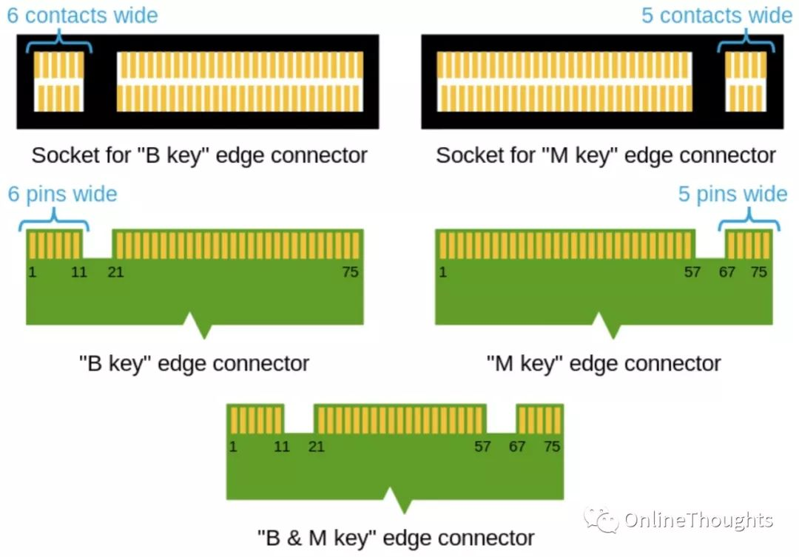

## USB Type-C：外部接口的大一统时代要到了

这个接口既支持USB3.1 gen2，当然也向下兼容USB3.0及2.0协议，还可以支持DP1.4协议，还可以支持PD充电，还支持PCIe3.0×4及PCIe3.0×2协议。而把这些统一起来的就是雷电三协议，所谓协议，落实到硬件上便是主控芯片，雷电三的主控芯片的功能就是实现这些协议的互相转换。理论速度能达到40Gb/s。

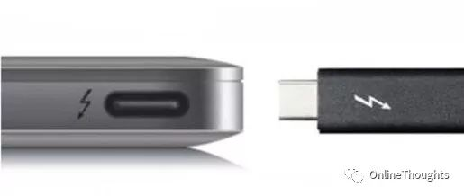

那现在是时候研究一下开篇的Mac mini了，四个雷电三，一个千兆网口，一个HDMI 2.0，两个USB 3.0，这样就完了？事情没这么简单。我们来看一下Ifixit官网的拆解图：

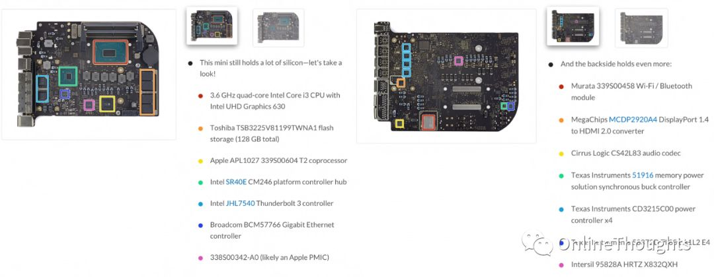

CPU是i7 8700，我们 查阅Intel官网资料可以得知(见下图)，直连CPU(也就是所谓的北桥，现代CPU都把北桥和内存控制器等集成在了CPU内部)的PCIe总线只有16条，而留给南桥控制器的PCIe总线只有四条，USB3.0，网卡走的是南桥，而NVME的SSD，显卡，雷电三直接连CPU。一算便知——4×4＝16(一个雷电三是PCIe3.0×4，而CPU只支持16条，SSD和显卡还需要)，四个“满血”的雷电三是不可能实现的。

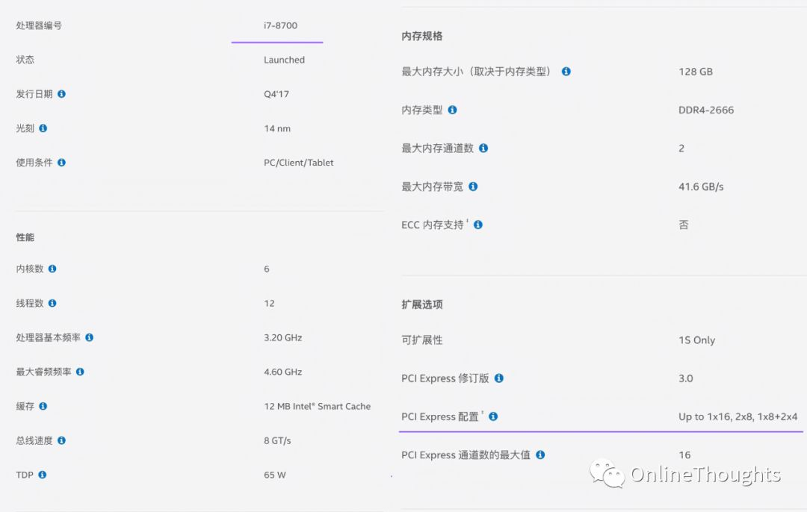

在ifixit的拆解图中我们可以看到雷电三控制器的型号，查阅intel官方资料便知：我们看下图中这个控制器，是两个端口共享一个PCIe3.0×4的带宽！所以如果你想接一个显卡坞，再接一个三星X5硬盘，那要小心不要插错了。

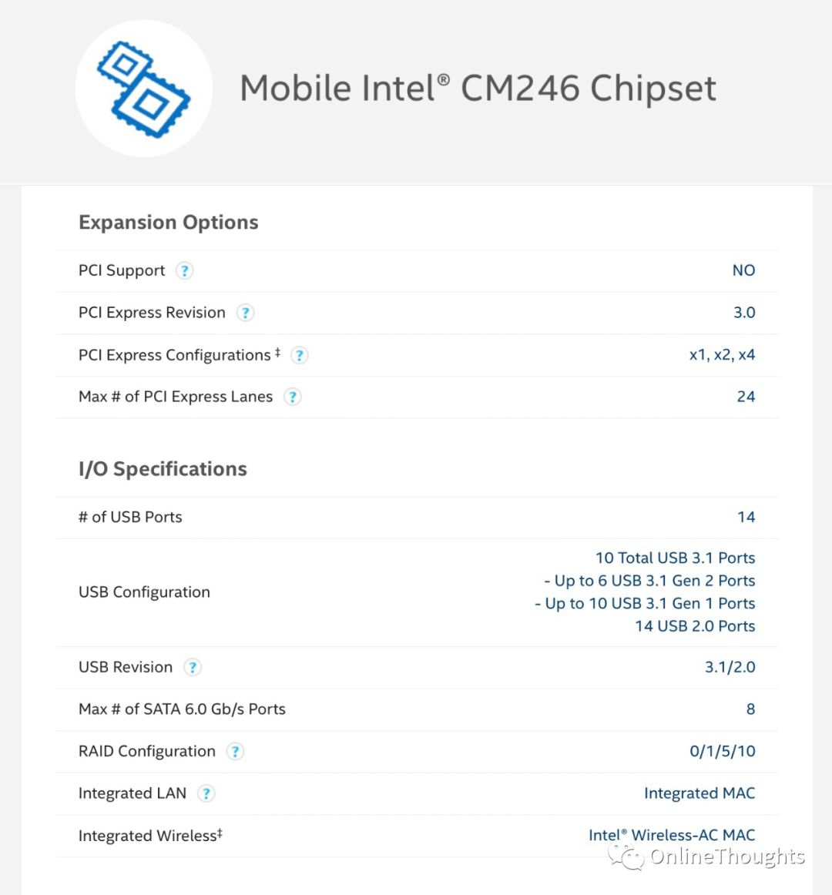