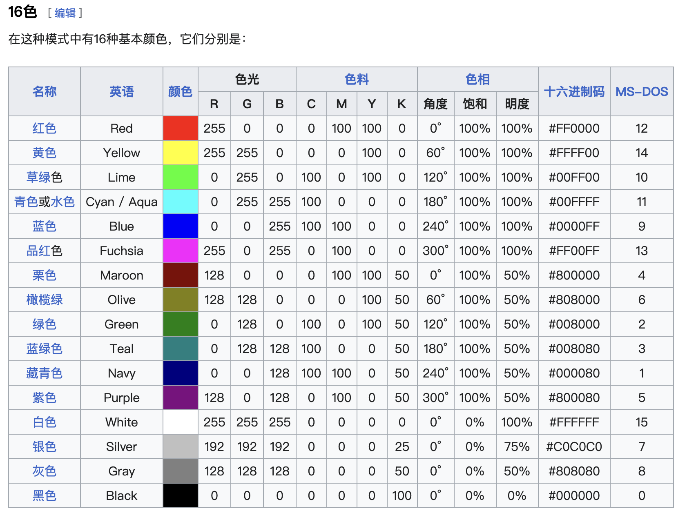

# 前言
分辨率，位深，色域，色度采样，编码格式，封装格式等等，这篇文章试着讲清楚。但是这篇文章需要一定的显示技术的基础知识，若从最基本的显示技术，比如如何用三原色混合显示出其他颜色；再比如传统LCD显示器如何控制背光、液晶层，有何缺点？miniLED显示器的分区背光、OLED显示器有何优缺点等等。这些可以去看一些科普文章，其中硬件茶谈就做的不错，但也很浅显，适合小白。

首先，一个视频：看着清晰且几乎没有噪点、艳丽又不过饱和、明亮又不会过爆、暗的深邃又不会看不清，颜色过渡自然没有断层；那么对于同样的内容，看起来舒服太多了。
## 一个视频的“一生”
一个视频（除非是纯电脑制作的动画，但即使电脑制作的动画多数参数也遵循）一般是先经过**拍摄**，再经过**剪辑**，然后**导出**。若是网络视频，还需要经过**上传**，最终我们在设备上下载或者在线**播放**，通过**显示器**呈现出来。

这个过程的描述好像是废话，但我想强调的是，这是一个串联的过程，类似我之前讲过的网络，每一个中间环节“慢“了，都会直接影响最终效果，而多个过程出问题，会以乘积的量级对最终效果产生影响。

我决定倒着讲述这其中的原理和现象，因为绝大多数人都是由看视频开始了解视频，而不是拍视频，我也一样。
## 概述
一个视频有很多参数，几乎都会影响到我们最终观看的质量，而这些参数都会在下文中细致的讲到，但我还要强调这需要一定的基础，不仅仅是因为我很难在任何专有名词提出的时候都紧跟着大量篇幅的讲解说明，更是这种专有名词随便在网上一搜都会有很细致、生动的解释。还有一些比如延迟这种参数和看视频关系不大，主要是打FPS游戏需要，所以就没提。我想写这篇文章主要是两点：一是大致梳理整个高质量视频的产出到观看流程；二是重点讨论一些网络上搜到大量低质量内容或者根本搜不到答案的问题，比如一些参数的关系、编码哪些是标准哪些；然后结合这个流程中的理论知识，运用到看视频时可能会遇到的问题中去，比如**同样是4k为何有的清楚有的不清楚？同样HDR有的发灰有的过爆？同样广色域有的过饱和有的发灰？**

# 1显示器
## 1.1分辨率&刷新率
在很多年前（当然对于现在很多人的显示器还是老旧的）显示器素质很低时，分辨率和刷新率的短板是对与提高观看体验的短板，所以这也是显示器购买时最看重的，不谈尺寸和观看距离谈分辨率就是耍流氓，所以PPI和观看距离才是对分辨率的正确要求。这就要说到苹果的Retina标准了，但是也不是什么高深的，只不过没有其他厂商提出类似的标准。（PPI、Retina标准是什么自行搜索）
分辨率接近Retina标准、刷新率120Hz之后，这部分参数的短板就几乎不存在了。Retina标准如果不了解，完全可以参考苹果设备的分辨率，比如屏幕16寸3K多、24寸4K多，27寸5K，32寸6K等，我是指接近，比如27寸4K就差不多了，但是27寸6K或者8K就没有必要，除非下面所说参数全部补齐之后。

要注意不同设备，不同材料的屏幕对PPI的要求不同，比如OLED因为需要次像素渲染，实际体验相同的话，对PPI要求更高；再比如VR设备，PPI尤其是相比手机电脑来比较的意义不大，什么单眼4K的体验其实低于手机的1080P屏幕（这里只是说屏幕的观看清晰度体验，而VR设备特有的沉浸体验当然是另一回事）
刷新率其实也有一些值得说的，但是其对观影体验影响甚小，不在此文章的讨论范围。
## 1.2[色域](https://www.bilibili.com/video/BV1kk4y167rk/)和[色深](https://www.bilibili.com/video/BV1dp4y1S7ow/)
色深和色域没有直接的联系，**色域是量程，色深是分辨率**。（色域也不是“完全”的量程，因为量程有两个维度：一个是亮度的量程，另一个是波长的量程。而色域指的是波长的量程）
色深衡量色彩数量的多少，色深指的是rgb通道每个通道的颜色的灰度值，也是是亮度信息，可以用y表示，比如10bit也就是每个通道的亮度信息是10的二次方为1024，然后三个1024相乘就是可以显示的颜色，目前的一些高端显示器就是10bit的，色深越多，画面色彩过渡越平衡。当然，这里还有一些如8bit“抖动”10bit的，原理就类似PWM调光，上文链接的视频中解释的很清楚了，这里就不赘述了。
色彩空间简称色域，及颜色的覆盖范围，简单理解就是红可以多红，蓝可以多蓝，绿可以多绿？而显示中人眼所能看见的也是有限的（下图中全部的彩色范围），人眼更敏感能明显区分的也是有限的，另一方面，显示器技术所能准确显示的范围也是有限的。所以，它需要一种标准来衡量它。从sRGB(如下图所示)到DCI-P3，再现在的bt2020。当然还有AdobeRGB。

## 1.3亮度、对比度、HDR
亮度的范围就是对比度，亮度的精度就是色深；亮度可以理解为上图中增加了一个Z轴，Z轴为你把显示器的亮度由最低调整至最高。

HDR要复杂得多，HDR不是一个独立于上述其他参数的标准，而是基于亮度对比度和色域色深提出的一系列综合性的“高”要求。顾名思义，也就是High Dynamic Range---高动态范围，既包括亮度范围和精度（亮度、色深），也包括色域，即图像或视频（视频本质就是多张图像）在光的高波长范围精度&高亮度范围和精度。
但是比如HDR10有很多推荐配置而不是硬性要求，比如显示器亮度1000nt就不是硬性要求，所以导致很多厂商利用这些点虚假宣传，反而会导致体验变差。杜比视界相比HDR10就好了很多，但是要求很高，专利授权费很高，但还是在不断普及。
## 1.4亮度和色域、色深的关系？
上述对亮度“为上图增加一个z轴”的粗暴描述是非常不准确的，而大部分科普文章也都会分开讨论色域（色彩空间）和亮度的关系，搜索其关系，也经常碰到说两者独立的描述。有个知乎回答，说的不太对，还是附在这里：[这些参数的区别？联系？](https://www.zhihu.com/question/342129041/answer/825753921)

因为，色彩空间中所有除RGB三原色之外的颜色，都是这三种颜色按照一定比例的**亮度**混合而成的。也就是说，比如在同样显示器亮度下的紫色和红色的亮度是完全不同的。见下图（来自维基百科）：

> Q: 如何能看起来让紫色和红色一样的亮度？但问题就在于，需要一样的亮度吗？

1. 因为人眼之所以看到不同颜色，就是三种视锥细胞感受到三种颜色（也就是仅对三种不同波长的光产生生理性的电化学反应），最终在大脑生成的“五颜六色”。而这三种视锥细胞几乎就对应的显示器的三原色（一是没有那么精准的对应；二是人对不同颜色的感觉敏感程度也不是线性叠加的，但是我们的期望是线性的，所以这种偏差需要厂商的精准调校）。
2. 显示器就是要模拟现实世界，而现实世界的绝大多数可见物体都是不发光的，而且是太阳这一全波长（近似）白光光源下吸收了其他的颜色，只有剩下波长的颜色反射了出来，所以白色就是比紫色要亮！so，这种现象和生理结构让显示器模拟现实世界的颜色时大大降低了难度。

> Q: 比如一个8bit的面板，即RGB亮度可调等级有256种(2^8)，但是如果我把显示器调到最低亮度，感觉还是可以准确显示其他颜色，所以这个可调等级是根据最低亮度调整的吗？如果是这样，比如100nt是可以8bit，200nt岂不可以9bit，400nt可以10bit？

前半句是对的，所以显示器的最低亮度并不会特别暗（暗到这个亮度下无法处理成256个等级），但后半句不对，理论上可行，但是这种亮度等级不是这么简单可以实现的：
比如LCD显示器，其实对RGB的亮度控制来实现不同颜色是通过液晶层的偏转实现的，而亮度是通过背光层发光材料的亮度实现，所以这么看来，位深是液晶层偏转角度的精细度，而亮度相对独立。但是OLED是自发光，反而不是独立控制了，更容易实现上述理论操作，但可能出于面板素质均一性考量？对此我就没有深究了。另外值得一提的是，虽然miniLED显示器在原理上仍归属于LCD显示器，但是其由于大量分区背光的特性，再显示原理上其实同时OLED和LCD，所以调试难度增加很多，因为需要控制好分区背光和液晶层的延迟等问题。

## However
但，即使你有一个很好的片源（比如4K HDR P3）和一个很好的显示器（同样4K HDR P3），依然很有可能得不到一个好的观看体验，因为这中间，还有两大步：
**显示器的这些参数仅是众多必要条件之一，播放器软件的适配性、操作系统的色彩管理和硬件素质决定着一个“好的”片源能否在好的显示器上正确的显示出来。**
# 2操作系统
倒着讲应该先讲播放器？但是显示器紧接着涉及到色彩管理，而编码格式可能也会涉及到硬件解码器、算法等计算机系统知识，so，就先讲这部分吧。现代操作系统非常复杂，这里仅说关于视频播放相关的一个重要事项---[色彩管理](https://www.bilibili.com/video/BV1wC4y1p7Xr/)，就结合这部分把上面显示器参数缺失的一个---色准，补上。

1. 就单论sRGB色域的SDR显示器显示准确性来讲，如何较为准确的显示白光？（白光理论上可以用255.255.255来表示，但实际上RGB的比例不会是1：1：1，甚至因为不同面板不同发光材料的不同，这种真实的亮度比例也会变化）如何利用线性代数计算颜色比例？见：[电子显示Display基础知识](https://blog.csdn.net/sy20173081277/article/details/117017809)。当然可能会以为这应该是显示器面板厂商的工作，但这就像是芯片，需要操作系统厂商和硬件厂商的深度合作才能完成。

2. 另外，因为内容如图片视频，会用不同的标准制作出来，比如一张P3色域HDR照片，如何比较准确的显示在sRGB的显示器上？一张sRGB的照片，如何准确的显示在P3色域的显示器上？也就是映射关系。理论很好理解，apple一直做的很好，安卓手机最近两年也变好了不少（2020年之前包括三星还是做的很烂），但现在2024年windows还是shit。apple在面板上并没有芯片这种设计研发能力，但是其与供应链深度合作共同研发的战略意识值得其他尤其是国产厂商学习。（国产厂商大多数闭关锁“厂”，生怕合作泄漏了自己的技术，然而自己还没多少技术，实在令人尴尬，甚至一个公司内部部门间合作亦如此）

这部分研究的很浅，之后有时间和兴趣再深入吧。
# 3[编解码与格式](https://www.bilibili.com/video/BV1ws41157f8/)
任何数据都需要有格式，只有按照一个规则排列，再按照一个规则展开，才能保证信息的准确，正如python文件是.py，c语言文件是.c等等，但，视频为何有各种各样的格式？
tim很多年前做的视频（标题链接），还有其他一搜就有的科普文章还不错的说明了这个问题，但我还是想要展开讨论一些细节。
## 编码
一个视频就是一组图片，而一张图片，就是一堆像素组成的方块（矩阵），而一个像素，由三原色的亮度信息组成，也就是RGB的亮度。
比如对于8bit位深的图片，一个像素就是24bit信息即3B（字节），而4k的1:1图片就是4000×4000个像素，也就是48MB，而对于4K60帧的视频来说，一秒就是60张4K图片，也就是1s的4K视频大约2GB。那我们是怎么看4K的？
一个图片中，很多信息都是重复的，比如蓝天都是差不多的，一个纯白色T恤也都是类似的信息，所以我们如果把类似的信息都用一份存储，剩下的只存储他们的位置（或者编好顺序存序号），虽然实际的算法还是很复杂，但是图片就可以被这样压缩了。这种被称为“帧内压缩”。
一个视频就是一堆图片，而比如60帧的视频，1s60张图片，而相邻图片的很多信息都是重复的，如果我们对于这种重复信息采用类似帧内编码的压缩算法，同样可以节省大量信息。
在像素级别其实就已经在“压缩”了，即色度采样。同样的道理，相邻像素大概率是重复的，所以干脆直接隔一个保存一个得了（当然不是这么简单粗暴的），比如对于不“压缩的”就是4:4:4采样，而很多视频都是4:2:0采样，这点标题链接中tim的视频也讲到了。所以，实际的图像也不是RGB来描述像素信息的，而是YUV，具体可以查维基百科。
具体压缩的算法和压缩后视频的格式是有明确的标准规定的（否则不乱套了，一家设备智能看自己公司制作的视频？），目前的主流是H256（HEVC）和AV1，我记得在2016年前后大多数视频还是H264的。H265相比H264的压缩算法可以在相同的画质下明显降低视频大小，当然具体如何实现，这就是数据结构和算法了，有兴趣可以参考论文：《Overview_of_the_High_Efficiency_Video_Coding_HEVC_Standard》。
## 解码器
一方面，编码算法还是蛮复杂的，另一方面，解码要求实时完成（因为看视频的时候边解码边播放），提前解码需要大量内存和硬盘空间，所以不现实。但是当今看视频又是电子产品的一个必需且占比非常大的功能，所以对硬件计算能力要求很高。“没有啊，看视频不卡也不热啊？”---正因为视频编解码的算法是相对固定的，所以芯片厂商在设计芯片是，直接针对这个算法设计硬件，实现高效率执行，也被称为硬件视频解码器，而调用硬件视频解码器看视频也被称为“硬解”，相反，CPU直接运行解码算法被称为“软解”。而高清视频软解对CPU性能要求很高，但是CPU软解几乎不会遇到兼容性问题（2024年H265硬解也基本遇不到啥大问题了）
## 码率

## 编码格式与封装格式

# 4播放器
操作系统一般都会内置很多软件，比如图片、音乐播放器等，同样也有视频播放器，但不知为何，所有主流操作系统的内置视频播放器都shit一样，各种兼容性问题，各种基本的快进等功能都难用到怀疑人生。我不知道为何会出现这种现象，因为很多其他系统软件还是做的不错的。anyway，我们目前看本地视频都只能用第三方播放器，比如mac的inna、windows的potplayer等。问题就在这里，第三方软件调用系统接口总会遇到各种各样的问题，到2024年还是无法做到开箱即用的4K HDR P3的视频播放，mac由于色彩管理和显示器素质高的优势，还是要领先windows不少的。

# 5拍摄&剪辑

