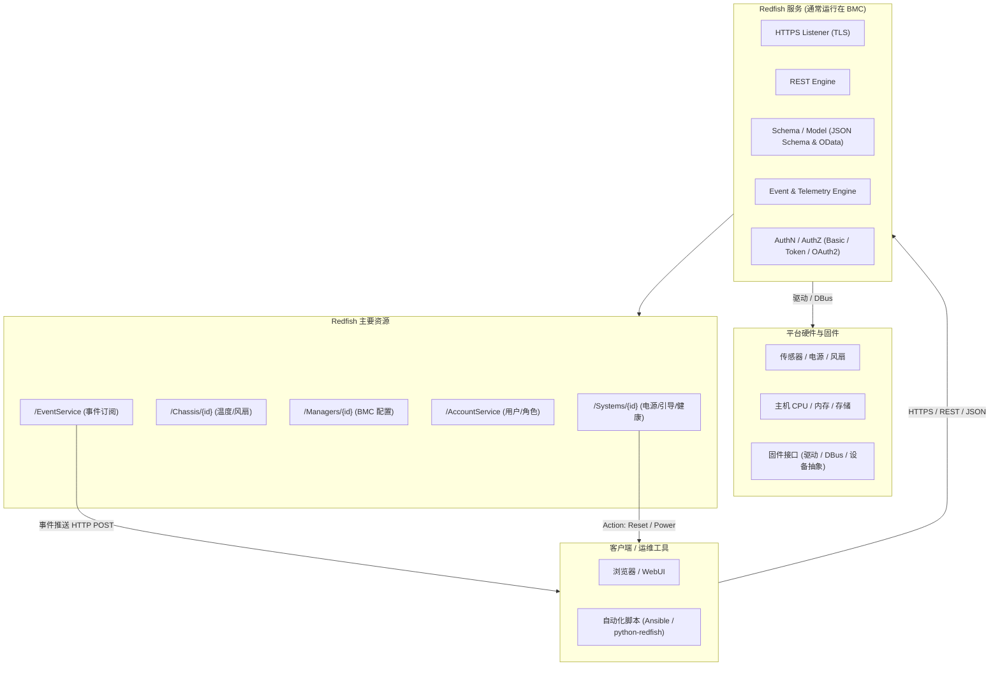

# 服务器固件基础知识

服务器需要不间断的监控硬件设备，哪怕服务器系统换机状态比如：

- 电源管理接口：监控/控制电压、风扇、温度。
- 主机桥接接口：KCS/BT/SMBus、PCIe、UART，用来与主 CPU/芯片组交换传感器数据或发起电源控制。
- 独立网络端口：IPMI/Redfish/SSH/Web 访问。
- 视频捕获/重定向：图形核心可把主机 VGA 输出通过网络提供远程 KVM。

  ## BMC系统与服务器操作系统


| 层级     | BMC 固件（以 OpenBMC 为例）                      | 服务器主机操作系统（如 Ubuntu Server）               |
| ------ | ----------------------------------------- | ---------------------------------------- |
| 运行平台   | BMC SoC（独立 CPU + RAM + Flash）             | x86/ARM 服务器 CPU + 系统内存                   |
| 启动链    | Boot ROM → U-Boot → Linux Kernel → rootfs | BIOS/UEFI → 引导程序 → Linux Kernel → rootfs |
| 主要任务   | 监控硬件、远程管理、电源控制、KVM、固件更新                   | 运行用户应用、文件系统、调度任务等                        |
| 接口标准   | IPMI、Redfish、Web UI、DBus                  | POSIX API、网络协议、系统调用                      |
| 实时性/负载 | 轻量管理，I/O 较少                               | 通用计算，可高负载并发                              |

区别关键点：

- BMC 是“旁路”系统，即使主机关机、系统崩溃，它仍可独立运行。
- 主机 OS（Ubuntu 等）仅在服务器正常上电时工作，无法直接取代 BMC 的带外管理功能。

很令人惊讶的是！
- OpenBMC 是基于 嵌入式 Linux 的完整发行版，使用 Yocto/BitBake 构建，核心是标准 Linux kernel + systemd + D-Bus。
- 这带来丰富的驱动支持、包管理和网络栈，而不是轻量 RTOS。
- 当然，厂商如果愿意，也可以写一个完全不同的 BMC 固件（比如基于 FreeRTOS、VxWorks），但 OpenBMC 官方选择 Linux 以便开发和移植，而且大多都是从OpenBMC移植过去的。

这意味着 BMC 自身就是一个需要驱动的嵌入式 Linux 系统，而不是只靠主机驱动。

## [OpenBMC]([openBMC](https://github.com/openbmc/openbmc)？)基本原理

1. 是什么：OpenBMC 是 Linux 基础的 BMC 固件发行版/项目（由 Linux Foundation 下的社区维护），目标是为不同厂商/平台提供统一、可定制的开源 BMC 实现。它用 Yocto/BitBake 构建镜像，运行 Linux + systemd + DBus，并把硬件资源映射为 DBus 对象，再通过服务（如 bmcweb）把这些映射为 Redfish 与 Web UI。 
2. 主要组件（典型）：  
    

- Bootloader（通常是 U-Boot）→ Linux kernel → OpenBMC userspace（Yocto 构建）。 
- phosphor- 组件*：状态管理、logging、sensor、SEL/事件管理等（OpenBMC 社区常见模块）。 
- bmcweb：把 DBus 对象翻译成 Redfish REST/JSON 接口，并提供 web UI / KVM / vMedia 支持。 
- 向后兼容：OpenBMC 能提供 IPMI 支持（通过 DBus/IPMI 桥接或直接实现），同时主推 Redfish（DMTF 标准）。 


### OpenBMC 典型软件栈

硬件 (BMC SoC + 外设)
└─ Linux 内核 & 设备驱动
   └─ systemd
      └─ DBus 对象 (传感器、电源、日志、网络)
         ├─ phosphor-* 服务 (电源控制、日志、IPMI)
         ├─ bmcweb (提供 Redfish REST / Web UI)
         └─ ipmid (IPMI 协议守护进程)

- Redfish：现代 REST/JSON 管理接口。
- IPMI：传统命令协议（向后兼容）。
- 通过 DBus 实现硬件抽象，开发者可用 Python/C++ 写管理服务而不用直接碰驱动。


## BMC与主机 OS 管理的边界

- 主机 OS 驱动：负责 CPU、磁盘、网卡等为业务服务的硬件。
- BMC 驱动：只关心 BMC 芯片本身和传感器，并可通过 IPMI/Redfish 向主机或远程运维人员汇报。
- 交互：主机 OS 可以使用 ipmitool、ipmi_si 等驱动与 BMC 通讯，实现如 ipmitool chassis power cycle 等带外操作，但两套内核彼此独立。


- BMC = 服务器上的独立嵌入式计算机。
- OpenBMC = 运行在 BMC 上的嵌入式 Linux 发行版，不使用 FreeRTOS。
- 它需要自己的Linux 内核驱动与板级传感器驱动，并通过 DBus + IPMI/Redfish 暴露功能。
- 主机 OS（Ubuntu 等）与 BMC 完全隔离：前者负责业务计算，后者负责带外管理。


## IPMI的原理与组成

1. 目标：在主机（OS/BIOS）不可用或关机的情况下，提供“带外”（out-of-band）的监控与管理能力（读温度/风扇/电压、查看硬件日志、远程开/关机、虚拟介质、串口重定向等）。 
2. 核心组成：  
- BMC 硬件：独立微控制器/SoC（有自己的网口、闪存、RAM、串口等）。
- IPMI 协议层：定义了 messages、sensor data records（SDR）、system event log（SEL）、FRU（Field Replaceable Unit）inventory、KCS/SMBus/BT 接口、Serial-over-LAN (SOL)、IPMI over LAN（RMCP+）等。 
- 常用工具：ipmitool、FreeIPMI、OpenIPMI 等用于交互与脚本化管理。 
安全注意：IPMI 的历史版本存在设计与实现上的弱点（明文/不安全的认证、Cipher 0 等），因此不要将管理口直接暴露到公网，务必隔离管理网络并及时升级固件。 

  
## Redfish简介
由 DMTF（Distributed Management Task Force）制定，2015 年发布。目标：取代 IPMI（早期二进制/专有命令）  
    
- 统一带外管理接口
- 采用现代 Web 标准（HTTPs + REST + JSON）
- 易扩展、面向云与自动化

### Redfish架构
  

- 服务端：通常运行在 BMC 上，也可运行在机架控制器、存储阵列或裸机主机。
- 客户端：浏览器、自动化脚本、运维平台、Ansible、Python SDK（python-redfish）等。

  
Redfish 采用面向资源的 REST 模型，每个资源是一个 JSON 对象并有 URI：

- 根入口：/redfish/v1/
- 关键资源示例：  
- Systems/{id}：主机节点、电源状态、引导顺序、虚拟介质
- Chassis/{id}：机箱、风扇、温度传感器
- Managers/{id}：BMC 自身信息、固件、网络配置
- AccountService：用户和认证管理
- EventService、TelemetryService 等


#### Schema
- 使用 JSON Schema 和 OData CSDL 定义资源属性与操作。
- 允许厂商扩展：OEM 节点 (Oem) 用于专有字段。
  

#### RESTful API

- 标准 HTTP 方法：GET/POST/PATCH/DELETE
- Content-Type: application/json
- 典型请求：  
`GET /redfish/v1/Systems/1`

- 返回主机 CPU、内存、引导、健康状态等 JSON

**事件与订阅** (Event Service)  

- 客户端可 POST 订阅目标到 /EventService/Subscriptions。
- 服务端通过 HTTP POST 向客户端推送异步事件（例如电源故障、温度告警）。
    
任务 (Task Service)  

- 对耗时操作（固件更新、系统重装）返回一个 Task 资源，可轮询或订阅完成状态。 
    
Action 机制  

- 在 JSON 中定义 "Actions" 节点，如：
```json
"Actions": {
  "#ComputerSystem.Reset": {
    "target": "/redfish/v1/Systems/1/Actions/ComputerSystem.Reset",
    "ResetType@Redfish.AllowableValues": ["On","ForceOff","GracefulRestart"]
  }
}
```
- 客户端 POST 请求到 target 即可触发重启等操作。

  
### 与 IPMI 的技术对比

| 特性      | IPMI            | Redfish            |
| ------- | --------------- | ------------------ |
| 协议栈     | 二进制消息，RMCP+     | HTTPS/REST/JSON    |
| 数据模型    | 固定命令与传感器表       | 动态 JSON Schema，可扩展 |
| 安全      | 早期弱加密问题多        | 强制 TLS、角色/Token    |
| 自动化/可编程 | 需专用工具（ipmitool） | 任何 HTTP/JSON 客户端   |
| 云/可扩展   | 有限              | 原生支持大规模、云原生        |

- bmcweb：C++ 写的 Redfish 服务守护进程，监听 443 端口。
- DBus 适配：bmcweb 通过 DBus 访问底层传感器、电源管理等对象。
- OData/Schema：由 redfish-core 模块提供 JSON Schema 与路由。
- 扩展：厂商可在 Oem 节点提供专用功能而不破坏标准。
  
### 常用工具/SDK
- python-redfish、redfishtool（DMTF 提供 CLI）
- Ansible redfish_* 模块、Terraform Provider

典型任务：  

- 批量电源控制、固件升级
- 自动化监控（订阅事件/遥测）
- 硬件清单与健康检查
  

## IPMI、Redfish OpenBMC 的关系

- IPMI = 傳統、消息/命令導向：設計年代早，輕量但在擴展性、可讀性與安全性上有限。很多現存服務器、工具鏈仍依賴 IPMI。 
- Redfish = 現代、REST/JSON：面向可擴展性、可用現有 web 工具與雲管理棧，支持 schema、事件訂閱、更好的認證機制。DMTF 將其作為面向雲/大規模管理的現代替代。 
- BIOS（厂商闭源，如 AMI Aptio）、coreboot（开源替代）、以及各类厂商的定制固件。主机固件决定了 OS 能否顺利启动、设备是否有厂商驱动支持。 
- BMC 芯片/SoC（常见且被 OpenBMC 广泛支持的）：ASPEED 的 AST 系列（AST2500/AST2600/AST2700 等）是当前市场上最常见的 BMC SoC，很多 OpenBMC 移植/设备基于它。选择支持这些 SoC 的硬件，OpenBMC 成功移植的可能性更高。 
- 商业/专有 BMC 固件：HPE iLO、Dell iDRAC、Lenovo XClarity（XCC）等 — 功能强、支持厂商整合工具，但不是开源；多数厂商也提供 Redfish 兼容层。 
- 厂商的“开源/混合”产品：AMI 的 MegaRAC（包括 MegaRAC OpenEdition / Open-source 变体）在业界也被用作可定制或被厂商采纳的 BMC 固件方案（AMI 也对 OpenBMC 有贡献/衍生）。 ****

  
## 开源支持好的服务器

几点先说明：BMC（OpenBMC）和主机操作系统（Ubuntu Server）是两套独立运行的系统——BMC 负责带外管理，主机固件（UEFI/BIOS/coreboot）+驱动决定主机能否跑好 Ubuntu。换言之，只要主机硬件（CPU、芯片组、网卡、存储控制器等）有 Linux 驱动，Ubuntu Server 能跑；BMC 是“额外加分项”（是否开源、是否支持 Redfish/IPMI、是否易于集成监控）。

- Supermicro 的部分新平台（例如一些 Ampere / ARM / x86 平台）已经以 OpenBMC 为出厂 BMC，并且厂商同时声明对 Ubuntu Server / RHEL 的支持；社区测评也报告了在这些机器上顺利安装 Ubuntu Server 的案例（例如 Supermicro ARS 系列等）。选择 Supermicro 的 OpenBMC 机型通常对开源系统友好、社区支持多。 
- OpenBMC 项目本身近年的 upstream 活动 已扩大对许多参考主板/厂商（Tyan、Supermicro、Wistron、IBM、HPE、ASRock 等）的支持，说明越来越多服务器平台可以拿到 OpenBMC 镜像或较易移植到 OpenBMC。主机上跑 Ubuntu 的可行性主要取决于主板/处理器驱动而非 BMC。 
- NVIDIA / DPU 与 BMC：有厂商（例如 NVIDIA 的部分 BMC/DPU 方案）基于 OpenBMC 构建 BMC 功能；它们通常也支持用 Linux 发行版（如 Ubuntu）作为主机或管理主机的操作系统（取决于平台）。 

  

实用选购建议：

1. 优先看厂商说明“OpenBMC / Redfish 支持”（OpenBMC 预装或厂商提供 OpenBMC 镜像/文档）。Phoronix、ServeTheHome 等社区评测也常给出实际兼容性反馈。 
2. 确认主机平台对 Ubuntu 的官方/社区支持（网卡、RAID、CPU 家族的驱动）。即便 BMC 是开源的，主机缺驱动也会卡住。
3. 选用基于 ASPEED AST2600/AST2700 的 BMC 平台（OpenBMC 移植工作量小，社区更成熟）。 
4. 若需要最大化“开源固件”血统，往 coreboot 支持列表里挑主板（但 coreboot 在服务器级别的硬件覆盖不如笔记本/嵌入式广泛）。


## 国产CPU对比

https://plantegg.github.io/2022/01/13/不同CPU性能大PK/


# ESXi 系统

```bash
uname -a
VMkernel localhost 8.0.3 #1 SMP Release build-24674464 Apr  1 2025 04:16:09 x86_64 x86_64 x86_64 ESXi

vmware -v
VMware ESXi 8.0.3 build-24674464

esxcli system version get
   Product: VMware ESXi
   Version: 8.0.3
   Build: Releasebuild-24674464
   Update: 3
   Patch: 70

df -h
Filesystem   Size   Used Available Use% Mounted on
VMFS-6       3.4T   2.4T    963.5G  72% /vmfs/volumes/datastore1
VMFSOS     119.8G   5.3G    114.4G   4% /vmfs/volumes/OSDATA-695a2b3b-7c5ae918-7045-ec2a7248c156
vfat         4.0G 262.5M      3.7G   6% /vmfs/volumes/BOOTBANK1
vfat         4.0G  64.0K      4.0G   0% /vmfs/volumes/BOOTBANK2


```


## ESXi GPU 直通

在某一台 Ubuntu 虚拟机里用 RTX 4090 做 LLM 推理，应该 GPU 直通（VMDirectPath I/O / Passthrough）：

- ESXi 主机上一般不需要装“显卡驱动”；你要做的是把 GPU 配成 Passthrough，让虚拟机直接接管它
- 真正的 NVIDIA 驱动/CUDA 要装在 Ubuntu 虚拟机里

另外，RTX 4090 这种消费卡也不走 vGPU 那条路（vGPU 需要特定支持的卡和对应的 vGPU host driver/许可），常见做法还是直通。NVIDIA vGPU 的 vSphere release notes 里列的支持型号主要是 A10/A16/A40/RTX A 系列等，并没有 4090 这类消费卡。

### 1) 服务器 BIOS 设置

在 Dell T640 的 BIOS 里确认：

1. 启用 IOMMU
    - Intel 平台通常是 VT-d（T640 常见是 Intel）
2. Above 4G Decoding：建议开启
3. 启动模式建议 UEFI（后面 VM 也会用 UEFI）

### 2) ESXi 主机侧：启用 Passthrough

在 vSphere Client：
1. Host → Manage → Hardware → PCI Devices
2. 找到 RTX 4090 以及它对应的 HD Audio 功能（通常是同一块卡的另一个 PCI function）
3. 分别勾选 Passthrough
4. 重启 ESXi
  
说明：把 PCI 设备分配给 VM 后，VM 需要对其“配置的全部内存”做 reservation（下面会做）。

---
### 3) 虚拟机侧：

关键设置（很重要，避免“Power on failed / PCIPassthruLate”）把 GPU 加到 Ubuntu VM 之前，先把这些 VM 级设置处理好：

#### A. 固件用 UEFI

VM Options → Boot Options → Firmware 选 EFI/UEFI。
NVIDIA 文档也明确：如果 BAR1 超过 256MB，VM 必须用 EFI 启动。

#### B. 给 VM 内存做全额 Reservation

Edit Settings → Memory → Reservation 设成 等于该 VM 配置内存总量。
这是 VMware 对直通设备的硬性要求之一。

#### C. 启用 64-bit MMIO，并设置足够的 MMIO 空间

很多高端 GPU（尤其带大 BAR/可调整 BAR 的）在 ESXi 上直通时，会因为 MMIO 空间不足导致启动失败。Dell 的 KB 给了标准做法：在 VMX 里加

- pciPassthru.use64bitMMIO="TRUE"
- pciPassthru.64bitMMIOSizeGB="..."（按 GPU 显存等估算并向上取 2 的幂）

你这张 4090 是 24GB 显存，常用的取值是 32（向上取到 2 的幂）。

做法（两种任选其一）：

- vSphere Client 里：VM → Edit Settings → Advanced Parameters（或 “Configuration Parameters”）添加上述两条
- 或直接编辑 VM 的 .vmx 文件加上两行（更直观）

### 4) 把 GPU 加到 VM

VM 关机状态下：
Edit Settings → Add New Device → PCI Device
把 4090（以及需要的话加上它的 Audio function）加进去，然后开机。
注意：启用直通后，这台 VM 一般就不能 vMotion，某些快照/容错特性也会受限（这是直通的典型限制）。

### 5) Ubuntu 虚拟机里装 NVIDIA 驱动

进 Ubuntu 后按这套做即可：

1. 确认能看到卡
```
lspci | grep -i nvidia
```

2. 用 Ubuntu 推荐驱动安装
```
sudo apt update
ubuntu-drivers devices
sudo apt install -y nvidia-driver-XXX
sudo reboot
```

XXX 用 ubuntu-drivers devices 推荐的版本替换。

3. 重启后验证
```
nvidia-smi
```

如果用 Docker 跑推理（vLLM/TGI/ollama 等），再装 NVIDIA Container Toolkit，然后 docker run --gpus all ... 即可。

### 常见故障快速定位

1. VM 开机报 “Module ‘DevicePowerOn’ power on failed” 或类似 PCIPassthruLate 错误
    优先检查：UEFI 固件 + 64bit MMIO + 64bitMMIOSizeGB + 全额内存 reservation。Dell KB 和 VMware/Broadcom 的要求基本就是为了解这个。
    
2. Ubuntu 里看得到显卡但 nvidia-smi 报错
    通常是驱动版本不匹配或 Secure Boot/签名模块问题（如果你在 VM 里开了 secure boot），先确保 VM 用 UEFI 但不强制 secure boot，或者按发行版方式装签名驱动。


# 磁盘问题


## 7zip压缩失败(磁盘损坏)

```bash
➜  pg-databases /usr/bin/7za a -mx=0 iep-admin-matou.7z iep-admin-matou-2026-01-08-01-00.sql

7-Zip (a) [64] 16.02 : Copyright (c) 1999-2016 Igor Pavlov : 2016-05-21
p7zip Version 16.02 (locale=zh_CN.UTF-8,Utf16=on,HugeFiles=on,64 bits,4 CPUs Intel(R) Core(TM) i5-7400 CPU @ 3.00GHz (906E9),ASM,AES-NI)

Scanning the drive:
1 file, 7341663241 bytes (7002 MiB)

Creating archive: iep-admin-matou.7z

Items to compress: 1

System ERROR:
未知的错误 -2147024891
```

### 1. 权限-磁盘空间问题?

```bash
➜  pg-databases ls -la                                             
total 7132752
drwxr-x--- 2 root root       4096 Jan  8 09:45 .
drwxr-xr-x 6 root root       4096 Jan  4 15:58 ..
-rw-r--r-- 1 root root         32 Jan  8 09:21 iep-admin-matou-2026-01-07-09-26.7z
-rw-r--r-- 1 root root 7341663241 Jan  8 01:03 iep-admin-matou-2026-01-08-01-00.sql
➜  pg-databases df -hT            
Filesystem     Type      Size  Used Avail Use% Mounted on
tmpfs          tmpfs     3.2G  2.9M  3.2G   1% /run
efivarfs       efivarfs  256K   44K  208K  18% /sys/firmware/efi/efivars
/dev/sda2      ext4      916G  110G  760G  13% /
tmpfs          tmpfs      16G     0   16G   0% /dev/shm
tmpfs          tmpfs     5.0M  4.0K  5.0M   1% /run/lock
/dev/sda1      vfat      511M  6.1M  505M   2% /boot/efi
/dev/md0       ext4      6.4T  2.1T  4.0T  35% /raid0data
tmpfs          tmpfs     3.2G   76K  3.2G   1% /run/user/128
tmpfs          tmpfs     3.2G   64K  3.2G   1% /run/user/0
...

➜  pg-databases echo $USER
root
```
没有任何问题。

### 2. 7zip 版本问题?

**`p7zip` 版本 (16.02) 确实太老了。**

- **发布时间：** 2016 年。
- **状态：** 原始的 `p7zip` 项目（Linux 移植版）已经**停止维护多年**。它对大于 4GB 的文件支持、多线程处理以及新的系统 API 兼容性都存在已知问题。这很可能就是你遇到 `-2147024891` (Access Denied/Seek Error) 错误的根本原因。

现在的官方 7-Zip 作者已经推出了**官方的 Linux 版本**（不再叫 p7zip）。

以下是在 Ubuntu 上安装最新版（官方版）的步骤：

首先，为了避免命令冲突，先卸载旧的 `p7zip`：

```bash
apt remove p7zip p7zip-full p7zip-rar
apt update
apt install 7zip

7zz --help   
7-Zip (z) 21.07 (x64) : Copyright (c) 1999-2021 Igor Pavlov : 2021-12-26
 64-bit locale=C.UTF-8 Threads:4
Usage: 7zz <command> [<switches>...] <archive_name> [<file_names>...] [@listfile]
...

```

接下来尝试新版本的7zip和tar，都不行，怀疑是磁盘问题。
```bash
➜  pg-databases 7zz a -mx=3 iep-admin-matou.7z iep-admin-matou-2026-01-08-01-00.sql

7-Zip (z) 21.07 (x64) : Copyright (c) 1999-2021 Igor Pavlov : 2021-12-26
 64-bit locale=C.UTF-8 Threads:4

Scanning the drive:
1 file, 7341663241 bytes (7002 MiB)
Creating archive: iep-admin-matou.7z
Add new data to archive: 1 file, 7341663241 bytes (7002 MiB)                                     
ERROR: errno=5 : 输入/输出错误
iep-admin-matou-2026-01-08-01-00.sql
System ERROR:
errno=5 : 输入/输出错误

➜  pg-databases tar -czf iep-admin-matou.tar.gz iep-admin-matou-2026-01-08-01-00.sql
tar: iep-admin-matou-2026-01-08-01-00.sql: File shrank by 6946083849 bytes; padding with zeros
```

### 3. 磁盘损坏问题

#### 3.1 查看内核日志

```bash
dmesg -T | tail -n 20

[Thu Jan  8 10:19:17 2026] ata3.00: cmd 60/30:f0:c8:33:48/00:00:15:00:00/40 tag 30 ncq dma 24576 in
                                    res 40/00:00:00:00:00/00:00:00:00:00/00 Emask 0x50 (ATA bus error)
[Thu Jan  8 10:19:17 2026] ata3.00: status: { DRDY }
[Thu Jan  8 10:19:17 2026] ata3: hard resetting link
[Thu Jan  8 10:19:18 2026] EXT4-fs error (device md0): __ext4_find_entry:1694: inode #30086286: comm MergeMutate: checksumming directory block 0
[Thu Jan  8 10:19:18 2026] EXT4-fs error (device md0): ext4_dx_find_entry:1798: inode #137828834: block 15: comm MergeMutate: Directory block failed checksum
[Thu Jan  8 10:19:18 2026] EXT4-fs error (device md0): __ext4_find_entry:1694: inode #30086286: comm MergeMutate: checksumming directory block 0
[Thu Jan  8 10:19:21 2026] ata3: SATA link up 1.5 Gbps (SStatus 113 SControl 310)
[Thu Jan  8 10:19:21 2026] ata3.00: configured for UDMA/33
[Thu Jan  8 10:19:21 2026] ata3: EH complete
[Thu Jan  8 10:19:22 2026] EXT4-fs error (device md0): __ext4_find_entry:1694: inode #30086286: comm MergeMutate: checksumming directory block 0
[Thu Jan  8 10:19:22 2026] EXT4-fs error (device md0): __ext4_find_entry:1694: inode #30086286: comm MergeMutate: checksumming directory block 0
[Thu Jan  8 10:19:23 2026] EXT4-fs error (device md0): ext4_dx_find_entry:1798: inode #137828834: block 15: comm MergeMutate: Directory block failed checksum
[Thu Jan  8 10:19:23 2026] EXT4-fs error (device md0): __ext4_find_entry:1694: inode #30086286: comm MergeMutate: checksumming directory block 0
[Thu Jan  8 10:19:25 2026] [UFW BLOCK] IN=enp2s0 OUT= MAC=01:00:5e:00:00:01:3c:7c:3f:e3:37:00:08:00 SRC=192.168.50.1 DST=224.0.0.1 LEN=36 TOS=0x00 PREC=0x00 TTL=1 ID=2364 DF PROTO=2 
[Thu Jan  8 10:19:27 2026] ata3: SATA link up 1.5 Gbps (SStatus 113 SControl 310)
[Thu Jan  8 10:19:27 2026] ata3.00: configured for UDMA/33
[Thu Jan  8 10:19:27 2026] EXT4-fs error (device md0): ext4_dx_find_entry:1798: inode #137828834: block 15: comm MergeMutate: Directory block failed checksum
[Thu Jan  8 10:19:28 2026] EXT4-fs error (device md0): ext4_dx_csum_verify:502: inode #137757167: comm MergeMutate: dir seems corrupt?  Run e2fsck -D.
[Thu Jan  8 10:19:28 2026] EXT4-fs error (device md0): dx_probe:823: inode #137757167: comm MergeMutate: Directory index failed checksum

```

#### 3.2 检查文件完整度

```bash

➜  dd if=iep-admin-matou-2026-01-08-01-00.sql of=/dev/null bs=4M status=progress

395579392 bytes (396 MB, 377 MiB) copied, 25 s, 15.6 MB/s
dd: error reading 'iep-admin-matou-2026-01-08-01-00.sql': Input/output error
94+1 records in
94+1 records out
395579392 bytes (396 MB, 377 MiB) copied, 35.9601 s, 11.0 MB/s

➜  md5sum iep-admin-matou-2026-01-08-01-00.sql
md5sum: iep-admin-matou-2026-01-08-01-00.sql: Input/output error
```

#### 3.3 查看磁盘健康程度

```bash
apt install smartmontools

# 先看总体健康 + 关键属性
for d in sda sdb sdc sdd sde sdf; do
    echo "===== /dev/$d ====="
    smartctl -H -A /dev/$d
done

smartctl -a /dev/sdc  # sdc 是确定的坏盘符
```

| 硬盘        | 状态    | 关键问题                                    |
| --------- | ----- | --------------------------------------- |
| **sda/b** | ✅ 健康  | 无问题                                     |
| **sdc**   | 🔴 故障 | 88 坏扇区，SATA 降速到 1.5Gbps，ATA 总线错误        |
| **sdd**   | 🔴 严重 | **1950 个 Reported_Uncorrect**（比 sdc 更糟） |
| **sde**   | ✅ 健康  | 无问题                                     |
| **sdf**   | ✅ 健康  | 无问题                                     |

#### 3.4 文件抢救

```bash
apt install gddrescue

# 要确认目标文件夹的分区是健康的。
ddrescue -d -r3 iep-admin-matou-2026-01-08-01-00.sql /home/iep-2026-01-08-backup.sql /home/iep-2026-01-08-backup.log

GNU ddrescue 1.23
Press Ctrl-C to interrupt
     ipos:    1089 MB, non-trimmed:        0 B,  current rate:       0 B/s
     opos:    1089 MB, non-scraped:        0 B,  average rate:   4221 kB/s
non-tried:        0 B,  bad-sector:     8192 B,    error rate:     170 B/s
  rescued:    7341 MB,   bad areas:        2,        run time:     28m 59s
pct rescued:   99.99%, read errors:       66,  remaining time:         n/a
                              time since last successful read:     10m  2s
Finished
```

检查抢救的文件：

```bash
➜  dd if=/home/iep-2026-01-08-backup.sql of=/dev/null bs=4M status=progress

7075790848 bytes (7.1 GB, 6.6 GiB) copied, 13 s, 544 MB/s
1750+1 records in
1750+1 records out
7341663241 bytes (7.3 GB, 6.8 GiB) copied, 13.3978 s, 548 MB/s

➜  tail -n 20 /home/iep-2026-01-08-backup.log
# Mapfile. Created by GNU ddrescue version 1.23
# Command line: ddrescue -d -r3 iep-admin-matou-2026-01-08-01-00.sql /home/iep-2026-01-08-backup.sql /home/iep-2026-01-08-backup.log
# Start time:   2026-01-08 11:04:58
# Current time: 2026-01-08 11:33:57
# Finished
# current_pos  current_status  current_pass
0x40F0AE00     +               3
#      pos        size  status
0x00000000  0x17941000  +
0x17941000  0x00001000  -
0x17942000  0x295C8000  +
0x40F0A000  0x00001000  -
0x40F0B000  0x174A83409  +

# 看洞位置附近 64 字节（洞开始前 32 + 洞开始后 32）
f=/home/iep-2026-01-08-backup.sql
for off in $((0x17941000)) $((0x40F0A000)); do
  echo "=== offset=$off ==="
  dd if="$f" bs=1 skip=$((off-32)) count=64 2>/dev/null | hexdump -C
done

=== offset=395579392 ===
00000000  35 33 32 35 39 30 33 32  37 39 36 5f 34 33 30 5f  |53259032796_430_|
00000010  31 37 36 30 36 30 34 36  32 39 39 37 38 5f 36 30  |1760604629978_60|
00000020  00 00 00 00 00 00 00 00  00 00 00 00 00 00 00 00  |................|
*
00000040
=== offset=1089511424 ===
00000000  7d 5d 2c 20 22 6f 75 74  70 75 74 4c 69 73 74 22  |}], "outputList"|
00000010  3a 20 5b 7b 22 6e 61 6d  65 22 3a 20 22 4f 55 54  |: [{"name": "OUT|
00000020  00 00 00 00 00 00 00 00  00 00 00 00 00 00 00 00  |................|
*
00000040
```

确认：这两处坏块在备份文件里被 **0x00 连续填充**，而且它们都落在“文本内容”的中间（前面还是正常 ASCII/JSON 字符，后面直接变成一串 00）。这对纯 SQL 文本来说通常会导致导入时报错，因为：

- PostgreSQL 的 psql/服务器端并不期待 SQL 文件里出现 NUL 字节
- 即使能读过去，也会把那一行/那段 COPY 数据破坏掉

坏了两段，各 4KiB，通常可以做到“库结构和绝大多数数据恢复”，坏的那一小段按表/按段跳过或重做。

**1）先找出 NUL 落在文件的哪一行（定位到对象/表）**

用 perl 统计到第一个 NUL 在第几行：
```bash
perl -ne 'if (index($_, "\0") != -1) { print "NUL at line $. \n"; exit 0 }' /home/iep-2026-01-08-backup.sql
```

再找第二个 NUL（稍微改一下，从后面继续找）：
```bash
perl -ne 'BEGIN{$seen=0} if (index($_, "\0") != -1) { $seen++; print "NUL #$seen at line $. \n"; exit 0 if $seen==2 }' /home/iep-2026-01-08-backup.sql
```

**2）把 NUL 那一行附近内容打印出来（看是 COPY 哪张表）**

拿到行号后（比如是 L），看上下文：
```bash
L=你得到的行号
sed -n "$((L-5)),$((L+5))p" /home/iep-2026-01-08-backup.sql | cat -n
```

如果附近能看到 COPY ... FROM stdin;，那就几乎确定坏在某张表的数据段。

##### **修复思路

场景 A：坏块在COPY ... FROM stdin;的数据行里（最常见）

做法是把那段 COPY 数据删掉或跳过，让其它表继续导入。

最稳的导入策略是两步：

1）先让导入“继续跑”，把能导的都导进去（不中断）：
```bash
psql -X -v ON_ERROR_STOP=0 -f /home/iep-2026-01-08-backup.sql your_dbname 2> /tmp/import.err
```

2）然后根据 /tmp/import.err 里报错的表名/行号，去 SQL 文件里定位对应的 COPY 段，删除该 COPY 段（从 COPY ... FROM stdin; 到 \.），重新导入。

场景 B：坏块落在 DDL/函数/索引定义里（相对麻烦）

这种会影响建表/建函数语句完整性，通常要么：
- 重新从源库导出（最推荐）
- 或者在备份文件中手工修补那段 SQL（难度取决于缺失位置）


#### 3.5 磁盘修复


# 服务器监控


## [Netdata](https://github.com/netdata/netdata)

### [安装](https://learn.netdata.cloud/docs/netdata-agent/installation/)

#### docker 部署

```bash
docker pull netdata/netdata

docker run -d --name=netdata \
  --pid=host \
  --network=host \
  -e NETDATA_CLAIM_URL="" \
  -e NETDATA_DISABLE_CLOUD=1 \
  -v netdataconfig:/etc/netdata \
  -v netdatalib:/var/lib/netdata \
  -v netdatacache:/var/cache/netdata \
  -v /:/host/root:ro,rslave \
  -v /etc/passwd:/host/etc/passwd:ro \
  -v /etc/group:/host/etc/group:ro \
  -v /etc/localtime:/etc/localtime:ro \
  -v /proc:/host/proc:ro \
  -v /sys:/host/sys:ro \
  -v /etc/os-release:/host/etc/os-release:ro \
  -v /var/log:/host/var/log:ro \
  -v /var/run/docker.sock:/var/run/docker.sock:ro \
  -v /run/dbus:/run/dbus:ro \
  --restart always \
  --cap-add SYS_PTRACE \
  --cap-add SYS_ADMIN \
  --security-opt apparmor=unconfined \
  netdata/netdata

vim /var/lib/netdata/cloud.d/cloud.conf

# 添加如下内容保存
[global]
  enabled = no
  
docker restart netdata
```

访问：`http://localhost:19999/v3`可以看到监控的细节。

