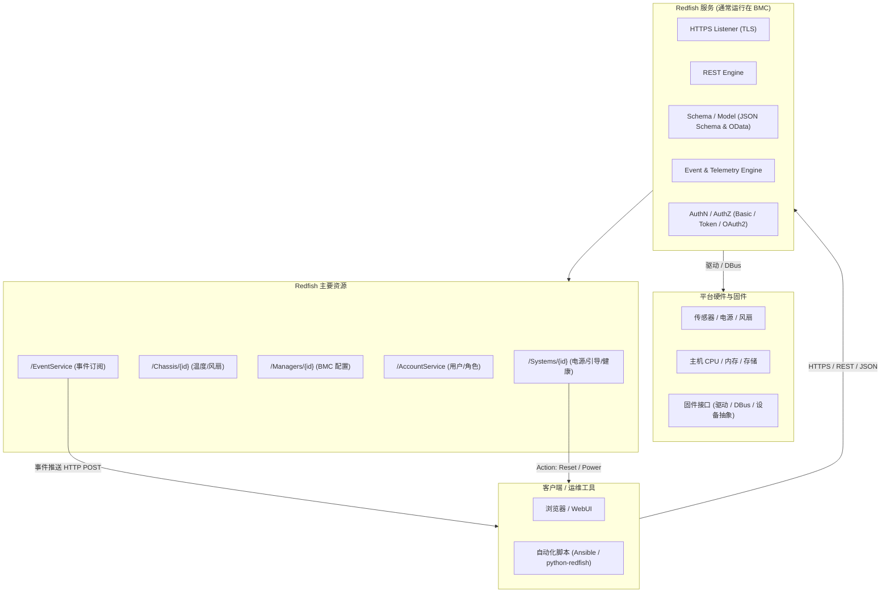

# 服务器固件基础知识

服务器需要不间断的监控硬件设备，哪怕服务器系统换机状态比如：

- 电源管理接口：监控/控制电压、风扇、温度。
- 主机桥接接口：KCS/BT/SMBus、PCIe、UART，用来与主 CPU/芯片组交换传感器数据或发起电源控制。
- 独立网络端口：IPMI/Redfish/SSH/Web 访问。
- 视频捕获/重定向：图形核心可把主机 VGA 输出通过网络提供远程 KVM。

  ## BMC系统与服务器操作系统

|   |   |   |
|---|---|---|
|层级|BMC 固件（以 OpenBMC 为例）|服务器主机操作系统（如 Ubuntu Server）|
|运行平台|BMC SoC（独立 CPU + RAM + Flash）|x86/ARM 服务器 CPU + 系统内存|
|启动链|Boot ROM → U-Boot → Linux Kernel → rootfs|BIOS/UEFI → 引导程序 → Linux Kernel → rootfs|
|主要任务|监控硬件、远程管理、电源控制、KVM、固件更新|运行用户应用、文件系统、调度任务等|
|接口标准|IPMI、Redfish、Web UI、DBus|POSIX API、网络协议、系统调用|
|实时性/负载|轻量管理，I/O 较少|通用计算，可高负载并发|

区别关键点：

- BMC 是“旁路”系统，即使主机关机、系统崩溃，它仍可独立运行。
- 主机 OS（Ubuntu 等）仅在服务器正常上电时工作，无法直接取代 BMC 的带外管理功能。

很令人惊讶的是！
- OpenBMC 是基于 嵌入式 Linux 的完整发行版，使用 Yocto/BitBake 构建，核心是标准 Linux kernel + systemd + D-Bus。
- 这带来丰富的驱动支持、包管理和网络栈，而不是轻量 RTOS。
- 当然，厂商如果愿意，也可以写一个完全不同的 BMC 固件（比如基于 FreeRTOS、VxWorks），但 OpenBMC 官方选择 Linux 以便开发和移植，而且大多都是从OpenBMC移植过去的。

这意味着 BMC 自身就是一个需要驱动的嵌入式 Linux 系统，而不是只靠主机驱动。

## [OpenBMC]([openBMC](https://github.com/openbmc/openbmc)？)基本原理

1. 是什么：OpenBMC 是 Linux 基础的 BMC 固件发行版/项目（由 Linux Foundation 下的社区维护），目标是为不同厂商/平台提供统一、可定制的开源 BMC 实现。它用 Yocto/BitBake 构建镜像，运行 Linux + systemd + DBus，并把硬件资源映射为 DBus 对象，再通过服务（如 bmcweb）把这些映射为 Redfish 与 Web UI。 
2. 主要组件（典型）：  
    

- Bootloader（通常是 U-Boot）→ Linux kernel → OpenBMC userspace（Yocto 构建）。 
- phosphor- 组件*：状态管理、logging、sensor、SEL/事件管理等（OpenBMC 社区常见模块）。 
- bmcweb：把 DBus 对象翻译成 Redfish REST/JSON 接口，并提供 web UI / KVM / vMedia 支持。 
- 向后兼容：OpenBMC 能提供 IPMI 支持（通过 DBus/IPMI 桥接或直接实现），同时主推 Redfish（DMTF 标准）。 


### OpenBMC 典型软件栈

硬件 (BMC SoC + 外设)
└─ Linux 内核 & 设备驱动
   └─ systemd
      └─ DBus 对象 (传感器、电源、日志、网络)
         ├─ phosphor-* 服务 (电源控制、日志、IPMI)
         ├─ bmcweb (提供 Redfish REST / Web UI)
         └─ ipmid (IPMI 协议守护进程)

- Redfish：现代 REST/JSON 管理接口。
- IPMI：传统命令协议（向后兼容）。
- 通过 DBus 实现硬件抽象，开发者可用 Python/C++ 写管理服务而不用直接碰驱动。


## BMC与主机 OS 管理的边界

- 主机 OS 驱动：负责 CPU、磁盘、网卡等为业务服务的硬件。
- BMC 驱动：只关心 BMC 芯片本身和传感器，并可通过 IPMI/Redfish 向主机或远程运维人员汇报。
- 交互：主机 OS 可以使用 ipmitool、ipmi_si 等驱动与 BMC 通讯，实现如 ipmitool chassis power cycle 等带外操作，但两套内核彼此独立。


- BMC = 服务器上的独立嵌入式计算机。
- OpenBMC = 运行在 BMC 上的嵌入式 Linux 发行版，不使用 FreeRTOS。
- 它需要自己的Linux 内核驱动与板级传感器驱动，并通过 DBus + IPMI/Redfish 暴露功能。
- 主机 OS（Ubuntu 等）与 BMC 完全隔离：前者负责业务计算，后者负责带外管理。


## IPMI的原理与组成

1. 目标：在主机（OS/BIOS）不可用或关机的情况下，提供“带外”（out-of-band）的监控与管理能力（读温度/风扇/电压、查看硬件日志、远程开/关机、虚拟介质、串口重定向等）。 
2. 核心组成：  
- BMC 硬件：独立微控制器/SoC（有自己的网口、闪存、RAM、串口等）。
- IPMI 协议层：定义了 messages、sensor data records（SDR）、system event log（SEL）、FRU（Field Replaceable Unit）inventory、KCS/SMBus/BT 接口、Serial-over-LAN (SOL)、IPMI over LAN（RMCP+）等。 
- 常用工具：ipmitool、FreeIPMI、OpenIPMI 等用于交互与脚本化管理。 
安全注意：IPMI 的历史版本存在设计与实现上的弱点（明文/不安全的认证、Cipher 0 等），因此不要将管理口直接暴露到公网，务必隔离管理网络并及时升级固件。 

  
## Redfish简介
由 DMTF（Distributed Management Task Force）制定，2015 年发布。目标：取代 IPMI（早期二进制/专有命令）  
    
- 统一带外管理接口
- 采用现代 Web 标准（HTTPs + REST + JSON）
- 易扩展、面向云与自动化

### Redfish架构
  

- 服务端：通常运行在 BMC 上，也可运行在机架控制器、存储阵列或裸机主机。
- 客户端：浏览器、自动化脚本、运维平台、Ansible、Python SDK（python-redfish）等。

  
Redfish 采用面向资源的 REST 模型，每个资源是一个 JSON 对象并有 URI：

- 根入口：/redfish/v1/
- 关键资源示例：  
- Systems/{id}：主机节点、电源状态、引导顺序、虚拟介质
- Chassis/{id}：机箱、风扇、温度传感器
- Managers/{id}：BMC 自身信息、固件、网络配置
- AccountService：用户和认证管理
- EventService、TelemetryService 等


#### Schema
- 使用 JSON Schema 和 OData CSDL 定义资源属性与操作。
- 允许厂商扩展：OEM 节点 (Oem) 用于专有字段。
  

#### RESTful API

- 标准 HTTP 方法：GET/POST/PATCH/DELETE
- Content-Type: application/json
- 典型请求：  
`GET /redfish/v1/Systems/1`

- 返回主机 CPU、内存、引导、健康状态等 JSON

**事件与订阅** (Event Service)  

- 客户端可 POST 订阅目标到 /EventService/Subscriptions。
- 服务端通过 HTTP POST 向客户端推送异步事件（例如电源故障、温度告警）。
    
任务 (Task Service)  

- 对耗时操作（固件更新、系统重装）返回一个 Task 资源，可轮询或订阅完成状态。 
    
Action 机制  

- 在 JSON 中定义 "Actions" 节点，如：
```json
"Actions": {
  "#ComputerSystem.Reset": {
    "target": "/redfish/v1/Systems/1/Actions/ComputerSystem.Reset",
    "ResetType@Redfish.AllowableValues": ["On","ForceOff","GracefulRestart"]
  }
}
```
- 客户端 POST 请求到 target 即可触发重启等操作。

  
### 与 IPMI 的技术对比

| 特性      | IPMI            | Redfish            |
| ------- | --------------- | ------------------ |
| 协议栈     | 二进制消息，RMCP+     | HTTPS/REST/JSON    |
| 数据模型    | 固定命令与传感器表       | 动态 JSON Schema，可扩展 |
| 安全      | 早期弱加密问题多        | 强制 TLS、角色/Token    |
| 自动化/可编程 | 需专用工具（ipmitool） | 任何 HTTP/JSON 客户端   |
| 云/可扩展   | 有限              | 原生支持大规模、云原生        |

- bmcweb：C++ 写的 Redfish 服务守护进程，监听 443 端口。
- DBus 适配：bmcweb 通过 DBus 访问底层传感器、电源管理等对象。
- OData/Schema：由 redfish-core 模块提供 JSON Schema 与路由。
- 扩展：厂商可在 Oem 节点提供专用功能而不破坏标准。
  
### 常用工具/SDK
- python-redfish、redfishtool（DMTF 提供 CLI）
- Ansible redfish_* 模块、Terraform Provider

典型任务：  

- 批量电源控制、固件升级
- 自动化监控（订阅事件/遥测）
- 硬件清单与健康检查
  

## IPMI、Redfish OpenBMC 的关系

- IPMI = 傳統、消息/命令導向：設計年代早，輕量但在擴展性、可讀性與安全性上有限。很多現存服務器、工具鏈仍依賴 IPMI。 
- Redfish = 現代、REST/JSON：面向可擴展性、可用現有 web 工具與雲管理棧，支持 schema、事件訂閱、更好的認證機制。DMTF 將其作為面向雲/大規模管理的現代替代。 
- BIOS（厂商闭源，如 AMI Aptio）、coreboot（开源替代）、以及各类厂商的定制固件。主机固件决定了 OS 能否顺利启动、设备是否有厂商驱动支持。 
- BMC 芯片/SoC（常见且被 OpenBMC 广泛支持的）：ASPEED 的 AST 系列（AST2500/AST2600/AST2700 等）是当前市场上最常见的 BMC SoC，很多 OpenBMC 移植/设备基于它。选择支持这些 SoC 的硬件，OpenBMC 成功移植的可能性更高。 
- 商业/专有 BMC 固件：HPE iLO、Dell iDRAC、Lenovo XClarity（XCC）等 — 功能强、支持厂商整合工具，但不是开源；多数厂商也提供 Redfish 兼容层。 
- 厂商的“开源/混合”产品：AMI 的 MegaRAC（包括 MegaRAC OpenEdition / Open-source 变体）在业界也被用作可定制或被厂商采纳的 BMC 固件方案（AMI 也对 OpenBMC 有贡献/衍生）。 ****

  
## 开源支持好的服务器

几点先说明：BMC（OpenBMC）和主机操作系统（Ubuntu Server）是两套独立运行的系统——BMC 负责带外管理，主机固件（UEFI/BIOS/coreboot）+驱动决定主机能否跑好 Ubuntu。换言之，只要主机硬件（CPU、芯片组、网卡、存储控制器等）有 Linux 驱动，Ubuntu Server 能跑；BMC 是“额外加分项”（是否开源、是否支持 Redfish/IPMI、是否易于集成监控）。

- Supermicro 的部分新平台（例如一些 Ampere / ARM / x86 平台）已经以 OpenBMC 为出厂 BMC，并且厂商同时声明对 Ubuntu Server / RHEL 的支持；社区测评也报告了在这些机器上顺利安装 Ubuntu Server 的案例（例如 Supermicro ARS 系列等）。选择 Supermicro 的 OpenBMC 机型通常对开源系统友好、社区支持多。 
- OpenBMC 项目本身近年的 upstream 活动 已扩大对许多参考主板/厂商（Tyan、Supermicro、Wistron、IBM、HPE、ASRock 等）的支持，说明越来越多服务器平台可以拿到 OpenBMC 镜像或较易移植到 OpenBMC。主机上跑 Ubuntu 的可行性主要取决于主板/处理器驱动而非 BMC。 
- NVIDIA / DPU 与 BMC：有厂商（例如 NVIDIA 的部分 BMC/DPU 方案）基于 OpenBMC 构建 BMC 功能；它们通常也支持用 Linux 发行版（如 Ubuntu）作为主机或管理主机的操作系统（取决于平台）。 

  

实用选购建议：

1. 优先看厂商说明“OpenBMC / Redfish 支持”（OpenBMC 预装或厂商提供 OpenBMC 镜像/文档）。Phoronix、ServeTheHome 等社区评测也常给出实际兼容性反馈。 
2. 确认主机平台对 Ubuntu 的官方/社区支持（网卡、RAID、CPU 家族的驱动）。即便 BMC 是开源的，主机缺驱动也会卡住。
3. 选用基于 ASPEED AST2600/AST2700 的 BMC 平台（OpenBMC 移植工作量小，社区更成熟）。 
4. 若需要最大化“开源固件”血统，往 coreboot 支持列表里挑主板（但 coreboot 在服务器级别的硬件覆盖不如笔记本/嵌入式广泛）。


## 国产CPU对比

https://plantegg.github.io/2022/01/13/不同CPU性能大PK/


# ESXi 系统

```bash
uname -a
VMkernel localhost 8.0.3 #1 SMP Release build-24674464 Apr  1 2025 04:16:09 x86_64 x86_64 x86_64 ESXi

vmware -v
VMware ESXi 8.0.3 build-24674464

esxcli system version get
   Product: VMware ESXi
   Version: 8.0.3
   Build: Releasebuild-24674464
   Update: 3
   Patch: 70

df -h
Filesystem   Size   Used Available Use% Mounted on
VMFS-6       3.4T   2.4T    963.5G  72% /vmfs/volumes/datastore1
VMFSOS     119.8G   5.3G    114.4G   4% /vmfs/volumes/OSDATA-695a2b3b-7c5ae918-7045-ec2a7248c156
vfat         4.0G 262.5M      3.7G   6% /vmfs/volumes/BOOTBANK1
vfat         4.0G  64.0K      4.0G   0% /vmfs/volumes/BOOTBANK2


```


## ESXi GPU 直通

在某一台 Ubuntu 虚拟机里用 RTX 4090 做 LLM 推理，应该 GPU 直通（VMDirectPath I/O / Passthrough）：

- ESXi 主机上一般不需要装“显卡驱动”；你要做的是把 GPU 配成 Passthrough，让虚拟机直接接管它
- 真正的 NVIDIA 驱动/CUDA 要装在 Ubuntu 虚拟机里

另外，RTX 4090 这种消费卡也不走 vGPU 那条路（vGPU 需要特定支持的卡和对应的 vGPU host driver/许可），常见做法还是直通。NVIDIA vGPU 的 vSphere release notes 里列的支持型号主要是 A10/A16/A40/RTX A 系列等，并没有 4090 这类消费卡。

### 1) 服务器 BIOS 设置

在 Dell T640 的 BIOS 里确认：

1. 启用 IOMMU
    - Intel 平台通常是 VT-d（T640 常见是 Intel）
2. Above 4G Decoding：建议开启
3. 启动模式建议 UEFI（后面 VM 也会用 UEFI）

### 2) ESXi 主机侧：启用 Passthrough

在 vSphere Client：
1. Host → Manage → Hardware → PCI Devices
2. 找到 RTX 4090 以及它对应的 HD Audio 功能（通常是同一块卡的另一个 PCI function）
3. 分别勾选 Passthrough
4. 重启 ESXi
  
说明：把 PCI 设备分配给 VM 后，VM 需要对其“配置的全部内存”做 reservation（下面会做）。

---
### 3) 虚拟机侧：

关键设置（很重要，避免“Power on failed / PCIPassthruLate”）把 GPU 加到 Ubuntu VM 之前，先把这些 VM 级设置处理好：

#### A. 固件用 UEFI

VM Options → Boot Options → Firmware 选 EFI/UEFI。
NVIDIA 文档也明确：如果 BAR1 超过 256MB，VM 必须用 EFI 启动。

#### B. 给 VM 内存做全额 Reservation

Edit Settings → Memory → Reservation 设成 等于该 VM 配置内存总量。
这是 VMware 对直通设备的硬性要求之一。

#### C. 启用 64-bit MMIO，并设置足够的 MMIO 空间

很多高端 GPU（尤其带大 BAR/可调整 BAR 的）在 ESXi 上直通时，会因为 MMIO 空间不足导致启动失败。Dell 的 KB 给了标准做法：在 VMX 里加

- pciPassthru.use64bitMMIO="TRUE"
- pciPassthru.64bitMMIOSizeGB="..."（按 GPU 显存等估算并向上取 2 的幂）

你这张 4090 是 24GB 显存，常用的取值是 32（向上取到 2 的幂）。

做法（两种任选其一）：

- vSphere Client 里：VM → Edit Settings → Advanced Parameters（或 “Configuration Parameters”）添加上述两条
- 或直接编辑 VM 的 .vmx 文件加上两行（更直观）

### 4) 把 GPU 加到 VM

VM 关机状态下：
Edit Settings → Add New Device → PCI Device
把 4090（以及需要的话加上它的 Audio function）加进去，然后开机。
注意：启用直通后，这台 VM 一般就不能 vMotion，某些快照/容错特性也会受限（这是直通的典型限制）。

### 5) Ubuntu 虚拟机里装 NVIDIA 驱动

进 Ubuntu 后按这套做即可：

1. 确认能看到卡
```
lspci | grep -i nvidia
```

2. 用 Ubuntu 推荐驱动安装
```
sudo apt update
ubuntu-drivers devices
sudo apt install -y nvidia-driver-XXX
sudo reboot
```

XXX 用 ubuntu-drivers devices 推荐的版本替换。

3. 重启后验证
```
nvidia-smi
```

如果用 Docker 跑推理（vLLM/TGI/ollama 等），再装 NVIDIA Container Toolkit，然后 docker run --gpus all ... 即可。

### 常见故障快速定位

1. VM 开机报 “Module ‘DevicePowerOn’ power on failed” 或类似 PCIPassthruLate 错误
    优先检查：UEFI 固件 + 64bit MMIO + 64bitMMIOSizeGB + 全额内存 reservation。Dell KB 和 VMware/Broadcom 的要求基本就是为了解这个。
    
2. Ubuntu 里看得到显卡但 nvidia-smi 报错
    通常是驱动版本不匹配或 Secure Boot/签名模块问题（如果你在 VM 里开了 secure boot），先确保 VM 用 UEFI 但不强制 secure boot，或者按发行版方式装签名驱动。


# 磁盘问题


## 7zip压缩失败(磁盘损坏)

```bash
➜  pg-databases /usr/bin/7za a -mx=0 iep-admin-matou.7z iep-admin-matou-2026-01-08-01-00.sql

7-Zip (a) [64] 16.02 : Copyright (c) 1999-2016 Igor Pavlov : 2016-05-21
p7zip Version 16.02 (locale=zh_CN.UTF-8,Utf16=on,HugeFiles=on,64 bits,4 CPUs Intel(R) Core(TM) i5-7400 CPU @ 3.00GHz (906E9),ASM,AES-NI)

Scanning the drive:
1 file, 7341663241 bytes (7002 MiB)

Creating archive: iep-admin-matou.7z

Items to compress: 1

System ERROR:
未知的错误 -2147024891
```

### 1. 权限-磁盘空间问题?

```bash
➜  pg-databases ls -la                                             
total 7132752
drwxr-x--- 2 root root       4096 Jan  8 09:45 .
drwxr-xr-x 6 root root       4096 Jan  4 15:58 ..
-rw-r--r-- 1 root root         32 Jan  8 09:21 iep-admin-matou-2026-01-07-09-26.7z
-rw-r--r-- 1 root root 7341663241 Jan  8 01:03 iep-admin-matou-2026-01-08-01-00.sql
➜  pg-databases df -hT            
Filesystem     Type      Size  Used Avail Use% Mounted on
tmpfs          tmpfs     3.2G  2.9M  3.2G   1% /run
efivarfs       efivarfs  256K   44K  208K  18% /sys/firmware/efi/efivars
/dev/sda2      ext4      916G  110G  760G  13% /
tmpfs          tmpfs      16G     0   16G   0% /dev/shm
tmpfs          tmpfs     5.0M  4.0K  5.0M   1% /run/lock
/dev/sda1      vfat      511M  6.1M  505M   2% /boot/efi
/dev/md0       ext4      6.4T  2.1T  4.0T  35% /raid0data
tmpfs          tmpfs     3.2G   76K  3.2G   1% /run/user/128
tmpfs          tmpfs     3.2G   64K  3.2G   1% /run/user/0
...

➜  pg-databases echo $USER
root
```
没有任何问题。

### 2. 7zip 版本问题?

**`p7zip` 版本 (16.02) 确实太老了。**

- **发布时间：** 2016 年。
- **状态：** 原始的 `p7zip` 项目（Linux 移植版）已经**停止维护多年**。它对大于 4GB 的文件支持、多线程处理以及新的系统 API 兼容性都存在已知问题。这很可能就是你遇到 `-2147024891` (Access Denied/Seek Error) 错误的根本原因。

现在的官方 7-Zip 作者已经推出了**官方的 Linux 版本**（不再叫 p7zip）。

以下是在 Ubuntu 上安装最新版（官方版）的步骤：

首先，为了避免命令冲突，先卸载旧的 `p7zip`：

```bash
apt remove p7zip p7zip-full p7zip-rar
apt update
apt install 7zip

7zz --help   
7-Zip (z) 21.07 (x64) : Copyright (c) 1999-2021 Igor Pavlov : 2021-12-26
 64-bit locale=C.UTF-8 Threads:4
Usage: 7zz <command> [<switches>...] <archive_name> [<file_names>...] [@listfile]
...

```

接下来尝试新版本的7zip和tar，都不行，怀疑是磁盘问题。
```bash
➜  pg-databases 7zz a -mx=3 iep-admin-matou.7z iep-admin-matou-2026-01-08-01-00.sql

7-Zip (z) 21.07 (x64) : Copyright (c) 1999-2021 Igor Pavlov : 2021-12-26
 64-bit locale=C.UTF-8 Threads:4

Scanning the drive:
1 file, 7341663241 bytes (7002 MiB)
Creating archive: iep-admin-matou.7z
Add new data to archive: 1 file, 7341663241 bytes (7002 MiB)                                     
ERROR: errno=5 : 输入/输出错误
iep-admin-matou-2026-01-08-01-00.sql
System ERROR:
errno=5 : 输入/输出错误

➜  pg-databases tar -czf iep-admin-matou.tar.gz iep-admin-matou-2026-01-08-01-00.sql
tar: iep-admin-matou-2026-01-08-01-00.sql: File shrank by 6946083849 bytes; padding with zeros
```

### 3. 磁盘损坏问题

#### 3.1 查看内核日志

```bash
dmesg -T | tail -n 20

[Thu Jan  8 10:19:17 2026] ata3.00: cmd 60/30:f0:c8:33:48/00:00:15:00:00/40 tag 30 ncq dma 24576 in
                                    res 40/00:00:00:00:00/00:00:00:00:00/00 Emask 0x50 (ATA bus error)
[Thu Jan  8 10:19:17 2026] ata3.00: status: { DRDY }
[Thu Jan  8 10:19:17 2026] ata3: hard resetting link
[Thu Jan  8 10:19:18 2026] EXT4-fs error (device md0): __ext4_find_entry:1694: inode #30086286: comm MergeMutate: checksumming directory block 0
[Thu Jan  8 10:19:18 2026] EXT4-fs error (device md0): ext4_dx_find_entry:1798: inode #137828834: block 15: comm MergeMutate: Directory block failed checksum
[Thu Jan  8 10:19:18 2026] EXT4-fs error (device md0): __ext4_find_entry:1694: inode #30086286: comm MergeMutate: checksumming directory block 0
[Thu Jan  8 10:19:21 2026] ata3: SATA link up 1.5 Gbps (SStatus 113 SControl 310)
[Thu Jan  8 10:19:21 2026] ata3.00: configured for UDMA/33
[Thu Jan  8 10:19:21 2026] ata3: EH complete
[Thu Jan  8 10:19:22 2026] EXT4-fs error (device md0): __ext4_find_entry:1694: inode #30086286: comm MergeMutate: checksumming directory block 0
[Thu Jan  8 10:19:22 2026] EXT4-fs error (device md0): __ext4_find_entry:1694: inode #30086286: comm MergeMutate: checksumming directory block 0
[Thu Jan  8 10:19:23 2026] EXT4-fs error (device md0): ext4_dx_find_entry:1798: inode #137828834: block 15: comm MergeMutate: Directory block failed checksum
[Thu Jan  8 10:19:23 2026] EXT4-fs error (device md0): __ext4_find_entry:1694: inode #30086286: comm MergeMutate: checksumming directory block 0
[Thu Jan  8 10:19:25 2026] [UFW BLOCK] IN=enp2s0 OUT= MAC=01:00:5e:00:00:01:3c:7c:3f:e3:37:00:08:00 SRC=192.168.50.1 DST=224.0.0.1 LEN=36 TOS=0x00 PREC=0x00 TTL=1 ID=2364 DF PROTO=2 
[Thu Jan  8 10:19:27 2026] ata3: SATA link up 1.5 Gbps (SStatus 113 SControl 310)
[Thu Jan  8 10:19:27 2026] ata3.00: configured for UDMA/33
[Thu Jan  8 10:19:27 2026] EXT4-fs error (device md0): ext4_dx_find_entry:1798: inode #137828834: block 15: comm MergeMutate: Directory block failed checksum
[Thu Jan  8 10:19:28 2026] EXT4-fs error (device md0): ext4_dx_csum_verify:502: inode #137757167: comm MergeMutate: dir seems corrupt?  Run e2fsck -D.
[Thu Jan  8 10:19:28 2026] EXT4-fs error (device md0): dx_probe:823: inode #137757167: comm MergeMutate: Directory index failed checksum

```

#### 3.2 检查文件完整度

```bash

➜  dd if=iep-admin-matou-2026-01-08-01-00.sql of=/dev/null bs=4M status=progress

395579392 bytes (396 MB, 377 MiB) copied, 25 s, 15.6 MB/s
dd: error reading 'iep-admin-matou-2026-01-08-01-00.sql': Input/output error
94+1 records in
94+1 records out
395579392 bytes (396 MB, 377 MiB) copied, 35.9601 s, 11.0 MB/s

➜  md5sum iep-admin-matou-2026-01-08-01-00.sql
md5sum: iep-admin-matou-2026-01-08-01-00.sql: Input/output error
```

#### 3.3 查看磁盘健康程度

```bash
apt install smartmontools

# 先看总体健康 + 关键属性
for d in sda sdb sdc sdd sde sdf; do
    echo "===== /dev/$d ====="
    smartctl -H -A /dev/$d
done

smartctl -a /dev/sdc  # sdc 是确定的坏盘符
```

| 硬盘        | 状态    | 关键问题                                    |
| --------- | ----- | --------------------------------------- |
| **sda/b** | ✅ 健康  | 无问题                                     |
| **sdc**   | 🔴 故障 | 88 坏扇区，SATA 降速到 1.5Gbps，ATA 总线错误        |
| **sdd**   | 🔴 严重 | **1950 个 Reported_Uncorrect**（比 sdc 更糟） |
| **sde**   | ✅ 健康  | 无问题                                     |
| **sdf**   | ✅ 健康  | 无问题                                     |

#### 3.4 文件抢救

```bash
apt install gddrescue

# 要确认目标文件夹的分区是健康的。
ddrescue -d -r3 iep-admin-matou-2026-01-08-01-00.sql /home/iep-2026-01-08-backup.sql /home/iep-2026-01-08-backup.log

GNU ddrescue 1.23
Press Ctrl-C to interrupt
     ipos:    1089 MB, non-trimmed:        0 B,  current rate:       0 B/s
     opos:    1089 MB, non-scraped:        0 B,  average rate:   4221 kB/s
non-tried:        0 B,  bad-sector:     8192 B,    error rate:     170 B/s
  rescued:    7341 MB,   bad areas:        2,        run time:     28m 59s
pct rescued:   99.99%, read errors:       66,  remaining time:         n/a
                              time since last successful read:     10m  2s
Finished
```

检查抢救的文件：

```bash
➜  dd if=/home/iep-2026-01-08-backup.sql of=/dev/null bs=4M status=progress

7075790848 bytes (7.1 GB, 6.6 GiB) copied, 13 s, 544 MB/s
1750+1 records in
1750+1 records out
7341663241 bytes (7.3 GB, 6.8 GiB) copied, 13.3978 s, 548 MB/s

➜  tail -n 20 /home/iep-2026-01-08-backup.log
# Mapfile. Created by GNU ddrescue version 1.23
# Command line: ddrescue -d -r3 iep-admin-matou-2026-01-08-01-00.sql /home/iep-2026-01-08-backup.sql /home/iep-2026-01-08-backup.log
# Start time:   2026-01-08 11:04:58
# Current time: 2026-01-08 11:33:57
# Finished
# current_pos  current_status  current_pass
0x40F0AE00     +               3
#      pos        size  status
0x00000000  0x17941000  +
0x17941000  0x00001000  -
0x17942000  0x295C8000  +
0x40F0A000  0x00001000  -
0x40F0B000  0x174A83409  +

# 看洞位置附近 64 字节（洞开始前 32 + 洞开始后 32）
f=/home/iep-2026-01-08-backup.sql
for off in $((0x17941000)) $((0x40F0A000)); do
  echo "=== offset=$off ==="
  dd if="$f" bs=1 skip=$((off-32)) count=64 2>/dev/null | hexdump -C
done

=== offset=395579392 ===
00000000  35 33 32 35 39 30 33 32  37 39 36 5f 34 33 30 5f  |53259032796_430_|
00000010  31 37 36 30 36 30 34 36  32 39 39 37 38 5f 36 30  |1760604629978_60|
00000020  00 00 00 00 00 00 00 00  00 00 00 00 00 00 00 00  |................|
*
00000040
=== offset=1089511424 ===
00000000  7d 5d 2c 20 22 6f 75 74  70 75 74 4c 69 73 74 22  |}], "outputList"|
00000010  3a 20 5b 7b 22 6e 61 6d  65 22 3a 20 22 4f 55 54  |: [{"name": "OUT|
00000020  00 00 00 00 00 00 00 00  00 00 00 00 00 00 00 00  |................|
*
00000040
```

确认：这两处坏块在备份文件里被 **0x00 连续填充**，而且它们都落在“文本内容”的中间（前面还是正常 ASCII/JSON 字符，后面直接变成一串 00）。这对纯 SQL 文本来说通常会导致导入时报错，因为：

- PostgreSQL 的 psql/服务器端并不期待 SQL 文件里出现 NUL 字节
- 即使能读过去，也会把那一行/那段 COPY 数据破坏掉

坏了两段，各 4KiB，通常可以做到“库结构和绝大多数数据恢复”，坏的那一小段按表/按段跳过或重做。

**1）先找出 NUL 落在文件的哪一行（定位到对象/表）**

用 perl 统计到第一个 NUL 在第几行：
```bash
perl -ne 'if (index($_, "\0") != -1) { print "NUL at line $. \n"; exit 0 }' /home/iep-2026-01-08-backup.sql
```

再找第二个 NUL（稍微改一下，从后面继续找）：
```bash
perl -ne 'BEGIN{$seen=0} if (index($_, "\0") != -1) { $seen++; print "NUL #$seen at line $. \n"; exit 0 if $seen==2 }' /home/iep-2026-01-08-backup.sql
```

**2）把 NUL 那一行附近内容打印出来（看是 COPY 哪张表）**

拿到行号后（比如是 L），看上下文：
```bash
L=你得到的行号
sed -n "$((L-5)),$((L+5))p" /home/iep-2026-01-08-backup.sql | cat -n
```

如果附近能看到 COPY ... FROM stdin;，那就几乎确定坏在某张表的数据段。

##### **修复思路

场景 A：坏块在COPY ... FROM stdin;的数据行里（最常见）

做法是把那段 COPY 数据删掉或跳过，让其它表继续导入。

最稳的导入策略是两步：

1）先让导入“继续跑”，把能导的都导进去（不中断）：
```bash
psql -X -v ON_ERROR_STOP=0 -f /home/iep-2026-01-08-backup.sql your_dbname 2> /tmp/import.err
```

2）然后根据 /tmp/import.err 里报错的表名/行号，去 SQL 文件里定位对应的 COPY 段，删除该 COPY 段（从 COPY ... FROM stdin; 到 \.），重新导入。

场景 B：坏块落在 DDL/函数/索引定义里（相对麻烦）

这种会影响建表/建函数语句完整性，通常要么：
- 重新从源库导出（最推荐）
- 或者在备份文件中手工修补那段 SQL（难度取决于缺失位置）


#### 3.5 磁盘修复


# 服务器监控


## [Netdata](https://github.com/netdata/netdata)

### [安装](https://learn.netdata.cloud/docs/netdata-agent/installation/)

#### docker 部署

```bash
docker pull netdata/netdata

docker run -d --name=netdata \
  --pid=host \
  --network=host \
  -e NETDATA_CLAIM_URL="" \
  -e NETDATA_DISABLE_CLOUD=1 \
  -v netdataconfig:/etc/netdata \
  -v netdatalib:/var/lib/netdata \
  -v netdatacache:/var/cache/netdata \
  -v /:/host/root:ro,rslave \
  -v /etc/passwd:/host/etc/passwd:ro \
  -v /etc/group:/host/etc/group:ro \
  -v /etc/localtime:/etc/localtime:ro \
  -v /proc:/host/proc:ro \
  -v /sys:/host/sys:ro \
  -v /etc/os-release:/host/etc/os-release:ro \
  -v /var/log:/host/var/log:ro \
  -v /var/run/docker.sock:/var/run/docker.sock:ro \
  -v /run/dbus:/run/dbus:ro \
  --restart always \
  --cap-add SYS_PTRACE \
  --cap-add SYS_ADMIN \
  --security-opt apparmor=unconfined \
  netdata/netdata

vim /var/lib/netdata/cloud.d/cloud.conf

# 添加如下内容保存
[global]
  enabled = no
  
docker restart netdata
```

访问：`http://localhost:19999/v3`可以看到监控的细节。


# dell服务器风扇问题

## 总结在前
具体技术细节和参考链接见下文。

- dell 服务器安装了第三方配件如PCIE卡、固态、显卡等，就会导致风扇自动控制废掉。
- 本来可以通过IPMI设置为手动控制解决，结果他在iDRAC 3.34版本后移除了改支持。
- 但是还能降版本重装解决，but 版本7.00.00.172 or newer设置无法降级。。。
- 或者取消第pand三方sg设备的guan关联，但是7.00zhi hou hai shia之后还是不行了。
- racadm就是iDRAC的命令行版本，几乎没有格外的控制功能。

## refs
- [ipmitool control PowerEdge fan](https://www.reddit.com/r/homelab/comments/t9pa13/dell_poweredge_fan_control_with_ipmitool/?tl=zh-hans)
- [fan_controller_Docker](https://github.com/tigerblue77/Dell_iDRAC_fan_controller_Docker)
- [服务器的BMC，IPMI介绍以及Dell服务器风扇降速方法](https://zhuanlan.zhihu.com/p/157796567)
- [reddit-adjust_the_fan_speed](https://www.reddit.com/r/homelab/comments/101u7br/how_can_i_adjust_the_fan_speed_beyond_low_offset/?tl=zh-hans)
- [Dell Fan Noise Control - Silence Your Poweredge](https://old.reddit.com/r/homelab/comments/7xqb11/dell_fan_noise_control_silence_your_poweredge/)

- [idrac9_downgrade](https://www.reddit.com/r/homelab/comments/1byc5pv/r740xd_idrac9_downgrade/?tl=zh-hans)
- [Dell ENG is taking away fan speed control away from users ( iDrac >= 3.34.34.34)](https://www.dell.com/community/en/conversations/poweredge-hardware-general/dell-eng-is-taking-away-fan-speed-control-away-from-users-idrac-3343434/647f8593f4ccf8a8de47aa9b)
- [Custom Cooling Fan Options for Dell EMC PowerEdge Servers](https://dl.dell.com/manuals/common/customcooling_poweredge_idrac9.pdf?dgc=SM&cid=243907&lid=spr5090153920&linkId=123036317](https://dl.dell.com/manuals/common/customcooling_poweredge_idrac9.pdf?dgc=SM&cid=243907&lid=spr5090153920&linkId=123036317))
- [iDRAC9 - RAC0181 - Firmware Downgrade Failures on 14G 15G Servers](https://www.dell.com/support/kbdoc/en-us/000225924/rac0181-idrac9-firmware-downgrade-failures-on-14-15g-poweredge-servers](https://www.dell.com/support/kbdoc/en-us/000225924/rac0181-idrac9-firmware-downgrade-failures-on-14-15g-poweredge-servers))
- [dell转速异常](https://www.dell.com/community/zh/conversations/poweredge服务器/r7525风扇转速异常/66bde9d047effa74c48587c6)

## ipmitool
```bash
sudo apt install -y ipmitool

# 去iDRAC设置密码，把《启动LAN伤的IPMI》打开，取消密钥（全设置0）否则会报错：无法建立 IPMI v2 / RMCP+ 会话
sudo ipmitool -I lanplus -H 192.168.4.100 -U root -P "pwd*1234" sdr elist all

# 查看信息
sudo ipmitool -I lanplus -H 192.168.4.100 -U root -P "pwd*1234" mc info

# Dell Fan Control Commands
# print temps and fans rpms
ipmitool -I lanplus -H <iDRAC-IP> -U <iDRAC-USER> -P <iDRAC-PASSWORD> sensor reading "Ambient Temp" "FAN 1 RPM" "FAN 2 RPM" "FAN 3 RPM"

# print fan info
ipmitool -I lanplus -H <iDRAC-IP> -U <iDRAC-USER> -P <iDRAC-PASSWORD> sdr get "FAN 1 RPM" "FAN 2 RPM" "FAN 3 RPM"

# enable manual/static fan control
ipmitool -I lanplus -H <iDRAC-IP> -U <iDRAC-USER> -P <iDRAC-PASSWORD> raw 0x30 0x30 0x01 0x00

# disable manual/static fan control
ipmitool -I lanplus -H <iDRAC-IP> -U <iDRAC-USER> -P <iDRAC-PASSWORD> raw 0x30 0x30 0x01 0x01

# set fan speed to 0 rpm
ipmitool -I lanplus -H <iDRAC-IP> -U <iDRAC-USER> -P <iDRAC-PASSWORD> raw 0x30 0x30 0x02 0xff 0x00

# set fan speed to 20 %
ipmitool -I lanplus -H <iDRAC-IP> -U <iDRAC-USER> -P <iDRAC-PASSWORD> raw 0x30 0x30 0x02 0xff 0x14

# set fan speed to 30 %
ipmitool -I lanplus -H <iDRAC-IP> -U <iDRAC-USER> -P <iDRAC-PASSWORD> raw 0x30 0x30 0x02 0xff 0x1e

# set fan speed to 100 %
ipmitool -I lanplus -H <iDRAC-IP> -U <iDRAC-USER> -P <iDRAC-PASSWORD> raw 0x30 0x30 0x02 0xff 0x64
```

### dell-iDRAC 与 IPMI问题

一、dell 服务器安装了第三方配件如PCIE卡、固态等，就会导致风扇自动控制废掉。

- [Dell actually instructs users to use this feature for certain issues arising from Dell's poor integration with other hardware.](https://www.dell.com/community/PowerEdge-Hardware-General/r730xd-excessive-fan-speed/td-p/4586254)
- So, dell says to do something and takes away the ability to do it? This is a very poor business practice.

```txt
# r730xd excessive fan speed
I added a PCIe card to my r730xd.  The fans went from 3,800 RPM to 17,000.

The Lifecycle log showed:

## _PCI3018_
_New PCI card(s) have been detected in the system. Fan speeds may have changed to add additional cooling to the cards._

The suggested solution to this is:
 _If a lower fan speed is required, contact your service provider for the appropriate IPMI commands to reduce the default fan speed response for new PCIe cards._

I have been working with my local Dell service contact but they so far are not able to provide me with the IPMI sequence I require to not scream the fans.

FWIW, my t410 has the pair of this card (a Mellanox 40/56GB dual port card) and it has not adjusted the fans in the least.  Mellanox describes this as a low power card.  Whenever I remove it from the screamer, the heat sink is not even warm to the touch.

```

二、本来可以通过IPMI设置为手动控制解决，结果他在iDRAC 3.34版本后移除了改支持。并在版本7.00.00.172 or newer设置无法降级。。。
- [idrac9_downgrade](https://www.reddit.com/r/homelab/comments/1byc5pv/r740xd_idrac9_downgrade/?tl=zh-hans)
- [Dell ENG is taking away fan speed control away from users ( iDrac >= 3.34.34.34)](https://www.dell.com/community/en/conversations/poweredge-hardware-general/dell-eng-is-taking-away-fan-speed-control-away-from-users-idrac-3343434/647f8593f4ccf8a8de47aa9b)
- [Custom Cooling Fan Options for Dell EMC PowerEdge Servers](https://dl.dell.com/manuals/common/customcooling_poweredge_idrac9.pdf?dgc=SM&cid=243907&lid=spr5090153920&linkId=123036317](https://dl.dell.com/manuals/common/customcooling_poweredge_idrac9.pdf?dgc=SM&cid=243907&lid=spr5090153920&linkId=123036317))
- [iDRAC9 - RAC0181 - Firmware Downgrade Failures on 14G 15G Servers](https://www.dell.com/support/kbdoc/en-us/000225924/rac0181-idrac9-firmware-downgrade-failures-on-14-15g-poweredge-servers](https://www.dell.com/support/kbdoc/en-us/000225924/rac0181-idrac9-firmware-downgrade-failures-on-14-15g-poweredge-servers))

下文节选自上述论坛。
```txt
我是戴尔EMC的解决方案经理，负责处理这个支持案例。我联系了我们的工程升级部门，询问了关于

使用IPMI命令以及在iDRAC 3.34版本中移除该功能的问题。虽然像您这样的客户很擅长使用

这些命令，但我们收到了很多关于因使用不当而导致严重问题的升级报告。我还被告知，

这些命令本来就不应该提供，但之前已经提供了一段时间。我们知道戴尔有一些白皮书介绍了如何使用IPMI，但由于它可能导致的问题，我们已经将其删除，并且不会在未来的任何版本中重新添加。至于您的服务器配置和

在系统中安装第三方组件，例如客户端硬盘和显卡，这些组件是不受支持的，并且您也知道，这会导致风扇高速运转，因为系统试图确保适当的散热。我们不确定您是如何使用这台服务器的，但作为建议

并且基于您添加的这些额外组件，使用工作站可能更合适，而不是服务器。

There are a couple configurations settings you can tweak.

This white paper has some adjustments you can try such as System Thermal Profile settings and Fan Offsets:

If you are on iDRAC vesion 7.00.00.172 or newer you cannot downgrade past 7.00.00.172
```

## 尝试关闭第三方配件响应

- [How to disable the third-party PCIe Card default cooling response on PowerEdge 13G Servers](https://www.dell.com/support/kbdoc/en-us/000135682/how-to-disable-the-third-party-pcie-card-default-cooling-response-on-poweredge-13g-servers)
```bash
# Set Third-Party PCIe Card Default Cooling Response Logic To Disabled
ipmitool -I lanplus -H <IPADDRESS> -U <USERNAME> -P <PASSWORD> raw 0x30 0xce 0x00 0x16 0x05 0x00 0x00 0x00 0x05 0x00 0x01 0x00 0x00
  
# Set Third-Party PCIe Card Default Cooling Response Logic To Enabled
ipmitool -I lanplus -H <IPADDRESS> -U <USERNAME> -P <PASSWORD> raw 0x30 0xce 0x00 0x16 0x05 0x00 0x00 0x00 0x05 0x00 0x00 0x00 0x00 

# Get Third-Party PCIe Card Default Cooling Response Logic Status.
ipmitool -I lanplus -H <IPADDRESS> -U <USERNAME> -P <PASSWORD> raw 0x30 0xce 0x01 0x16 0x05 0x00 0x00 0x00
```

The response data will be:
```bash
16 05 00 00 00 05 00 01 00 00 (Disabled)
16 05 00 00 00 05 00 00 00 00 (Enabled)
```

但是我的是：
```bash
Unable to send RAW command (channel=0x0 netfn=0x30 lun=0x0 cmd=0xce rsp=0xc1): Invalid command
```
### 还是iDRAC7.0的问题
下文部分内容截取自该链接：[dell转速异常](https://www.dell.com/community/zh/conversations/poweredge服务器/r7525风扇转速异常/66bde9d047effa74c48587c6)。

使用了ipmitool & racadm 风扇转速没有下降，还是在100%维持。
```
racadm>>racadm setsystem.pcieslotlfm.2.lfmmode disabled ERROR: PCI3022: Unable toadjust the Airflow Linear Flow per Minute (LFM) settings of the PCIe slot because the LFM settings can be adjusted only for installed cards that are identified as third party cards. racadm>>racadm getsystem.PCIeSlotLFM.2.LFMMode [Key=system.Embedded.1#PCIeSlotLFM.3] LFMMode=Automatic racadm>>racadm set system.PCIeSlotLFM.2.LFMMode 1ERROR: PCI3022: Unable to adjust the Airflow Linear Flow per Minute (LFM) settings of the PCIe slot because the LFM settings can be adjusted only for installed cards that are identified as third party cards. racadm>>racadm setsystem.PCIeSlotLFM.2.3rdpartycard yes ERROR: The specified object isREAD ONLY and cannot be modified.
```

以上是我尝试使用命令去关闭a30槽位的lfm补偿，但是它说这必须是第三方卡才行，但是这个a30卡就是普通的英伟达公版，并不是戴尔的oem版本，因此我尝试把它修改成第三方卡，发现这个值是只读的。(补充：我使用了非兼容性列表中的显卡，服务器依旧认为这不是第三方配件)

所以目前我想要修改它的lfm补偿值，就需要把它修改成第三方卡，但是第三方卡是只读的，我目前不知道怎么强行修改。但是在低版本的idrac9(6.00.30.00)中似乎可以直接通过：
```
racadm setsystem.pcieslotlfm.2.lfmmode disabled
```
命令来关闭lfm补偿，因为设备正确的把第三方配件识别出来了，但是在idrac9(7.00.00.00)中因为设备没有正确识别第三方配件，所以无法按照所希望的那样去执行，会有报错。
```
racadm>>racadm setsystem.pcieslotlfm.2.lfmmode disabled ERROR: PCI3022: Unable toadjust the Airflow Linear Flow perMinute (LFM) settings of the PCIe slot because the LFM settings can be adjusted only for installed cards that are identified as third party cards.
```
如果没有报错，就会像我以下列出的文章一样返回一个正确的响应，并且风扇速度下降：[Dell R7515 使用第三方Pcie设备后导致的风扇转速偏高](https://atsuko.org/?p=263)
我真诚希望可以在论坛中获取到如何修正第三方配件的识别结果或者其他有效的方法以把风扇转速降低到一个正常的范围，而不是在无负载且温度正常时转速维持100%

## racadm

- 《Dell EMC Systems Management Tools And Documentation 安装指南》
- [Dell EMC OpenManage DRAC Tools 9.2](https://www.dell.com/support/home/en-us/drivers/driversdetails?driverid=9dd9y)
- [Dell PowerEdge T640 风扇噪音问题的解决](https://zhuanlan.zhihu.com/p/336990051)
- [dell support](https://www.dell.com/support/product-details/en-us/product/poweredge-t640/drivers)「FZDCMW3」

- [T640噪音](https://blog.csdn.net/weixin_35727143/article/details/119591479)
```bash
# 查看有几个PCIE的东西。一般来说是最后一个。
sudo racadm get System.PCIESlotLFM

# 设置模式，应该只有0，1，2三种，对应高中低; 设置为2后，耳朵终于清静了？
sudo racadm set System.PCIESlotLFM.8.LFMMode
```

有三种 RACADM 使用模式（理解好再动手会少踩坑）

- Local RACADM（在被管理主机的 OS 上运行，通常需要在该主机上安装 iDRAC Tools/OMSA）；
- Remote RACADM（在管理站通过网络对 iDRAC 发命令，常用
```bash
racadm -r <IP> -u <user> -p <pass> <cmd>）；
```

Firmware/SSH RACADM（直接 SSH 登 iDRAC，进入 iDRAC 的 racadm shell）。

### 检查系统设置
1. 确认 iDRAC 的 IP、子网、网关与管理帐号（默认 root / calvin，若已改则用改后帐号）。
2. 管理站能连通 iDRAC（示例）：

```bash
ping -c 3 <idrac-ip>

# 或检查 443/22 端口是否开放
nc -vz <idrac-ip> 443
nc -vz <idrac-ip> 22
```

确保 iDRAC 上已启用 Remote RACADM/SSH（通常默认启用；若没启可在 iDRAC Web UI → Overview → iDRAC Settings → Network → Services 下启用 Remote RACADM / SSH）。

### 安装 RACADM

**Windows**

1. 到 Dell 支持页面下载 “Dell OpenManage / iDRAC Tools (包含 RACADM CLI)”（例如 Windows 安装包 OM-DRAC-Dell-Web-WINX64-*.exe）。下载页面示例。
2. 在管理员权限下运行安装程序，按向导完成。
3. 安装后打开 CMD/PowerShell，验证：

```bash
racadm help
racadm getsysinfo
```

**Linux（RHEL/CentOS/Ubuntu 等）**

1. 到 Dell 支持页面下载 iDRAC Tools for Linux 的 tar.gz（版本按你需要的 iDRAC Tools 选）。
2. 在管理站解压并安装（示例）：

```bash
# 假设文件名
iDRAC.TOOLS.LX.x.x.tar.gz
tar -zxvf iDRAC.TOOLS.LX.x.x.tar.gz
cd iDRAC_Tools/linux/rac
sudo ./install_racadm.sh
```

Debian/Ubuntu 如无原生包，有时需要把 RPM 转成 DEB（alien）或使用官方给出的说明（多数 RHEL系直接支持）。安装后验证：

```bash
which racadm
racadm help
racadm getsysinfo
```

（官方安装流程与脚本说明见包内 readme.txt/Dell 文档）。

### 远程连接 iDRAC

**1) Remote RACADM（最常用）**

语法：
```bash
racadm -r <iDRAC-IP> -u <username> -p <password> <subcommand> [options]
```

示例：
```bash
# 获取详细系统/iDRAC 信息
racadm -r 10.0.0.5 -u root -p 'YourP@ss' getsysinfo -d

# 查询 iDRAC 的网口配置
racadm -r 10.0.0.5 -u root -p 'YourP@ss' getniccfg

# 查看硬件清单（长）
racadm -r 10.0.0.5 -u root -p 'YourP@ss' hwinventory

# 查看系统事件日志（SEL）
racadm -r 10.0.0.5 -u root -p 'YourP@ss' getsel
```

（远程 RACADM 的访问/限制与使用说明见官方文档）。

**2) Firmware RACADM（SSH 登录 iDRAC）**

```bash
ssh root@<iDRAC-IP>

# 登入后会到 iDRAC shell，直接运行 racadm 命令（或直接在 ssh 一行运行）
ssh root@<iDRAC-IP> 'racadm getsysinfo -d'
```

这个方式等同在 iDRAC 固件层使用 racadm，适合无法在管理站安装工具或需要在 iDRAC 本地执行命令的情况。

### 常用命令

 **系统信息 / 盘点**
```bash
# 详细系统信息
racadm -r <IP> -u <user> -p <pass> getsysinfo -d        

# iDRAC/firmware 版本信息
racadm -r <IP> -u <user> -p <pass> getversion          

# 完整硬件清单（NIC, PCIe, DIMM...）
racadm -r <IP> -u <user> -p <pass> hwinventory
#（hwinventory 可用来定位“哪个 PCIe 卡 没被识别 / third-party”）。
```

**网络设置**
```bash
# 用静态 IP 设置（简便命令）
racadm -r <IP> -u <user> -p <pass> setniccfg -s 192.168.1.55 255.255.255.0 192.168.1.1

# 打开/关闭 DHCP
racadm -r <IP> -u <user> -p <pass> setniccfg -d   # 开启 DHCP
racadm -r <IP> -u <user> -p <pass> setniccfg -s <ip> <mask> <gw>  # 设静态
（也可用 racadm get / racadm set 或 racadm config -g <group> -o <obj> <val> 操作更细的对象）。

```
**电源 / 重启**
```bash
racadm -r <IP> -u <user> -p <pass> serveraction powerstatus   # 查看电源状态
racadm -r <IP> -u <user> -p <pass> serveraction powerdown     # 关机
racadm -r <IP> -u <user> -p <pass> serveraction powerup       # 开机
racadm -r <IP> -u <user> -p <pass> serveraction powercycle    # 重启（cold）
racadm -r <IP> -u <user> -p <pass> serveraction hardreset     # 强制重启
```
（这些是官方支持的 serveraction 选项）。

**日志 / SEL**

```bash
racadm -r <IP> -u <user> -p <pass> getsel
racadm -r <IP> -u <user> -p <pass> clrsel       # 清 SEL（谨慎）
```
**iDRAC 重启 / 恢复出厂**

```bash
# 重启 iDRAC（不改配置）
racadm -r <IP> -u <user> -p <pass> racreset

# 恢复出厂（会清除配置，谨慎）
racadm -r <IP> -u <user> -p <pass> racresetcfg    # 保留某些网络/用户选项
racadm -r <IP> -u <user> -p <pass> racresetcfg -rc # 恢复 root/calvin (出厂)
```
（racreset、racresetcfg 的行为与参数请先读说明，执行前确认）。

**创建 / 修改 iDRAC 用户（示例把 3 号槽设置为 admin2）**
```bash
racadm -r <IP> -u <user> -p <pass> set iDRAC.Users.3.Username admin2
racadm -r <IP> -u <user> -p <pass> set iDRAC.Users.3.Password 'P@ssw0rd'

# 启用该账号
racadm -r <IP> -u <user> -p <pass> set iDRAC.Users.3.Enable 1

# 分配权限：建议用官方文档查权限 bitmask 或用 web UI 设置
（默认 root 索引通常是 2；修改默认密码很重要）。
**上传 SSH 公钥（免密登录）**
# 本地安装 racadm 后，上传 public key 文件到用户 index（例如 index=2, key slot=1）
racadm sshpkauth -i 2 -k 1 -f /path/to/id_rsa.pub

# 或直接把 key 文本提交（remote racadm）
racadm -r <IP> -u <user> -p <pass> sshpkauth -i 2 -k 1 -t "<key-text>"
```

（iDRAC 支持为用户上传多把公钥，用于 SSH 公钥认证）。
```bash
# 验证连通
ping <idrac-ip>
nc -vz <idrac-ip> 443

# 测试远程 racadm
racadm -r <IP> -u <user> -p <pass> getsysinfo -d

# 查看传感器信息
racadm -r <IP> -u <user> -p <pass> getsensorinfo

# 网卡信息
racadm -r <IP> -u <user> -p <pass> getniccfg

# 硬件盘点
racadm -r <IP> -u <user> -p <pass> hwinventory

# 查看 / 清 SEL
racadm -r <IP> -u <user> -p <pass> getsel
racadm -r <IP> -u <user> -p <pass> clrsel

# 电源控制
racadm -r <IP> -u <user> -p <pass> serveraction powerstatus
racadm -r <IP> -u <user> -p <pass> serveraction powercycle

# 重启/恢复
racadm -r <IP> -u <user> -p <pass> racreset
racadm -r <IP> -u <user> -p <pass> racresetcfg -rc

# 添加用户
racadm -r <IP> -u <user> -p <pass> set iDRAC.Users.3.Username admin2
racadm -r <IP> -u <user> -p <pass> set iDRAC.Users.3.Password 'P@ssw0rd'
```

#### racadm 设置风扇(跟界面设置一样的)

```bash
racadm -r <iDRAC-IP> -u root -p '<pass>' get system.thermalsettings.ThermalProfile
racadm -r <iDRAC-IP> -u root -p '<pass>' get system.thermalsettings.FanSpeedOffset

# 0=Auto, 1=Maximum performance, 2=Minimum Power
racadm -r <iDRAC-IP> -u root -p '<pass>' set system.thermalsettings.ThermalProfile 2

# FanSpeedOffset: 0=Low, 1=High, 2=Medium, 3=Max, 255=None
racadm -r <iDRAC-IP> -u root -p '<pass>' set system.thermalsettings.FanSpeedOffset 255
# 或者设为 Low（看你机器实际效果）
racadm -r <iDRAC-IP> -u root -p '<pass>' set system.thermalsettings.FanSpeedOffset 0

# 0=Disable, 1=Enable
racadm -r <iDRAC-IP> -u root -p '<pass>' set system.thermalsettings.ThirdPartyPCIFanResponse 0
```

### 常见问题

1. “Failed to initialize transport” / racadm 无法发起连接：在 Linux 上常见是缺少 OpenSSL dev 库（或 openssl-devel），或管理站上 racadm 版本与系统库冲突；根据错误安装 openssl-devel / 相关依赖后重试。
2. 远程连接被拒绝 / “Remote RACADM disabled”：检查 iDRAC Web UI 的 Services 页面是否禁用了 Remote RACADM；SSH 也需启用。
3. 权限不足的错误：确认你用的账户有足够权限（例如查询 SEL 需相应权限，修改 iDRAC 配置需 Configure iDRAC 权限）。
4. 某些旧/新命令被弃用或行为随 iDRAC 版本不同：例如 getconfig 在新固件中被标记为弃用，使用 racadm get/racadm set 替代。务必按你 iDRAC 版本的 RACADM CLI Guide 来执行命令（不同版本的对象名或选项可能不同）。


**注意：**
- 修改 root/calvin 默认密码
- 把 iDRAC 放在受控的管理 VLAN/子网，控制访问来源（防火墙规则），不要直接暴露到公网。
- 用 SSH 公钥登录或证书登陆替代明文密码。
- RACADM、iDRAC 固件和管理工具（iDRAC Tools/OMSA）保持相互兼容的版本，升级前在测试环境验证命令行为（firmware 与工具的版本差异会影响命令可用性）。

## openBMC？

iDRAC就是从openBMC的基础上改的，到现在故意不兼容……

[Dell Open Server Manager (OSM) guide](https://www.dell.com/support/manuals/zh-cn/oth-t340/smog_26.0/dell-open-server-manager-osm?guid=guid-1242ec72-e69b-41c5-bfde-0729604acce0&lang=zh-cn)
> 注:OSM 现已停售，Dell Technologies 建议执行 OSM 3.0.2 到 iDRAC10 的转换。

## 尝试拆/换“不兼容”PCIE
SB-DELL，这明显故意不修，还把路都堵死，作为一个OEM，比苹果兼容性还差……
只能拆/换所谓不兼容的PCIE设备（4090显卡拆下来就好了）。

### dell 服务器兼容性查询
- [poweredge-server-gpu-matrix](https://www.delltechnologies.com/asset/en-iq/products/servers/briefs-summaries/poweredge-server-gpu-matrix.pdf)
- [poweredge-t640 GPU options](https://i.dell.com/sites/csdocuments/shared-content_data-sheets_documents/en/poweredge-t640-spec-sheet.pdf): 4 x DW or 8 x SW
	- Nvidia Tesla P100, K80M, M60, M10, P40
	- AMD S7150, S7150X22
